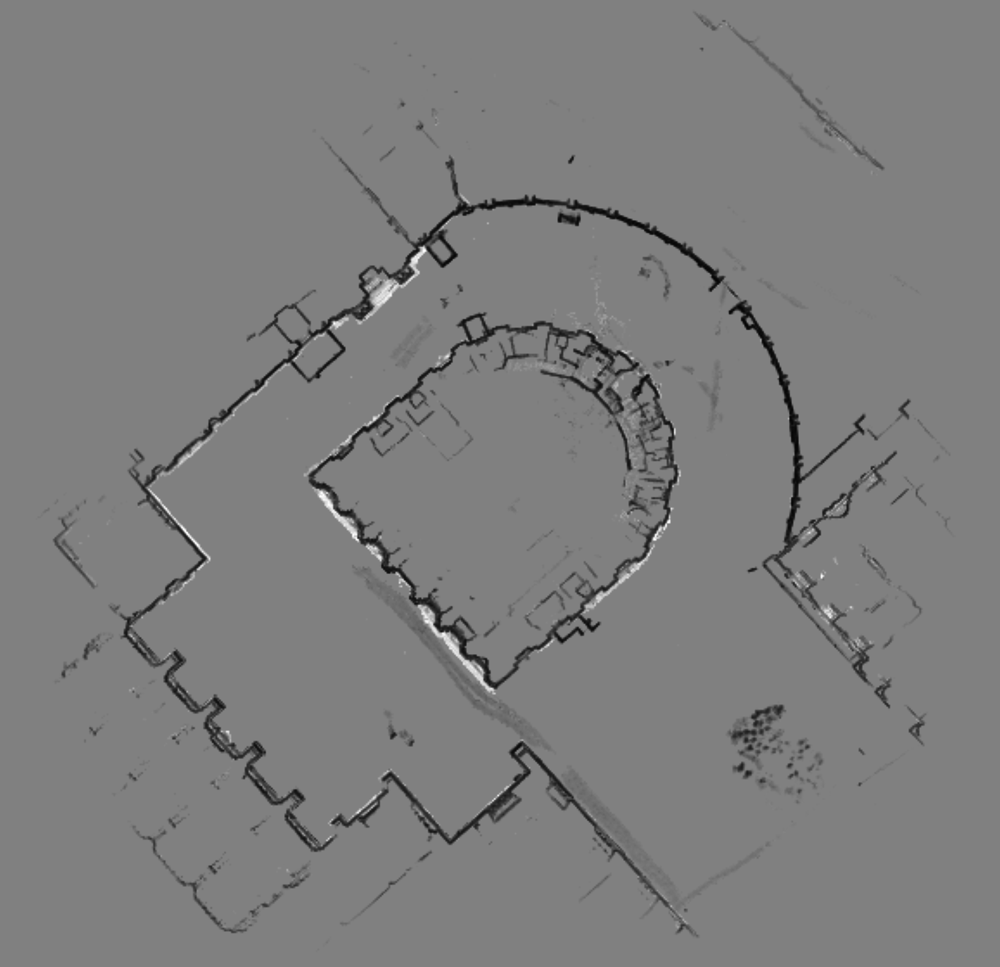
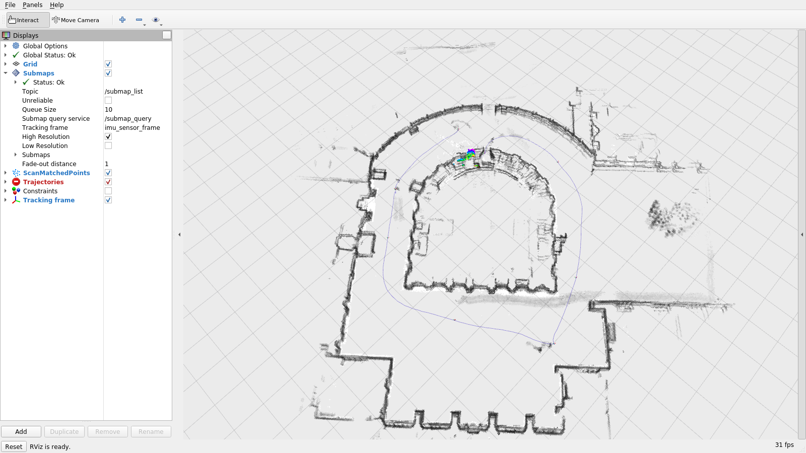
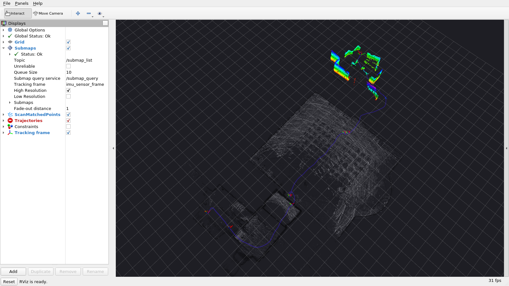
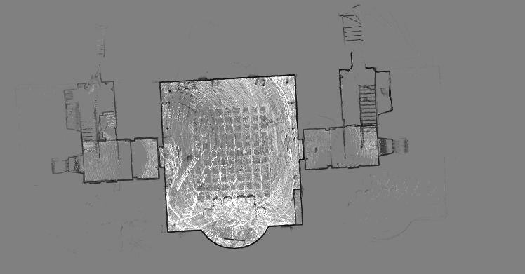

# Cartographer

Google's real-time 2D and 3D LiDAR SLAM: local scan matching into submaps, plus a background pose-graph optimization with branch-and-bound loop closure. The default demo runs the **3D + IMU** builder on the Hilti SLAM Challenge 2022 sequence `exp21_outside_building.bag`: a 152 s handheld walk (130 m) around the outside of a building, with a Hesai PandarXT-32 and the Alphasense IMU. The map covers about 87 × 84 m. The indoor sequence `exp14_basement_2.bag` (74 s, 4.2 m level change) is kept as a second, smaller demo.

- **Repo**: [cartographer-project/cartographer](https://github.com/cartographer-project/cartographer) (bundled here as `cartographer.tar.xz`, built for ROS Noetic) — upstream is no longer actively maintained; ROS 2 users are directed to [ros2/cartographer_ros](https://github.com/ros2/cartographer_ros)
- **Paper**: [Real-Time Loop Closure in 2D LIDAR SLAM](https://research.google/pubs/real-time-loop-closure-in-2d-lidar-slam/) — Hess et al., IEEE ICRA 2016. (Covers the 2D system; Cartographer's 3D SLAM has no separate paper.)

## Build

```bash
podman build -t slam_zero_to_hero:rviz_unified_controls ../rviz_unified_controls   # once; the Dockerfile copies the rviz mouse plugin from it
podman build -t slam_zero_to_hero:cartographer .
```

CPU-only SLAM; the image also carries `rviz`, `cartographer_rviz`, the course's rviz mouse plugin, and Xvfb + ImageMagick + xdotool for headless screenshots.

## Data

```bash
python3 ../download_hilti_2022.py exp21_outside_building   # -> ~/data/hilti_2022/exp21_outside_building.bag (12,014,463,331 B)
# sparse ground truth (5 surveyed positions), used by scripts/eval_survey.py:
wget -O ~/data/hilti_2022/exp21_outside_building_gt.txt \
  https://huggingface.co/datasets/Hilti-Research/hilti-slam-challenge-2022/resolve/main/ground_truth/exp21_outside_building.txt
```

The downloader fetches from the Hilti-Research Hugging Face mirror. `python3 ../download_hilti_2022.py exp14_basement_2` gets the smaller indoor sequence (6,260,771,085 B).

Then add the per-point `time` field Cartographer needs for de-skewing, and drop the five camera streams (about a minute; writes a 1.9 GB bag next to the original):

```bash
podman run --rm -v ~/data/hilti_2022:/data -v "$(pwd)/scripts":/scripts:ro \
  slam_zero_to_hero:cartographer \
  python3 /scripts/hesai_add_time_field.py /data/exp21_outside_building.bag \
    /data/exp21_outside_building_carto.bag /hesai/pandar,/alphasense/imu
```

For exp14, use the same command with `exp14_basement_2` (0.9 GB output). Without this step every point has time 0 and the error triples. See [NOTES.md](NOTES.md).

## Run (offline, no GUI)

```bash
podman run --rm \
  -v ~/data/hilti_2022:/data:ro -v "$(pwd)/config":/cfg:ro -v "$(pwd)/urdf":/urdf:ro \
  -v "$(pwd)/scripts":/scripts:ro -v "$(pwd)/run_carto.sh":/run_carto.sh:ro \
  -v "$(pwd)/results":/out -e TAG=hilti_outdoor_3d \
  slam_zero_to_hero:cartographer /run_carto.sh

python3 scripts/eval_survey.py results/hilti_outdoor_3d/carto_tum.txt ~/data/hilti_2022/exp21_outside_building_gt.txt
```

`cartographer_offline_node` processes the bag as fast as it can with `config/hilti_outdoor_3d.lua`. The script then exports these files into `results/hilti_outdoor_3d/`:

- `map.pbstream`
- the trajectory as `carto_tum.txt` (TUM format)
- a 2D projection of the submaps, `map.pgm`
- a dense 3D cloud, `assets_map3d.{ply,pcd}`
- a 2D occupancy grid with free space, `assets_slab.{pgm,yaml}`

SLAM itself takes about 31 s; the whole script takes about 5 min, mostly the two assets-writer passes.

For exp14 add `-e CFG=hilti_3d_lio.lua -e BAG=/data/exp14_basement_2_carto.bag -e ASSETS_CFG=assets_writer_hilti.lua -e TAG=hilti_3d`.

## Run with the GUI (rviz)

```bash
podman run --rm \
  --runtime=/usr/bin/nvidia-container-runtime \
  -e NVIDIA_VISIBLE_DEVICES=all -e NVIDIA_DRIVER_CAPABILITIES=graphics,compute,utility \
  -e DISPLAY=$DISPLAY -v /tmp/.X11-unix:/tmp/.X11-unix \
  -v ~/data/hilti_2022:/data:ro -v "$(pwd)/config":/cfg:ro -v "$(pwd)/scripts":/scripts:ro \
  -v "$(pwd)/run_carto_live.sh":/run_carto_live.sh:ro -v "$(pwd)/results":/out \
  slam_zero_to_hero:cartographer /run_carto_live.sh
```

This runs the online `cartographer_node` against `rosbag play` in real time (`-e RATE=3` speeds it up). rviz opens on `config/hilti_outdoor_3d.rviz` and shows cartographer_rviz's `Submaps` display, the trajectory, and the current scan-matched points coloured by height. No `xhost` change and no `--net=host` are needed. The `Trajectories` display shows a red status marker, but the trajectory still draws. `-e SHOT=/out/rviz.png` saves a capture of the rviz window when the bag ends.

**Mouse:** left drag rotates the view, the wheel zooms, and right drag (or middle drag) pans. This is the course-wide scheme from [`../rviz_unified_controls`](../rviz_unified_controls); `hilti_*.rviz` and the upstream `demo_2d.rviz` / `demo_3d.rviz` in the image use its view controllers.

For exp14 add `-e CFG=hilti_3d_lio.lua -e BAG=/data/exp14_basement_2_carto.bag -e RVIZ_CFG=hilti_3d.rviz`.

For a headless run, rviz renders on Xvfb inside the container and is captured when the bag ends:

```bash
podman run --rm \
  -v ~/data/hilti_2022:/data:ro -v "$(pwd)/config":/cfg:ro -v "$(pwd)/scripts":/scripts:ro \
  -v "$(pwd)/run_carto_live.sh":/run_carto_live.sh:ro -v "$(pwd)/results":/out \
  -e XVFB=1 -e SHOT=/out/cartographer_rviz.png \
  slam_zero_to_hero:cartographer /run_carto_live.sh
```

## Results — Hilti 2022 `exp21_outside_building` (3D + IMU, default)

Measured 2026-09-28, with the host at load average 27–42 (other jobs running). The sequence publishes ground truth at 5 surveyed timestamps, up to 44 m apart. `scripts/eval_survey.py` interpolates the trajectory at those times, fits one rigid SE(3) transform (no scale), and reports the residuals.

| | offline (`run_carto.sh`) | online (`run_carto_live.sh`, 1x, rviz on the RTX 5090) |
|---|---|---|
| Poses | 1,518 (one per sweep) | 1,527 |
| Path length | 130.3 m | 130.3 m |
| **Error at the 5 survey points** | **0.093 m RMSE**, max 0.112 m | 0.099 m RMSE, max 0.119 m |
| Loop closure | 1,536 match attempts, 192 constraints accepted, ~10 submaps | |
| Dense map | 49,928,673 points (10 cm voxels) | |

The same bag with the basement config `hilti_3d_lio.lua` scores 0.517 m RMSE. Its xy error stays within 0.12 m, but the height drifts by 1.4 m.

The offline run is deterministic: two runs at different host loads wrote byte-identical pbstreams. [NOTES.md](NOTES.md) has the tuning, one value at a time.

2D projection of the 3D submaps (`map.pgm`, 0.05 m/px, 87 × 84 m):



Occupancy grid with free space, from `assets_writer_hilti_outdoor_grid.lua` (`assets_slab.pgm`, 0.10 m/px, a 1 m slab around sensor height):


rviz at the end of the online run:



## Results — Hilti 2022 `exp14_basement_2` (3D + IMU)

Measured 2026-09-27; the offline run was repeated on 2026-09-28 with the new image and gave a byte-identical pbstream. This sequence has no public ground truth, so the trajectory is compared against this repo's FAST-LIO2 run on the same bag (`../fast_lio2/results/fullA`).

| | offline (`run_carto.sh`) | online (`run_carto_live.sh`, 1x) | FAST-LIO2 reference |
|---|---|---|---|
| Poses | 730 | 739 | 737 |
| Path length | **38.38 m** | 38.57 m | 37.93 m |
| z extent | 4.19 m | 4.22 m | 4.15 m |
| Rigid SE(3) ATE vs FAST-LIO2 | **0.084 m RMSE** (728 pairs) | 0.089 m RMSE (737 pairs) | — |

8 submaps, 221 loop-closure computations, 26 constraints accepted. The pbstream (10,576,369 B) is byte-identical to the one measured in August. The dense map has 21,335,730 points.





## Supported datasets

| Dataset | Config | Status |
|---|---|---|
| **Hilti 2022** `exp21_outside_building.bag` (default) | `config/hilti_outdoor_3d.lua` — 3D + IMU, ranges to 120 m | ✅ verified 2026-09-28: 1,518 poses, 130.3 m path, **0.093 m RMSE** at the 5 survey points; rviz renders submaps + trajectory |
| Hilti 2022 `exp14_basement_2.bag` | `config/hilti_3d_lio.lua` — 3D + IMU, indoor (`-e CFG=... -e BAG=...`, see above) | ✅ verified 2026-09-27: 730 poses, 38.38 m path, **0.084 m RMSE** against FAST-LIO2 |
| same, 2D comparison | `config/hilti_2d_imu.lua` — 2D + IMU | Kept for contrast: tilt compensation fixes the smearing, but 2D cannot represent this sequence's 4.19 m level change |
| Any ROS bag with a LiDAR `PointCloud2` + `sensor_msgs/Imu` | copy `hilti_outdoor_3d.lua` (outdoors) or `hilti_3d_lio.lua` (indoors) | Needs the sensor↔IMU extrinsic supplied via `urdf/`, and a per-point `time` field for de-skewing |
| KITTI, 2D (legacy) | `velodyne_kitti_2D.lua` | ⚠️ not verified — needs a `kitti2bag` bag and cannot run headless (`rviz` is `required="true"`) |

The original 2D config produced a badly smeared map. [NOTES.md](NOTES.md) explains why, and describes the de-skewing bug that mattered more than any parameter.
