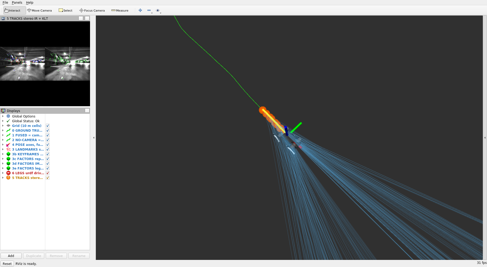
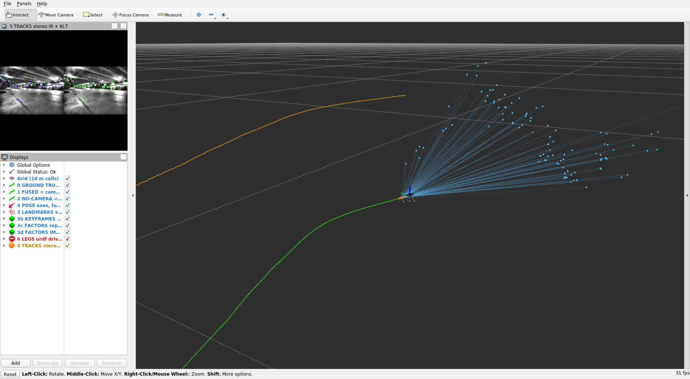
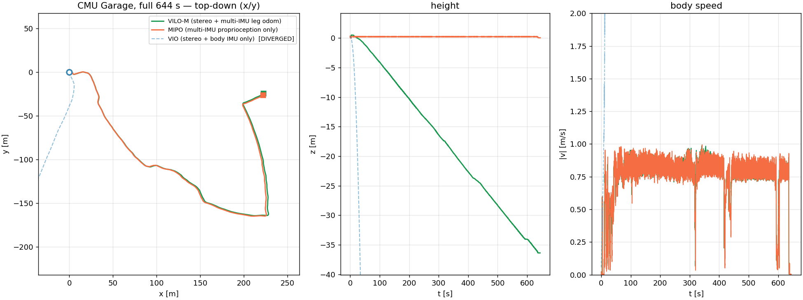
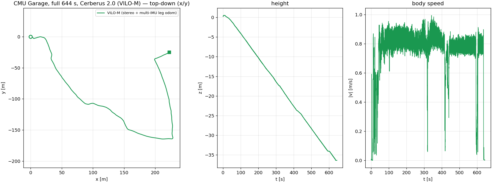
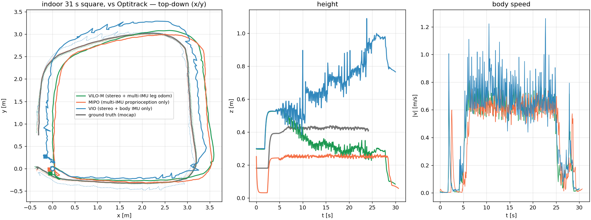

# Cerberus 2.0

Visual-Inertial-Leg Odometry for legged robots. A stereo VIO sliding window (VINS-Fusion
lineage) is fused with a proprioceptive filter that runs **five** IMUs — one on the Unitree
Go1's trunk and one on each foot — plus joint encoders, so the legs supply a metric velocity
the camera never has to recover on its own.

- **Repo**: [ShuoYangRobotics/Cerberus2.0](https://github.com/ShuoYangRobotics/Cerberus2.0) (pinned here at `main@d81c394`)
- **Papers**:
  - [Multi-IMU Proprioceptive Odometry for Legged Robots](https://roboticexplorationlab.org/papers/foot_imu_iros2023.pdf) — Yang, Zhang, Bokser, Manchester, IROS 2023 (Best Paper finalist). This is the `MIPO` filter.
  - [Cerberus: Low-Drift Visual-Inertial-Leg Odometry For Agile Locomotion](https://ieeexplore.ieee.org/document/10160486) — Yang, Zhang, Fu, Manchester, ICRA 2023
  - [Online Kinematic Calibration for Legged Robots](https://ieeexplore.ieee.org/abstract/document/9807408) — Yang, Choset, Manchester, RA-L / IROS 2022
- Predecessor: [ShuoYangRobotics/Cerberus](https://github.com/ShuoYangRobotics/Cerberus)

## The three estimators, and which is which

The same binary runs several estimators at once and the names are not self-explanatory. This
is the whole vocabulary you need:

| Name | Sensors | In rviz | In the CSV |
|---|---|---|---|
| **VILO** — visual-inertial-**leg** odometry. The fused estimate; "Cerberus" means this. | stereo + trunk IMU + 4 foot IMUs + joints | **green** | `vilo-m-<seq>.csv` |
| **MIPO** — multi-IMU **proprioceptive** odometry. Runs alongside VILO and feeds it a leg velocity. **No camera at all.** | trunk IMU + 4 foot IMUs + joints | **orange** | `mipo-<seq>.csv` |
| **VIO** — the visual-inertial half on its own, legs switched off. Ablation only. | stereo + trunk IMU | not shown by default | `vio-<seq>.csv` |
| ground truth | Optitrack, indoor sequences only | **white** | `gt-<seq>.csv` |

So green vs orange is *with camera* vs *without*. On a good run they sit almost on top of
each other **horizontally** — on CMU Garage they agree to ~1 % of a 227 m circuit. Vertically
they diverge, but be careful how you read that: MIPO reports base height above the local
terrain (flat at 0.24 m by construction, it cannot see elevation at all), while VILO's z
**drifts**, on this sequence at a near-constant 5.7 cm/s. It is not measuring the ramp. See
"the vertical channel drifts" below. `SIPO` and `vilo-s`/`vilo-tm` also exist (single-IMU and
tightly-coupled leg-factor variants); see `FUSION_TYPE`/`KF_TYPE` below.

## Build

```bash
podman build -t slam_zero_to_hero:cerberus_2 .
```

5.4 GB. Bakes ROS Noetic, casadi 3.5.5 (built from source — the long step), Ceres 1.14 from
apt, a CPU libtorch, VINS-Fusion's `camera_models`, and Cerberus 2.0 itself into
`/home/EstimationUser/estimation_ws`, then asserts the binaries, launch file and configs all
resolve.

Upstream ships no Dockerfile — it ships a **devcontainer** that pulls a prebuilt 2.5 GB image
and expects you to run `catkin build` by hand in VSCode. Four things this image has to work
around, all commented in the [Dockerfile](Dockerfile):

- `cerberus2` needs `camera_models` but its `package.xml` doesn't declare it, so catkin builds
  them in parallel and configure fails in under a second. Two sequential `catkin build` calls.
- The workspace uses `--merge-devel`. With catkin_tools' default *linked* layout,
  `devel/setup.bash` leaves the workspace off `ROS_PACKAGE_PATH` — the base image exports
  `CMAKE_PREFIX_PATH=/opt/ros/noetic` as image ENV — and `rospack find cerberus2` fails even
  though the binaries are built.
- `misc/casadi_misc.hpp` is copied over casadi's own header (upstream does this as a
  devcontainer `postStartCommand`); it removes a `std::pair` `operator<<` that is ambiguous
  against libtorch's.
- [`patches/`](patches/) reinstates the landmark and factor-graph publishing upstream
  commented out — see [NOTES.md](NOTES.md). Generated against the pinned commit and applied
  with `git apply`, so it fails the build loudly if upstream ever moves.

## Datasets

Go1 bags on Google Drive. `download_cerberus2.py` knows every sequence, its exact size, and
resumes; no `gdown` needed.

```bash
python3 ../download_cerberus2.py cmu_garage        # the demo sequence, 5.96 GB -> ~/data/cerberus2/
python3 ../download_cerberus2.py indoor_square_31s # 291 MB, the only one with ground truth
python3 ../download_cerberus2.py --list            # all 11 sequences, ~33 GB
```

Every bag carries the same eight topics: `/unitree_hardware/imu` (400 Hz),
`/unitree_hardware/joint_foot` (400 Hz, 12 joints + 4 foot-force channels),
`/WT901_47..50_Data` (the four foot IMUs, 200 Hz, gyro in **deg/s**), and the rectified stereo
IR pair `/camera_forward/infra{1,2}/image_rect_raw` (15 Hz).

**Ground truth.** Only the indoor bags have a pose topic (`/natnet_ros/Shuo_Go1/pose`), which
`cerberus2_main` writes out as `gt-<seq>.csv` and `plot_trajectory.py` turns into an ATE.
Outdoor bags have none — what ships beside them is a MATLAB Mobile `.mat` of iPhone GPS/IMU
stored as `timetable` **objects** (MCOS) that `scipy.io.loadmat` cannot decode; converting it
needs MATLAB and upstream's `script/matlab/mobile_gps_process/`.

## Run

```bash
mkdir -p results/cmu_garage
podman run --rm \
  -v ~/data/cerberus2:/data:ro \
  -v "$PWD/results/cmu_garage":/out:rw \
  -e BAG=/data/cmu_garage/230828-cmu-trot-06-040-east-campus-garage-bad-gps.bag \
  -e CONFIG=/home/EstimationUser/estimation_ws/src/cerberus2/config/lecture/cmu_garage.yaml \
  slam_zero_to_hero:cerberus_2 bash /opt/cerberus2_demo/run_demo.sh
```

Writes `vilo-m-cmu_garage.csv` (`time, x, y, z, roll, pitch, yaw, vx, vy, vz`), a
`trajectory.png`, and a drift table to stdout. Add `-e DURATION=140` for a two-minute taste.

### With the GUI

```bash
mkdir -p results/cmu_garage_gui
podman run --rm \
  --runtime=/usr/bin/nvidia-container-runtime \
  -e NVIDIA_VISIBLE_DEVICES=all -e NVIDIA_DRIVER_CAPABILITIES=graphics,compute,utility \
  -e DISPLAY=$DISPLAY -e XDG_RUNTIME_DIR=/tmp/runtime-root \
  -v /tmp/.X11-unix:/tmp/.X11-unix \
  -v ~/data/cerberus2:/data:ro \
  -v "$PWD/results/cmu_garage_gui":/out:rw \
  -e BAG=/data/cmu_garage/230828-cmu-trot-06-040-east-campus-garage-bad-gps.bag \
  -e CONFIG=/home/EstimationUser/estimation_ws/src/cerberus2/config/lecture/cmu_garage.yaml \
  -e RVIZ=true -e SHOT_AT=320 \
  slam_zero_to_hero:cerberus_2 bash /opt/cerberus2_demo/run_demo.sh
```

No `xhost` change and no `--net=host` needed. The rviz camera **follows the robot**
(`Target Frame: robot`), which matters because the landmark cloud is the *sliding window* —
about ten keyframes around the current pose — so a world-anchored view loses it within
seconds. Screenshots land in `/out` at `SHOT_AT` seconds and at end of playback.

### Knobs

| Env | Meaning |
|---|---|
| `BAG`, `CONFIG` | bag path and sequence config (`config/lecture/{cmu_garage,mill19_trail,indoor_mocap}.yaml`) |
| `START`, `DURATION`, `RATE` | `rosbag play -s / -u / -r` |
| `RVIZ=true`, `SHOT_AT=90` | rviz on the host X display; screenshot this many seconds in |
| `RVIZ_DISTANCE`, `RVIZ_FOCAL`, `RVIZ_PITCH` | orbit camera; the shipped view suits an outdoor run, an indoor 3 m square wants `RVIZ_DISTANCE=5` |
| `FUSION_TYPE` | `0` = VIO **and** MIPO baselines, `1` = fuse leg velocity (**Cerberus 2.0**), `2` = tightly-coupled leg factor |
| `KF_TYPE` | `0` = MIPO (5 IMUs), `1` = SIPO (trunk IMU only) |
| `OVERRIDES` | any scalar config field, e.g. `"estimate_extrinsic=1,init_base_height=0.05"` |

The variant decides which CSVs appear, because `parameters.cpp` derives their names from
`kf_type`/`vilo_fusion_type`: `vilo-m-` for the fused estimator, `vio-` **plus** `mipo-` when
`FUSION_TYPE=0`. That is how the ablation figure is produced.

### Topics

| Topic | What | Source |
|---|---|---|
| `/vilo/estimate_pose`, `/mipo/estimate_pose` | fused and proprioception-only pose | upstream |
| `/vilo/image_track` | left IR with KLT tracks | upstream (its only live display) |
| `/vis_joint_state` | 12 joint angles, URDF names | upstream, consumed by nothing until now |
| `/vilo/point_cloud` | sliding-window landmarks | **patch** |
| `/vilo/key_poses` | keyframe nodes | **patch** |
| `/vilo/factor_graph_pose` | keyframe↔keyframe IMU + leg factors | **patch** |
| `/vilo/factor_graph_obs` | landmark↔keyframe reprojection factors | **patch** |
| `/vilo/path_viz`, `/mipo/path_viz`, `/gt/path_viz` | trajectories as `nav_msgs/Path` | `pose_to_path.py` |
| leg TF (`base → trunk → …_foot`) | leg kinematics | `robot_state_publisher` on `/vis_joint_state` |

## Output

**The sliding window, drawn as the factor graph ceres actually solves.** Close in on the
robot and the whole structure is there:

| | |
|---|---|
| **orange spheres** | the 11 keyframe pose nodes — `WINDOW_SIZE + 1` |
| **yellow chain** | 10 IMU preintegration factors, one per consecutive keyframe pair |
| **magenta chain** | 10 leg-odometry preintegration factors, on the *same* pairs — these are the factors that make this VI**L**O and not VIO, so they are drawn 4 cm below the yellow ones instead of hidden underneath |
| **blue fan** | 348 landmark→keyframe reprojection factors |
| **cyan points** | the landmarks themselves |
| **green line** | the fused trajectory so far |
| **robot** | the URDF, driven live by the joint encoders through `/vis_joint_state` — the same leg chain the leg-odometry factors are computed from |



Counts verified off the live topics: 11 nodes, 10 + 10 keyframe-chain factors, 348
reprojection factors. Pulled back, the fan is what the visual half of the estimator is
holding on to at any instant, against the orange no-camera estimate:



Every layer is a separate rviz display and toggles independently. **None of it is published by
upstream** — `visualization.cpp` has all twelve of its publishers commented out except the
tracked-image one — so the graph and the landmarks come from [`patches/`](patches/), the paths
from `scripts/pose_to_path.py`, and the legs from `robot_state_publisher` on a topic upstream
publishes but never consumes. See [NOTES.md](NOTES.md).

The whole 644 s with both ablations. Fused and proprioception-only trace the *same* 227 m
circuit for eleven minutes; **stereo VIO on its own diverges within 30 s**. On a trotting
quadruped it is the legs that keep the estimate alive — which is the papers' claim, in one
picture.



Fused estimate alone. The height panel is **not** the garage ramp — see below.



Ground truth, from the one indoor sequence that has it — white is Optitrack, and the dotted
lines are each estimate after rigid alignment.



## What was verified here

All of it in this image, on the downloaded bags; numbers from `plot_trajectory.py`. "max
step" is the largest single-sample position jump — a healthy run has exactly one, at
initialisation, which is how a visibly jumping estimate is told from smooth drift.

| Sequence | Window | Variant | Path | xy span | end→start | max step | Verdict |
|---|---|---|---|---|---|---|---|
| **CMU Garage** | 644 s (full) | `vilo-m` | 476 m | **228.3 m** | 227.0 m | 0.30 m | ✅ the demo, **horizontally**. Same circuit as MIPO for 11 min. Vertical channel drifts, below |
| **CMU Garage** | 644 s | `mipo` | 474 m | **225.9 m** | 223.9 m | 0.14 m | ✅ agrees with the fused estimate to ~1 % of span |
| **CMU Garage** | 644 s | `vio` | 568 km | — | — | — | ❌ diverged, as the ablation figure shows |
| **CMU Garage** | 140 s | `vilo-m` | 91.8 m | 68.2 m | 75.4 m | 0.30 m | ✅ tracks the 7 m ramp |
| **Wightman Park** flying trot | 197 s (upstream's own `-u 197`) | `vilo-m` | 136.9 m | 43.7 m | **4.54 m** | 0.30 m | ✅ closed loop, closes to **3.3 % of path** |
| **indoor 31 s square** (Optitrack) | 31 s | `vilo-m` / `mipo` / `vio` | 15 m | 3.6 m | 0.2 m | 0.08 / 0.04 / 0.39 m | ✅ **ATE 0.070 / 0.045 / 0.148 m** vs mocap |
| Mill19 Trail | any | all variants | — | — | — | — | ❌ diverges ~22 s in |
| St Mary Cemetery (706 s) | any | `vilo-m` | — | — | — | 670 km | ❌ diverges, 56 jumps > 25 cm in the first 40 s |
| indoor 93 s square | 93 s | all variants | — | — | — | — | ❌ diverges |

The indoor ATE, rigidly aligned (Umeyama, rotation+translation, no scale) over 11.7 m of
mocap path, is the one place a real number is available — and it orders exactly as the papers
argue:

| variant | ATE RMSE | ATE max | RMSE / path |
|---|---|---|---|
| `mipo` — 5 IMUs + joints, no camera | **0.045 m** | 0.162 m | 0.38 % |
| `vilo-m` — fused | **0.070 m** | 0.176 m | 0.60 % |
| `vio` — stereo + trunk IMU, no legs | **0.148 m** | 0.411 m | 1.26 % |

Dropping the legs roughly doubles the error. MIPO alone edging out the fused estimate at
0.4 m/s in a 3 m box is not a contradiction: with continuous contact, proprioception is the
stronger signal there, and the camera is what stops it drifting over hundreds of metres
outdoors — which is what the CMU Garage figures show.

### The one config change that matters

The shipped configs set **`estimate_extrinsic: 0`**, not upstream's `1`. Online camera-IMU
extrinsic estimation is right on live hardware; on a recorded sequence whose rig transform is
already in the config it slowly corrupts the heading. Same bag, everything else identical:

| | xy span | end→start | Wightman loop closure |
|---|---|---|---|
| `estimate_extrinsic: 1` (upstream) | 430.0 m | 431.7 m | 6.14 m |
| `estimate_extrinsic: 0` (here) | **228.3 m** | **227.0 m** | **4.54 m** |

228.3 m is the tell: MIPO, which never touches the camera, independently reports 225.9 m on
the same bag. With `0` the two agree; with `1` they do not. Restore upstream's behaviour with
`OVERRIDES=estimate_extrinsic=1`.

### The vertical channel drifts — unfixed

`vilo-m` reaches z = −36.9 m over the 644 s CMU Garage run and the height panel looks like a
clean ramp descent. It is not one, and I could not fix it. What the run's own CSV shows:

- Regressing vertical rate on horizontal speed in 10 s buckets gives **slope −0.0779,
  correlation −0.861**: the robot "descends" a constant **4.45° grade for exactly as long as
  it is moving**, and stops descending when it stops. That is a fixed rotation applied to a
  velocity, not terrain.
- Body pitch ramps monotonically from −1° to **−27°**, which no trotting Go1 holds.

The cause is identifiable in the code. `LOFactor` is a *displacement* constraint in VILO's
world frame — residual `(Pj − Pi) − ∫v dt` — while the velocity it integrates is handed over as
`mipo_x.segment<3>(3)`, MIPO's velocity in **MIPO's own world frame**. The two filters
gravity-align their world frames independently and nothing relates them, so a constant ~4.45°
offset becomes a steady fake grade.

Two fixes were tried and **both are worse**, over the full bag:

| | final z | grade |
|---|---|---|
| upstream as-is (`vilo_fusion_type: 1`, shipped) | −36.4 m | **+4.45°** |
| rotate the velocity through the body frame with `R_vilo · R_mipo^T` | +60.5 m | −7.11° |
| `vilo_fusion_type: 2`, tightly-coupled leg factor | −205.7 m | +27.81° |

The rotation fails because `R_vilo · R_mipo^T` is the difference of two *drifting* attitude
estimates rather than the constant offset. Type 2 looks better over a 140 s window (−1.01°) and
is far worse over the full 644 s. Upstream's default is therefore kept as the least-bad option.
The real fix is to make the leg preintegration accumulate `R_vilo(t)·v_body·dt` internally the
way the IMU preintegration already does — estimator surgery, documented in
[NOTES.md](NOTES.md), not attempted here.

**Practical consequence:** trust the horizontal circuit, which is independently corroborated —
VILO's 228.3 m xy span against MIPO's 225.9 m on the same bag — and treat outdoor z as
unvalidated. Indoors, where mocap exists, full 3D ATE is 0.070 m over 11.7 m, so this is a
long-run effect, not a broken vertical channel per se.

### Sequences that do not work

**Mill19 Trail** — the one upstream's README showcases as a video — diverges ~22 s in, and so
does **St Mary Cemetery** and the **93 s indoor square**. `MIPO`, the camera-free filter,
fails first on Mill19: correct for 20 s at 0.5 m/s with base height pinned at 0.24 m, then
velocity ramps linearly to 24 m/s. Ruled out by experiment: playback rate,
`init_base_height`, bag start offset, message gaps, foot-IMU units, the WT901→leg assignment,
and the extrinsics. Each of those experiments, and the rest of the archaeology, is in
[NOTES.md](NOTES.md).

## Layout

```
Dockerfile                    build from source, upstream pinned at main@d81c394
patches/                      reinstates the landmark publishing upstream commented out
config/lecture/*.yaml         per-sequence configs + the two RealSense calibs
launch/cerberus2_bag.launch   estimator, pose_to_path, leg robot_state_publisher, and the
                              rosparam topics upstream never sets
rviz/cerberus2_vilo.rviz      landmarks, both trajectories, ground truth, legs, tracks
scripts/run_demo.sh           play, screenshot, drain, plot
scripts/pose_to_path.py       pose streams -> nav_msgs/Path (upstream publishes none)
scripts/plot_trajectory.py    figures, drift table, ATE against mocap
../download_cerberus2.py      dataset downloader
```
