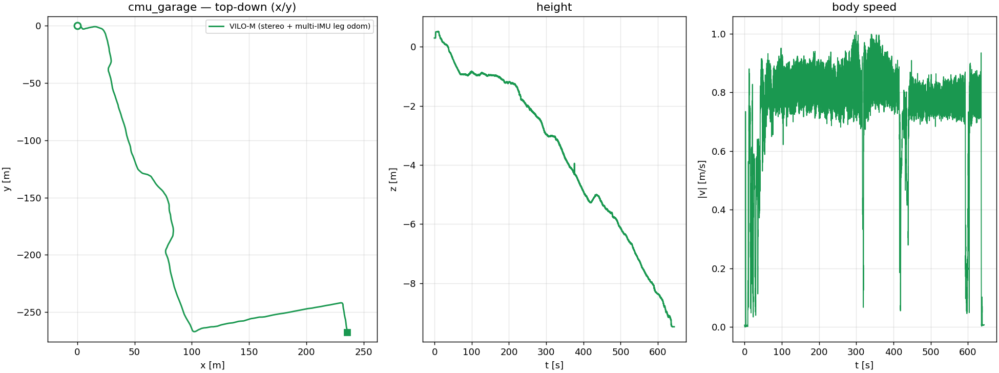
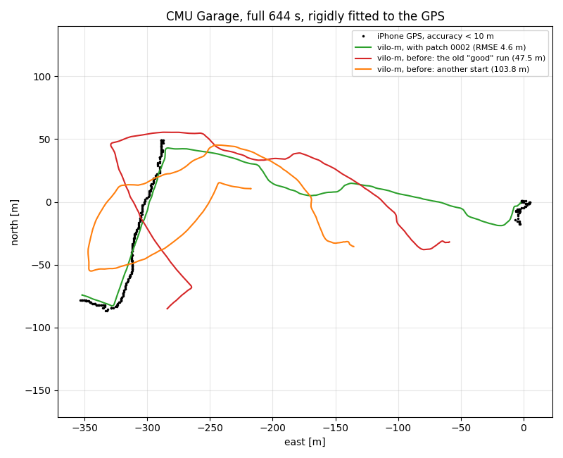
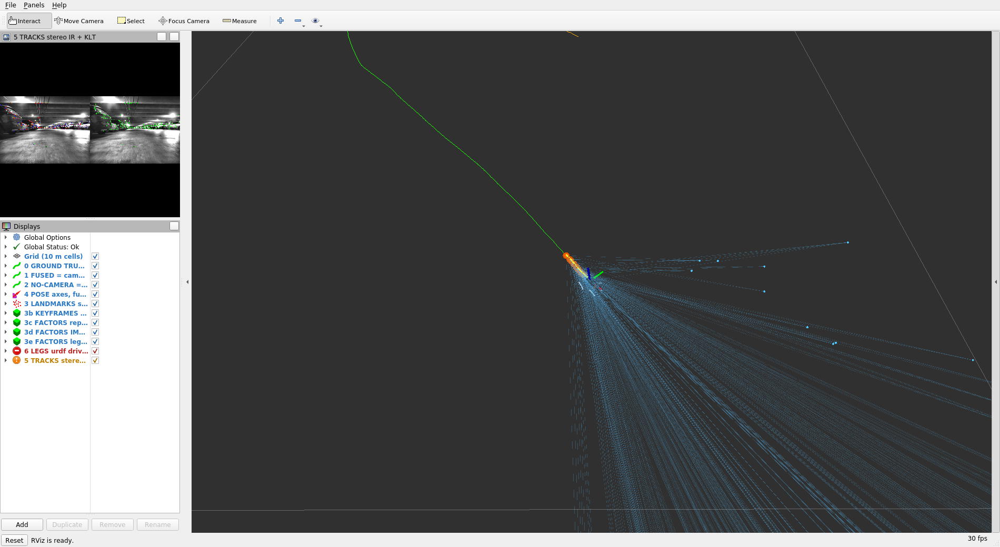
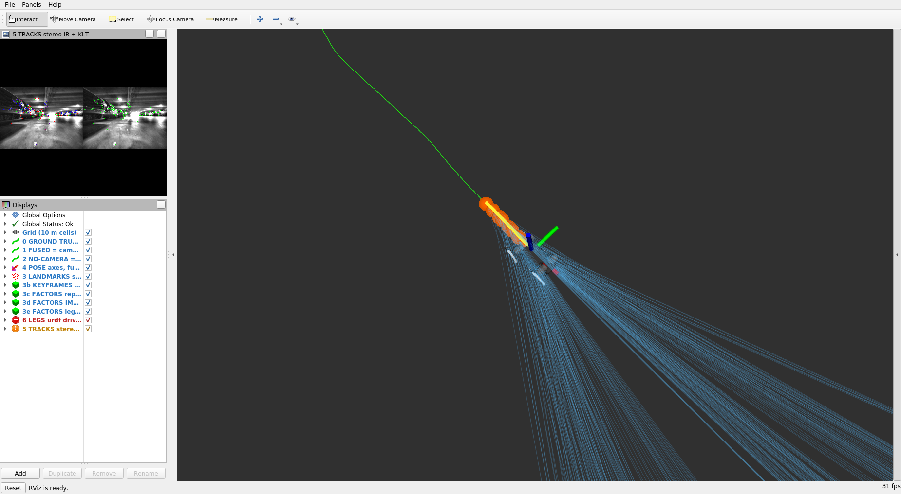
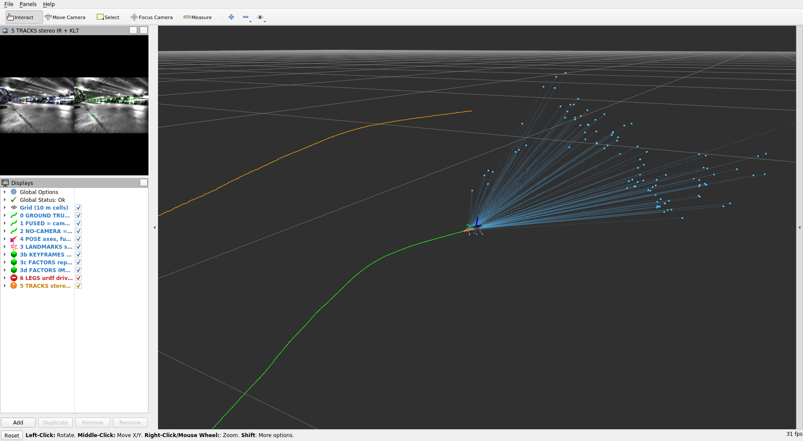
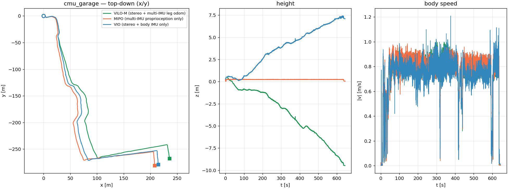
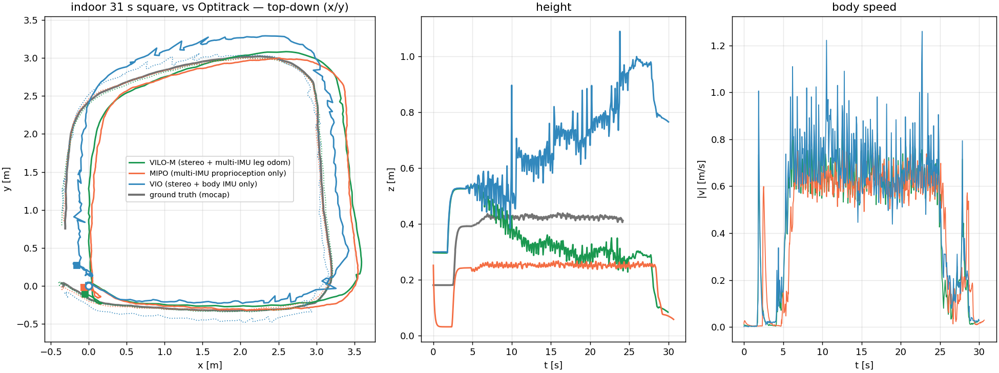

# Cerberus 2.0

Visual-Inertial-Leg Odometry for legged robots. A stereo VIO sliding window (VINS-Fusion
lineage) is fused with a proprioceptive filter that runs **five** IMUs — one on the Unitree
Go1's trunk and one on each foot — plus joint encoders, so the legs supply a metric velocity
the camera never has to recover on its own.

- **Repo**: [ShuoYangRobotics/Cerberus2.0](https://github.com/ShuoYangRobotics/Cerberus2.0) (pinned here at `main@d81c394`)
- **Papers**:
  - [Multi-IMU Proprioceptive Odometry for Legged Robots](https://roboticexplorationlab.org/papers/foot_imu_iros2023.pdf) — Yang, Zhang, Bokser, Manchester, IROS 2023 (Best Paper finalist). This is the `MIPO` filter.
  - [Cerberus: Low-Drift Visual-Inertial-Leg Odometry For Agile Locomotion](https://ieeexplore.ieee.org/document/10160486) — Yang, Zhang, Fu, Manchester, ICRA 2023
  - [Online Kinematic Calibration for Legged Robots](https://ieeexplore.ieee.org/abstract/document/9807408) — Yang, Choset, Manchester, RA-L / IROS 2022
- Predecessor: [ShuoYangRobotics/Cerberus](https://github.com/ShuoYangRobotics/Cerberus)
- **Default dataset**: Cerberus 2.0 Go1 **CMU Garage** (`cmu_garage`, 644 s, 5.96 GB) at
  `~/data/cerberus2/cmu_garage/`. Every command below uses it unless it says otherwise.

## The three estimators, and which is which

The same binary runs several estimators at once and the names are not self-explanatory. This
is the whole vocabulary you need:

| Name | Sensors | In rviz | In the CSV |
|---|---|---|---|
| **VILO** — visual-inertial-**leg** odometry. The fused estimate; "Cerberus" means this. | stereo + trunk IMU + 4 foot IMUs + joints | **green** | `vilo-m-<seq>.csv` |
| **MIPO** — multi-IMU **proprioceptive** odometry. Runs alongside VILO and feeds it a leg velocity. **No camera at all.** | trunk IMU + 4 foot IMUs + joints | **orange** | `mipo-<seq>.csv` |
| **VIO** — the visual-inertial half on its own, legs switched off. Ablation only. | stereo + trunk IMU | not shown by default | `vio-<seq>.csv` |
| ground truth | Optitrack, indoor sequences only | **white** | `gt-<seq>.csv` |

So green vs orange is *with camera* vs *without*. Horizontally they trace the same circuit;
note that MIPO is not fully independent, it takes its yaw from VILO. Vertically they differ:
MIPO reports base height above the local terrain (flat at 0.24 m by construction, it cannot
see elevation at all), while VILO's z drifts by ~10 m over the 644 s CMU Garage run. See "the
vertical channel" below. `SIPO` and `vilo-s`/`vilo-tm` also exist (single-IMU and
tightly-coupled leg-factor variants); see `FUSION_TYPE`/`KF_TYPE` below.

## Build

```bash
podman build -t slam_zero_to_hero:cerberus_2 .
```

5.4 GB. Bakes ROS Noetic, casadi 3.5.5 (built from source — the long step), Ceres 1.14 from
apt, a CPU libtorch 1.13.1, VINS-Fusion's `camera_models` (pinned at `4ef0240`), and Cerberus 2.0 itself into
`/home/EstimationUser/estimation_ws`, then asserts the binaries, launch file and configs all
resolve.

Upstream ships no Dockerfile — it ships a **devcontainer** that pulls a prebuilt 2.5 GB image
and expects you to run `catkin build` by hand in VSCode. Four things this image has to work
around, all commented in the [Dockerfile](Dockerfile):

- `cerberus2` needs `camera_models` but its `package.xml` doesn't declare it, so catkin builds
  them in parallel and configure fails in under a second. Two sequential `catkin build` calls.
- The workspace uses `--merge-devel`. With catkin_tools' default *linked* layout,
  `devel/setup.bash` leaves the workspace off `ROS_PACKAGE_PATH` — the base image exports
  `CMAKE_PREFIX_PATH=/opt/ros/noetic` as image ENV — and `rospack find cerberus2` fails even
  though the binaries are built.
- `misc/casadi_misc.hpp` is copied over casadi's own header (upstream does this as a
  devcontainer `postStartCommand`); it removes a `std::pair` `operator<<` that is ambiguous
  against libtorch's.
- [`patches/`](patches/) reinstates the landmark and factor-graph publishing upstream
  commented out — see [NOTES.md](NOTES.md). Generated against the pinned commit and applied
  with `git apply`, so it fails the build loudly if upstream ever moves.

## Datasets

Go1 bags on Google Drive. `download_cerberus2.py` knows every sequence, its exact size, and
resumes; no `gdown` needed.

```bash
python3 ../download_cerberus2.py cmu_garage        # the demo sequence, 5.96 GB -> ~/data/cerberus2/
python3 ../download_cerberus2.py indoor_square_31s # 291 MB, the only one with ground truth
python3 ../download_cerberus2.py --list            # all 11 sequences, ~33 GB
```

Name the sequence: with no argument the script fetches `mill19_trail` **and** `cmu_garage`
(9.8 GB), and Mill19 is one of the sequences that diverges. It checks each file's exact byte
count, so a re-run on a finished download does nothing.

Every bag carries the same eight topics: `/unitree_hardware/imu` (400 Hz),
`/unitree_hardware/joint_foot` (400 Hz, 12 joints + 4 foot-force channels),
`/WT901_47..50_Data` (the four foot IMUs, 200 Hz, gyro in **deg/s**), and the rectified stereo
IR pair `/camera_forward/infra{1,2}/image_rect_raw` (15 Hz).

**Ground truth.** Only the indoor bags have a pose topic (`/natnet_ros/Shuo_Go1/pose`), which
`cerberus2_main` writes out as `gt-<seq>.csv` and `plot_trajectory.py` turns into an ATE.
Outdoor bags have none — what ships beside them is a MATLAB Mobile `.mat` of iPhone GPS/IMU
stored as `timetable` **objects** (MCOS) that `scipy.io.loadmat` cannot decode; upstream
converts it with MATLAB and `script/matlab/mobile_gps_process/`. For CMU Garage the GPS
arrays were read straight out of the file's binary blob to check the fix below (see
[NOTES.md](NOTES.md)); `plot_trajectory.py` does not do that.

## Supported datasets

| Sequence | Config | Status |
|---|---|---|
| **CMU Garage** `cmu_garage` (default) | `cmu_garage.yaml` | ✅ 2026-09-28, with patch 0002: 478 m path, 4.6 m RMSE against the iPhone GPS, same result in every run |
| Wightman Park flying trot `wightman_park_flying_trot` | `mill19_trail.yaml` + `BAG=`, `DURATION=197` | ✅ 2026-09-28: 135 m loop closes to 4.2-4.7 m |
| indoor 31 s square `indoor_square_31s` (Optitrack) | `indoor_mocap.yaml`, `RVIZ_DISTANCE=5` | ✅ 2026-09-28: ATE 0.065-0.094 m (`vilo-m`), 0.041 m (`mipo`), 0.077 m (`vio`) |
| St Mary Cemetery | `cmu_garage.yaml` + `BAG=` | ✅ 2026-09-28, with patch 0002: 411 m, 0 jumps in 3 of 3 runs (it diverged every time before) |
| Mill19 Trail | `mill19_trail.yaml` | ⚠️ 120 s: 3 of 5 runs clean (75.4 m), 2 diverge ~35 s in; the full 419 s diverged |
| indoor 93 s square | — | ❌ diverges, see "Sequences that do not work" |
| indoor two loops `indoor_two_loops_27hz` | — | ❌ foot IMUs at 27 Hz; the estimator stops emitting after ~11 s |
| Frick Park, Schenley Park, Wightman trot bridge | — | not tried |

## Run

```bash
mkdir -p results/cmu_garage
podman run --rm \
  -v ~/data/cerberus2:/data:ro \
  -v "$PWD/results/cmu_garage":/out:rw \
  -e BAG=/data/cmu_garage/230828-cmu-trot-06-040-east-campus-garage-bad-gps.bag \
  -e CONFIG=/home/EstimationUser/estimation_ws/src/cerberus2/config/lecture/cmu_garage.yaml \
  slam_zero_to_hero:cerberus_2 bash /opt/cerberus2_demo/run_demo.sh
```

Writes `vilo-m-cmu_garage.csv` (`time, x, y, z, roll, pitch, yaw, vx, vy, vz`), a
`trajectory.png`, and a drift table to stdout. Add `-e DURATION=140` for a two-minute taste.
Takes 11.5 min wall-clock: the bag is played in real time (646 s) after a one-off read of the
whole bag into the page cache.

Re-run on 2026-09-28 with exactly this command, on the current image:

```
variant        poses   path [m]  span xy [m]  end-start [m]  z rng [m]  max step  >25cm  state
vilo-m         23330      478.7        268.0         357.15      10.00      0.38      2  ok
[run] init: gyroscope bias initial calibration 0.00028 -0.00010 0.00013
[run] 'numerical unstable in preintegration' warnings: 0
```



The two ">25cm" steps are one frame at 376.7 s, identical in every run: a burst of new visual
outliers pulls the newest pose up for one frame before outlier rejection drops them. It is
upstream VINS behaviour, not a divergence; see [NOTES.md](NOTES.md).

Against the iPhone GPS that ships with the bag (276 fixes better than 10 m, at both ends of the
circuit outside the garage), after a rigid 2D fit, the whole run is off by **4.6 m RMS**, which
is the GPS's own accuracy:



**It used to diverge at random; patch 0002 fixed that.** Until 2026-09-28 identical runs gave
different answers and some blew up (z to 20 m, roll to ±π, then kilometres off), which looked
like thread timing under host load, `-r 0.5`, or rviz on the GPU. The real cause was the
initialisation. The body IMU reaches the visual-inertial estimator only after the
proprioceptive loop has 25 samples in every leg/IMU queue, ~0.15 s after the first camera
frame, and upstream preintegrated the first two frames from **one** IMU sample each. That
gave a singular covariance (every one of the ~106 "numerical unstable" warnings a run used to
print) which went into the sliding window's prior, and an initial gyro bias that was a single
noise sample. [`patches/0002-wait-for-imu-before-first-frame.patch`](patches/) drops camera
frames until the IMU covers them. Measured on this host, most runs at load 10-60:

| | runs diverged, before | after |
|---|---|---|
| 30-45 s, `-r 1` / `-r 0.5` / 2 cores / rviz on NVIDIA | 5/58 | **0/69** |
| full bag | varies from run to run: 101-234 m end-to-start, 47-104 m off the GPS | 8/8 the same: 4.6-4.9 m off the GPS |
| St Mary Cemetery, full bag | 2/2 | 0/3 |

`run_demo.sh` still prints the two health lines: a good start estimates a gyro bias within a
few 1e-4 rad/s of zero and logs **0** "numerical unstable" warnings. The whole story, with the
per-condition numbers, is in [NOTES.md](NOTES.md).

### With the GUI

```bash
mkdir -p results/cmu_garage_gui
podman run --rm \
  -e DISPLAY=$DISPLAY -e XDG_RUNTIME_DIR=/tmp/runtime-root \
  -v /tmp/.X11-unix:/tmp/.X11-unix \
  -v ~/data/cerberus2:/data:ro \
  -v "$PWD/results/cmu_garage_gui":/out:rw \
  -e BAG=/data/cmu_garage/230828-cmu-trot-06-040-east-campus-garage-bad-gps.bag \
  -e CONFIG=/home/EstimationUser/estimation_ws/src/cerberus2/config/lecture/cmu_garage.yaml \
  -e DURATION=140 -e RVIZ=true -e SHOT_AT=120 \
  slam_zero_to_hero:cerberus_2 bash /opt/cerberus2_demo/run_demo.sh
```

No `xhost` change and no `--net=host` needed. The rviz camera **follows the robot**
(`Target Frame: robot`), which matters because the landmark cloud is the *sliding window* —
about ten keyframes around the current pose — so a world-anchored view loses it within
seconds. Screenshots land in `/out` at `SHOT_AT` seconds and at end of playback.

The shot 120 s in: fused path (green), the keyframes (orange), landmarks (cyan) and the
reprojection fan (blue).

**Mouse:** left drag rotates, wheel zooms, right (or middle, or Shift+left) drag pans, the
course-wide scheme from [`../rviz_unified_controls`](../rviz_unified_controls). The view
controller is `slam_zero_to_hero/UnifiedOrbit`, set in `rviz/cerberus2_vilo.rviz` and in
upstream's own `cerberus_debug.rviz` / `cerberus_elevmap.rviz`; rviz loads it with no plugin
errors.



rviz renders with the image's Mesa OpenGL at 30 fps, so the command needs no GPU flags. Adding
`--runtime=/usr/bin/nvidia-container-runtime -e NVIDIA_VISIBLE_DEVICES=all -e
NVIDIA_DRIVER_CAPABILITIES=graphics,compute,utility` renders on the GPU instead and works too
(3 of 3 runs clean). The divergence once blamed on it was the initialisation bug above. rviz
may log a `Segmentation fault` as `run_demo.sh` shuts it down; that is after both screenshots
and the CSV are written.

### Knobs

| Env | Meaning |
|---|---|
| `BAG`, `CONFIG` | bag path and sequence config (`config/lecture/{cmu_garage,mill19_trail,indoor_mocap}.yaml`) |
| `START`, `DURATION`, `RATE` | `rosbag play -s / -u / -r`. `RATE=0.5` gives the same result as 1.0 |
| `RVIZ=true`, `SHOT_AT=90` | rviz on the host X display; screenshot this many seconds in |
| `RVIZ_DISTANCE`, `RVIZ_FOCAL`, `RVIZ_PITCH` | orbit camera; the shipped view suits an outdoor run, an indoor 3 m square wants `RVIZ_DISTANCE=5` |
| `FUSION_TYPE` | `0` = VIO **and** MIPO baselines, `1` = fuse leg velocity (**Cerberus 2.0**), `2` = tightly-coupled leg factor |
| `KF_TYPE` | `0` = MIPO (5 IMUs), `1` = SIPO (trunk IMU only) |
| `OVERRIDES` | any scalar config field, e.g. `"estimate_extrinsic=1,init_base_height=0.05"` |

The variant decides which CSVs appear, because `parameters.cpp` derives their names from
`kf_type`/`vilo_fusion_type`: `vilo-m-` for the fused estimator, `vio-` **plus** `mipo-` when
`FUSION_TYPE=0`. That is how the ablation figure is produced.

### Topics

| Topic | What | Source |
|---|---|---|
| `/vilo/estimate_pose`, `/mipo/estimate_pose` | fused and proprioception-only pose | upstream |
| `/vilo/image_track` | left IR with KLT tracks | upstream (its only live display) |
| `/vis_joint_state` | 12 joint angles, URDF names | upstream, consumed by nothing until now |
| `/vilo/point_cloud` | sliding-window landmarks | **patch** |
| `/vilo/key_poses` | keyframe nodes | **patch** |
| `/vilo/factor_graph_pose` | keyframe↔keyframe IMU + leg factors | **patch** |
| `/vilo/factor_graph_obs` | landmark↔keyframe reprojection factors | **patch** |
| `/vilo/path_viz`, `/mipo/path_viz`, `/gt/path_viz` | trajectories as `nav_msgs/Path` | `pose_to_path.py` |
| leg TF (`base → trunk → …_foot`) | leg kinematics | `robot_state_publisher` on `/vis_joint_state` |

## Output

**The sliding window, drawn as the factor graph ceres actually solves.** Close in on the
robot and the whole structure is there:

| | |
|---|---|
| **orange spheres** | the 11 keyframe pose nodes — `WINDOW_SIZE + 1` |
| **yellow chain** | 10 IMU preintegration factors, one per consecutive keyframe pair |
| **magenta chain** | 10 leg-odometry preintegration factors, on the *same* pairs — these are the factors that make this VI**L**O and not VIO, so they are drawn 4 cm below the yellow ones instead of hidden underneath |
| **blue fan** | 348 landmark→keyframe reprojection factors |
| **cyan points** | the landmarks themselves |
| **green line** | the fused trajectory so far |
| **robot** | the URDF, driven live by the joint encoders through `/vis_joint_state` — the same leg chain the leg-odometry factors are computed from |



Counts verified off the live topics: 11 nodes, 10 + 10 keyframe-chain factors, 348
reprojection factors. Pulled back, the fan is what the visual half of the estimator is
holding on to at any instant, against the orange no-camera estimate:



Every layer is a separate rviz display and toggles independently. **None of it is published by
upstream** — `visualization.cpp` has all twelve of its publishers commented out except the
tracked-image one — so the graph and the landmarks come from [`patches/`](patches/), the paths
from `scripts/pose_to_path.py`, and the legs from `robot_state_publisher` on a topic upstream
publishes but never consumes. See [NOTES.md](NOTES.md).

The whole 644 s with both ablations (`FUSION_TYPE=0` gives `mipo` and `vio`). With patch 0002
all three trace the same circuit: 4.6 m (fused), 6.0 m (MIPO) and 5.6 m (VIO) RMS against the
GPS. Before the patch this figure showed stereo VIO diverging within 30 s, which was the
initialisation bug, not VIO. What the legs buy on this sequence is height: VIO climbs 7 m, the
fused estimate drifts 10 m down, MIPO is flat by construction.



Fused estimate alone. The height panel is **not** the garage ramp — see below.


Ground truth, from the one indoor sequence that has it — white is Optitrack, and the dotted
lines are each estimate after rigid alignment.



## What was verified here

All of it in this image, on the downloaded bags; numbers from `plot_trajectory.py`. "max
step" is the largest single-sample position jump — a healthy run has exactly one, at
initialisation, which is how a visibly jumping estimate is told from smooth drift.

| Sequence | Window | Variant | Path | xy span | end→start | max step | Verdict |
|---|---|---|---|---|---|---|---|
| **CMU Garage** | 644 s (full) | `vilo-m` | 478 m | 268-270 m | 357 m | 0.38 m | ✅ **4.6 m RMS vs GPS**, same in every run. The 0.38 m step is the one-frame outlier blip at 376.7 s |
| **CMU Garage** | 644 s | `mipo` | 472 m | 281 m | 350 m | 0.50 m | ✅ 6.0 m RMS vs GPS (yaw comes from VIO) |
| **CMU Garage** | 644 s | `vio` | 493 m | 280 m | 353 m | 0.33 m | ✅ 5.6 m RMS vs GPS, but z climbs 7 m |
| **Wightman Park** flying trot | 197 s (upstream's own `-u 197`) | `vilo-m` | 135 m | 43.5 m | **4.2-4.7 m** | 0.22 m | ✅ closed loop, closes to ~3.3 % of path |
| **St Mary Cemetery** | 706 s (full) | `vilo-m` | 411 m | 204 m | 212-218 m | 0.16 m | ✅ with patch 0002; diverged in 2 of 2 runs without it |
| **indoor 31 s square** (Optitrack) | 31 s | `vilo-m` / `mipo` / `vio` | 15 m | 3.6 m | 0.2 m | 0.09 / 0.06 / 0.23 m | ✅ **ATE 0.065 / 0.041 / 0.077 m** vs mocap |
| Mill19 Trail | 120 s | `vilo-m` | 75.4 m | 54 m | 70 m | 0.13 m | ⚠️ 3 of 5 runs; the other 2 diverge ~35 s in, and so did the full 419 s |
| indoor 93 s square | 93 s | `vilo-m` | — | — | — | 4.6 m | ❌ diverges |

The indoor ATE, rigidly aligned (Umeyama, rotation+translation, no scale) over 11.7 m of
mocap path, is the one place a real number is available — and it orders exactly as the papers
argue:

| variant | ATE RMSE | ATE max | RMSE / path |
|---|---|---|---|
| `mipo` — 5 IMUs + joints, no camera | **0.041 m** | 0.274 m | 0.35 % |
| `vilo-m` — fused | **0.065 m** | 0.127 m | 0.56 % |
| `vio` — stereo + trunk IMU, no legs | **0.077 m** | 0.209 m | 0.65 % |

(2026-09-28 re-run; the 2026-08 numbers were 0.045 / 0.070 / 0.148 m. `vilo-m` varies
0.065-0.117 m between identical runs on this bag, which the patch does not touch, because
the IMU already starts before the camera here.)

Dropping the legs costs accuracy. MIPO alone edging out the fused estimate at
0.4 m/s in a 3 m box is not a contradiction: with continuous contact, proprioception is the
stronger signal there, and the camera is what stops it drifting over hundreds of metres
outdoors — which is what the CMU Garage figures show.

### The one config change that matters

The shipped configs set **`estimate_extrinsic: 0`**, not upstream's `1`. Online camera-IMU
extrinsic estimation is right on live hardware; on a recorded sequence whose rig transform is
already in the config, fixing it is better. Same bag, everything else identical:

| | CMU Garage, RMSE vs GPS | Wightman loop closure |
|---|---|---|
| `estimate_extrinsic: 1` (upstream) | 6.4 m | 6.14 m |
| `estimate_extrinsic: 0` (here) | **4.6-4.7 m** | **4.54 m** |

Restore upstream's behaviour with `OVERRIDES=estimate_extrinsic=1`.

### The vertical channel

`vilo-m` ends the 644 s CMU Garage run at z = −9.5 m. Before patch 0002 it ended at −36.5 m,
and regressing vertical rate on horizontal speed in 10 s buckets gave a constant 4.8° "grade
while moving" (correlation −0.92): a tilted world frame from a bad initial gyro bias, turning
forward motion into descent. With the patch the same regression gives **0.9°, correlation
−0.19**. What is left is ordinary vertical drift, ~1.5 cm/s. The leg factor still integrates
MIPO's world-frame velocity in VILO's world frame (`LOFactor`, see [NOTES.md](NOTES.md)), so
treat outdoor z as unvalidated; indoors, full 3D ATE is 0.065 m over 11.7 m.

### Sequences that do not work

**The 93 s indoor square** diverges with or without the patch. **Mill19 Trail** — the one
upstream's README showcases as a video — used to diverge ~22 s in every time; with patch 0002
3 of 5 120 s runs are clean, the other two and the full 419 s run still diverge ~35 s in, so a
second problem remains there. `MIPO`, the camera-free filter, is the part that fails on
Mill19: velocity ramps linearly to tens of m/s. Ruled out by experiment: playback rate,
`init_base_height`, bag start offset, message gaps, foot-IMU units, the WT901→leg assignment,
and the extrinsics. The details are in [NOTES.md](NOTES.md).

## Layout

```
Dockerfile                    build from source, upstream pinned at main@d81c394
patches/                      0001 reinstates the landmark publishing upstream commented out;
                              0002 fixes the start-up bug that made runs diverge at random
config/lecture/*.yaml         per-sequence configs + the two RealSense calibs
launch/cerberus2_bag.launch   estimator, pose_to_path, leg robot_state_publisher, and the
                              rosparam topics upstream never sets
rviz/cerberus2_vilo.rviz      landmarks, both trajectories, ground truth, legs, tracks
scripts/run_demo.sh           pre-read, play, screenshot, drain, init-health lines, plot
scripts/pose_to_path.py       pose streams -> nav_msgs/Path (upstream publishes none)
scripts/plot_trajectory.py    figures, drift table, ATE against mocap
../download_cerberus2.py      dataset downloader
```
