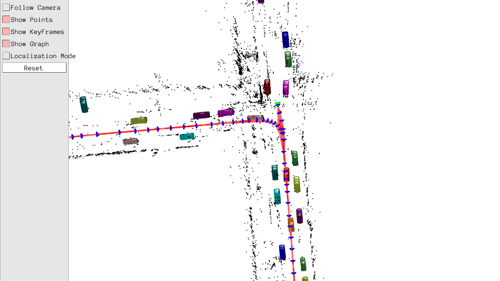
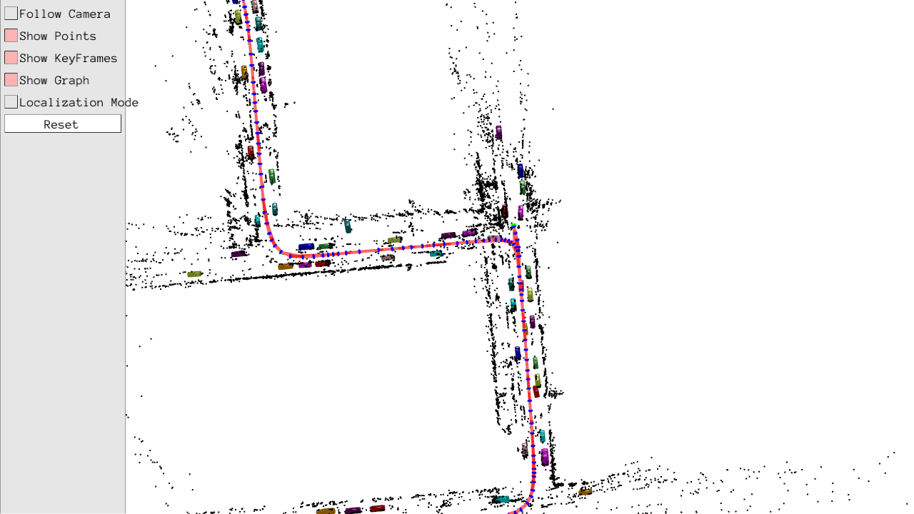
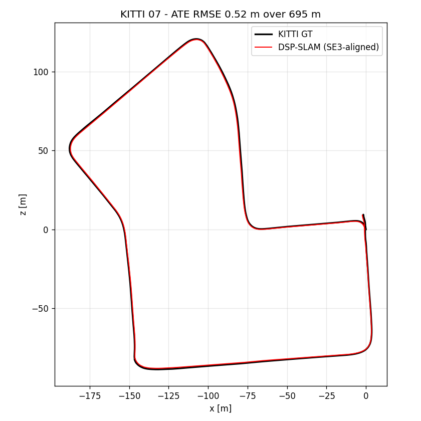

# DSP-SLAM

Object-oriented SLAM: ORB-SLAM2 (stereo) tracks the camera and builds a sparse map,
and every car it detects is reconstructed as a dense **DeepSDF** shape. Shape code
and 7-DoF object pose are optimised against the car's LiDAR points and its 2D mask,
and the objects enter bundle adjustment as extra landmarks.

- **Repo**: [JingwenWang95/DSP-SLAM](https://github.com/JingwenWang95/DSP-SLAM) (pinned to `ed14d02`, the last commit)
- **Paper**: [DSP-SLAM: Object Oriented SLAM with Deep Shape Priors](https://arxiv.org/abs/2108.09481) — Wang, Rünz and Agapito, 3DV 2021
- Also relevant: [DeepSDF](https://arxiv.org/abs/1901.05103) (Park et al., CVPR 2019 — the shape prior); [ORB-SLAM2](https://arxiv.org/abs/1610.06475) (Mur-Artal and Tardós, T-RO 2017 — the SLAM backbone)
- **Dataset**: KITTI odometry sequence **07** as packaged by the DSP-SLAM authors (stereo + Velodyne + pre-computed MaskRCNN / PointPillars labels) — [KITTI](https://www.cvlibs.net/datasets/kitti/eval_odometry.php)



The Pangolin viewer at the end of KITTI 07: sparse ORB-SLAM2 map points (black),
keyframes (blue) and trajectory (red), and one DeepSDF mesh per reconstructed car,
each in its own colour, parked along both sides of the street.

## Build

```bash
podman build -t localhost/slam_zero_to_hero:dsp_slam .
```

CUDA 12.8 + PyTorch 2.7.1 (cu128), so the DeepSDF optimisation runs on Blackwell
(sm_120). The C++ side is built as upstream built it: OpenCV 3.4, Eigen 3.4 and a
Feb-2022 Pangolin. The detectors run **offline**: KITTI 07 ships its MaskRCNN and
PointPillars outputs, so mmdetection / mmdetection3d are not installed. See
[NOTES.md](NOTES.md) for every difference from upstream.

## Download the dataset

```bash
python3 ../download_dsp_slam.py            # KITTI 07 + DeepSDF cars_64, ~3.6 GB
python3 ../download_dsp_slam.py --list     # Freiburg Cars, Redwood Chairs, detector weights
```

Everything lands in `~/data/dsp_slam/`. The script fetches from the authors'
[public SharePoint folder](https://liveuclac-my.sharepoint.com/:f:/g/personal/ucabjw4_ucl_ac_uk/Eh3nHv6D-LZHkuny4iNOexQBGdDVxloM_nwbEZdxeRfStw?e=sYO1Ot); no login needed.

```
~/data/dsp_slam/
├── kitti/07/
│   ├── image_0/ image_1/        # grey stereo pair, 1101 frames (ORB-SLAM2 input)
│   ├── image_2/                 # colour left (used for the object masks)
│   ├── velodyne/                # 1101 LiDAR scans
│   ├── labels/maskrcnn_labels/      # 2D boxes + masks, one .lbl per frame
│   ├── labels/pointpillars_labels/  # 3D boxes, one .lbl per frame
│   └── calib.txt times.txt
└── weights/deepsdf/cars_64/     # DeepSDF decoder, 64-d shape code
```

The local `~/data/kitti_vo_slam` copy cannot be used: its image zips are truncated
(no seq 07 images) and it has no DSP-SLAM labels.

## Run the algorithm

Headless: Xvfb inside the container, screenshots of the Pangolin viewer, map and
trajectory written to `results/`:

```bash
podman run --rm \
  --runtime=/usr/bin/nvidia-container-runtime \
  -e NVIDIA_VISIBLE_DEVICES=all -e NVIDIA_DRIVER_CAPABILITIES=compute,utility,graphics \
  -v ~/data/dsp_slam:/data:ro \
  -v $PWD/results:/results \
  localhost/slam_zero_to_hero:dsp_slam \
  /DSP-SLAM/scripts/run_kitti07_headless.sh /results
```

With the viewer on the host display instead (same image; not part of the headless
verification below):

```bash
podman run --rm -it \
  --runtime=/usr/bin/nvidia-container-runtime \
  -e NVIDIA_VISIBLE_DEVICES=all -e NVIDIA_DRIVER_CAPABILITIES=compute,utility,graphics \
  -e DISPLAY=$DISPLAY -e QT_X11_NO_MITSHM=1 -v /tmp/.X11-unix:/tmp/.X11-unix \
  -v ~/data/dsp_slam:/data:ro \
  -v $PWD/results:/results \
  localhost/slam_zero_to_hero:dsp_slam \
  ./dsp_slam Vocabulary/ORBvoc.bin configs/KITTI04-12.yaml /data/kitti/07 /results/map
```

Two windows open: the current frame with ORB features, and the Pangolin map with
keyframes, map points and the reconstructed car meshes. After the last frame the map
is saved and the program waits for a key in the frame window (or set
`-e DSP_SLAM_NO_WAIT=1`).

`results/map/` then holds `MapObjects.txt` (shape code + pose per car),
`MapPoints.txt`, `Cameras.txt` and `CameraTrajectory.txt` (KITTI format, all frames).
Score it against KITTI ground truth:

```bash
python3 scripts/eval_kitti.py results/map/CameraTrajectory.txt \
  ~/data/kitti_vo_slam/extracted/dataset/poses/07.txt --plot results/trajectory_vs_gt.png
```

## Supported datasets

| Dataset | Status | Notes |
|---|---|---|
| **KITTI 07** (authors' package) | ✅ | Default. Stereo + LiDAR, offline labels. 1101 frames, RMS ATE 0.52 m over 695 m, 99 cars reconstructed, loop closed |
| Other KITTI sequences | ❌ | No pre-computed labels; would need the online MaskRCNN + PointPillars (mmdet3d 0.17), which does not build for sm_120 here |
| Freiburg Cars (`freiburg_car001/002/010`) | not verified | Monocular (`dsp_slam_mono`, `configs/freiburg_*.yaml`); downloadable, not run here |
| Redwood Chairs (`redwood_*`) | not verified | Monocular, needs `deepsdf_chairs_64`; downloadable, not run here |

## Results (KITTI 07, RTX 5090)

Measured with the headless command above (the script writes the screenshots to `results/`, which git ignores; the ones shown here are copied to `docs/`):

| Metric | Value |
|---|---|
| Frames tracked | 1101 / 1101, no tracking loss |
| Keyframes / map points | 250 / 27,178 |
| Trajectory | 692.1 m estimated vs 694.7 m ground truth |
| **RMS ATE (SE(3)-aligned)** | **0.521 m** (mean 0.49 m, max 0.99 m, 0.07 % of path) |
| Loop closure | 1 (`Loop detected with objects!`) at the return to the start |
| Cars reconstructed | 99 map objects (`MapObjects.txt`: id, 7-DoF pose, 64-d shape code) |
| Shape optimisation | 118 calls, mean 0.086 s, max 0.59 s (first call, CUDA warm-up) |
| Wall time | 231 s including start-up; the loop replays at the yaml's 5 fps (1101 frames = 220 s) |

A second run gave RMS ATE 0.517 m and 96 cars (the object count varies with thread
timing). Ground truth is KITTI `poses/07.txt`.

| | |
|---|---|
|  |  |
| Zoomed out: the cars along every street of the loop | Estimated trajectory against KITTI ground truth |

[`docs/screen_final.png`](docs/screen_final.png) shows the map viewer together with the frame window
(tracked ORB features, `SLAM MODE | KFs: 250, MPs: 27178`).
