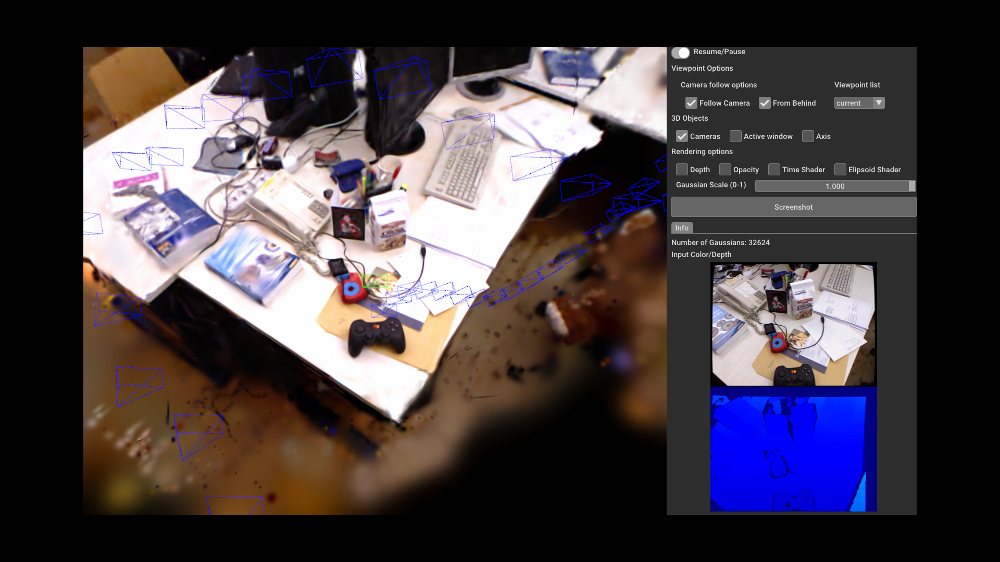
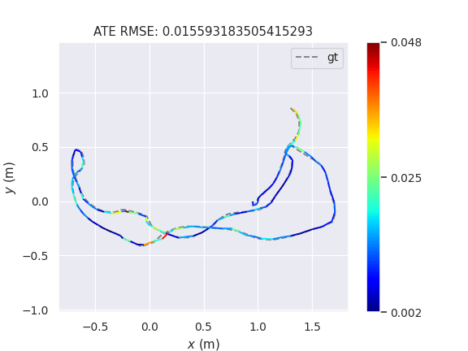
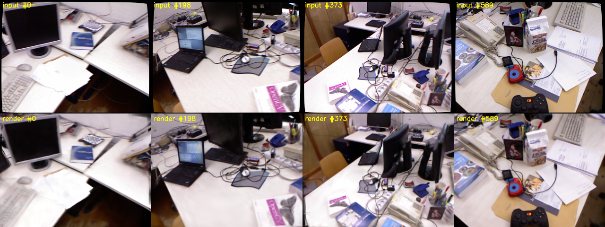
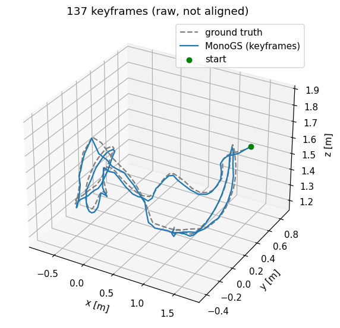
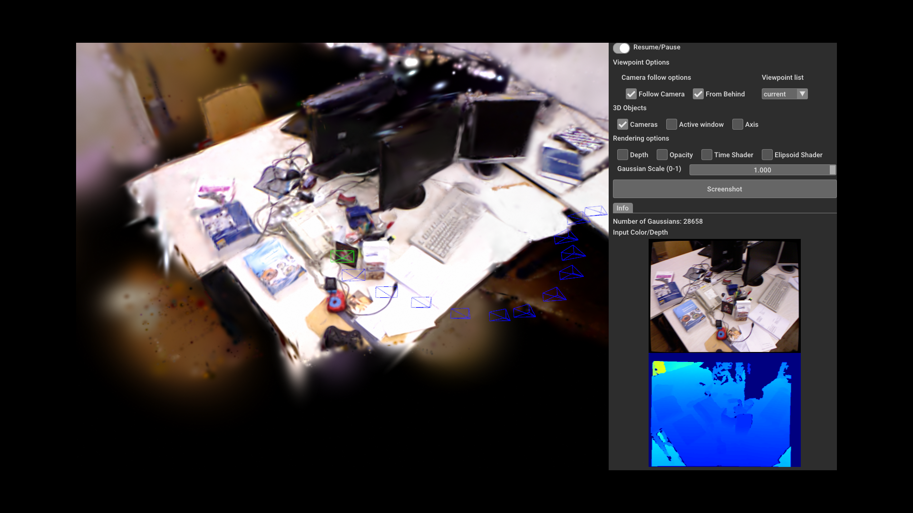

# Gaussian Splatting SLAM (MonoGS)

Dense SLAM whose only map is a set of 3D Gaussians. Every frame is tracked by
rendering the Gaussians with a differentiable rasteriser and optimising the camera
pose against the photometric (and, with RGB-D, depth) residual; a backend thread
optimises a window of keyframes and adds, splits and prunes Gaussians. There are no
features, no point cloud and no TSDF: the map you look at is the map that is tracked
against. This demo runs the RGB-D mode.

**Default dataset:** TUM RGB-D `rgbd_dataset_freiburg1_desk` (Kinect v1, 640x480,
595 depth / 613 colour frames, `~/data/tum_rgbd/`).

- **Repo**: [muskie82/MonoGS](https://github.com/muskie82/MonoGS) (pinned to `6c9254c`)
- **Paper**: [Gaussian Splatting SLAM](https://arxiv.org/abs/2312.06741) — Matsuki, Murai, Kelly and Davison, CVPR 2024 (Highlight, Best Demo)
- Also relevant: [3D Gaussian Splatting for Real-Time Radiance Field Rendering](https://arxiv.org/abs/2308.04079) (Kerbl et al., SIGGRAPH 2023 — the representation and the rasteriser this builds on)
- **Dataset**: [TUM RGB-D](https://cvg.cit.tum.de/data/datasets/rgbd-dataset) — [A Benchmark for the Evaluation of RGB-D SLAM Systems](https://cvg.cit.tum.de/_media/spezial/bib/sturm12iros.pdf), Sturm, Engelhard, Endres, Burgard and Cremers, IROS 2012



## Build

```bash
podman build -t localhost/slam_zero_to_hero:gaussian_splatting_slam .
```

CUDA 12.8.1 + PyTorch 2.7.1 (cu128) on Ubuntu 22.04. sm_120 (RTX 50-series) needs
CUDA 12.8 at least; the upstream conda recipe (CUDA 11.6, torch 1.12) cannot run a
kernel on it. The two CUDA extensions (`diff-gaussian-rasterization` with the
pose-gradient patch, `simple-knn`) are compiled for `--build-arg CUDA_ARCHS="8.6;8.9;12.0"`.
Verified on an RTX 5090, driver 580. The image is ~19 GB.

Four fixes are baked into the image:

| Problem | Fix |
|---|---|
| `simple_knn.cu` uses `FLT_MAX` without `<cfloat>` | `#include <cfloat>` patched in |
| evo defaults to the TkAgg backend, the image has no tkinter: the frontend dies on the first ATE evaluation and **the run then hangs forever** (backend and main process wait on it) | `evo_config set plot_backend Agg`, `MPLBACKEND=Agg` |
| evo 1.11 (which MonoGS needs for `align_trajectory`) calls `fig.colorbar` without `ax`, a `ValueError` on matplotlib >= 3.6 | `matplotlib==3.5.3`, `numpy<2` (MonoGS also uses `np.unicode_`) |
| Without `--eval`, `slam.py` joins the backend process without draining the queue the backend still pushes Gaussians into, so after `Total FPS` the process **never exits** | [`patches/slam_drain_backend_queue.patch`](patches/slam_drain_backend_queue.patch) drains it while joining |

wandb is installed because `slam.py` imports it, and `WANDB_MODE=disabled` is set so
`--eval` does not ask for a login.

## Download the dataset

```bash
python3 ../download_tum_3d.py
```

It fetches and extracts all 15 TUM RGB-D sequences in its list into
`~/data/tum_rgbd/` — there is no per-sequence option and no `--list`, so it always
walks all 15 (skipping any `.tgz` already present). On
this machine all 15 are already there. `rgbd_dataset_freiburg1_desk` is 353 MB:
`rgb/` 613 PNGs, `depth/` 595 16-bit PNGs (scale 5000), `groundtruth.txt` with
2335 mocap poses. MonoGS associates colour, depth and ground truth itself and ends
up with **592 frames**.

## Run the algorithm

MonoGS' own `configs/rgbd/tum/fr1_desk.yaml` reads
`datasets/tum/rgbd_dataset_freiburg1_desk`, so mounting `~/data/tum_rgbd` there is
all the wiring it needs. Headless, with the evaluation:

```bash
mkdir -p results/runs
podman run --rm \
  --runtime=/usr/bin/nvidia-container-runtime \
  -e NVIDIA_VISIBLE_DEVICES=all -e NVIDIA_DRIVER_CAPABILITIES=compute,utility \
  -v ~/data/tum_rgbd:/MonoGS/datasets/tum:ro \
  -v "$PWD/results/runs":/MonoGS/results \
  localhost/slam_zero_to_hero:gaussian_splatting_slam \
  python3 slam.py --config configs/rgbd/tum/fr1_desk.yaml --eval
```

`--eval` turns the GUI off and, after tracking, computes keyframe ATE, renders every
5th non-keyframe for PSNR/SSIM/LPIPS, runs 26k iterations of colour refinement and
renders again. Output goes to `results/runs/datasets_tum/<UTC timestamp>/`:
`plot/trj_final.json` (estimated and GT keyframe poses), `plot/stats_final.json`,
`plot/evo_2dplot_final.png`, `psnr/{before,after}_opt/final_result.json`,
`point_cloud/final/point_cloud.ply` (the Gaussians, standard 3DGS layout) and
`config.yml`.

Measured on 2026-09-28, RTX 5090 (GPU and CPU shared with other jobs). MonoGS runs
tracking and mapping in separate processes, so two runs of the same command do not
give identical numbers:

| Run | frames | keyframes | Gaussians | ATE RMSE (SE(3)-aligned, keyframes) | est. / GT path (keyframes) | PSNR / SSIM / LPIPS before -> after refinement | tracking time |
|---|---|---|---|---|---|---|---|
| `--eval` #1 (earlier build without the queue patch; same `--eval` code) | 592 | 139 | 35,425 | **1.44 cm** (mean 1.22, max 4.41) | 9.34 m / 9.23 m | 18.97 / 0.711 / 0.311 -> **23.48 / 0.782 / 0.248** | 332.5 s (1.78 fps) |
| `--eval` #2 (final image) | 592 | 137 | 38,693 | **1.56 cm** (mean 1.33, max 4.77) | 9.30 m / 9.23 m | 18.92 / 0.715 / 0.309 -> **23.73 / 0.786 / 0.244** | 311.5 s (1.90 fps) |
| GUI (`run_gui_capture.sh`) | 592 | — | 32,624 on screen at the end | 1.50 cm (running estimate) | — | — | 472.4 s (1.25 fps) |

The paper reports 1.50 cm ATE on fr1_desk for RGB-D MonoGS, so this reproduces it.
An `--eval` container takes about 7 minutes end to end (406 s for run #2: tracking,
evaluation and 26k refinement iterations). The GUI costs about a third of the
throughput. Run #2's numbers and trajectory are in
[docs/fr1_desk_eval/](docs/fr1_desk_eval/), and every figure on this page comes
from run #2 and the GUI run that followed it.



## Visualization

### Rendered views and trajectory (headless)

`scripts/render_views.py` reloads a finished run, renders the final Gaussians from
four estimated keyframe poses next to the input frames, and plots the 3D keyframe
trajectory against ground truth:

```bash
podman run --rm \
  --runtime=/usr/bin/nvidia-container-runtime \
  -e NVIDIA_VISIBLE_DEVICES=all -e NVIDIA_DRIVER_CAPABILITIES=compute,utility \
  -v ~/data/tum_rgbd:/MonoGS/datasets/tum:ro \
  -v "$PWD/results/runs":/MonoGS/results \
  localhost/slam_zero_to_hero:gaussian_splatting_slam \
  python3 /opt/scripts/render_views.py results/datasets_tum/<timestamp>
```

It writes `render_grid.png` and `trajectory_3d.png` into the run folder.





### The MonoGS GUI, on your desktop

Without `--eval` the stock config opens MonoGS' Open3D GUI: the rendered map from a
free or follow camera, keyframe frusta, the current frame, and switches for depth,
opacity and ellipsoid views.

```bash
xhost +local:
podman run --rm -it \
  --runtime=/usr/bin/nvidia-container-runtime \
  -e NVIDIA_VISIBLE_DEVICES=all -e NVIDIA_DRIVER_CAPABILITIES=compute,utility,graphics \
  -e DISPLAY=$DISPLAY -v /tmp/.X11-unix:/tmp/.X11-unix \
  -v ~/data/tum_rgbd:/MonoGS/datasets/tum:ro \
  -v "$PWD/results/runs":/MonoGS/results \
  localhost/slam_zero_to_hero:gaussian_splatting_slam \
  python3 slam.py --config configs/rgbd/tum/fr1_desk.yaml
```

The window closes itself when tracking ends (with the queue patch above; stock
MonoGS hangs there). This desktop variant was not run in this session; the headless
one below, which is the same GUI code under Xvfb, was.

### The MonoGS GUI, headless screenshots

`scripts/run_gui_capture.sh` runs the same GUI inside its own Xvfb (Mesa llvmpipe
for the window, CUDA for the splatting) and saves the whole screen every
`SHOT_EVERY` seconds (default 15):

```bash
podman run --rm \
  --runtime=/usr/bin/nvidia-container-runtime \
  -e NVIDIA_VISIBLE_DEVICES=all -e NVIDIA_DRIVER_CAPABILITIES=compute,utility \
  -v ~/data/tum_rgbd:/MonoGS/datasets/tum:ro \
  -v "$PWD/results/runs":/MonoGS/results \
  localhost/slam_zero_to_hero:gaussian_splatting_slam \
  /opt/scripts/run_gui_capture.sh configs/rgbd/tum/fr1_desk.yaml
```

Screenshots land in `results/runs/gui_shots/shot_NNN.png` (30 of them on fr1_desk).
Midway through (left) and at the end (right, the image at the top): the map rendered
from behind the current camera (green), keyframe frusta in blue, and the incoming
colour and depth on the right.

| ~75 s in | end of the sequence |
|---|---|
|  |  |

## Supported datasets

| Dataset | Config (in the image) | Status |
|---|---|---|
| **TUM RGB-D `freiburg1_desk`** (default) | `configs/rgbd/tum/fr1_desk.yaml` | ✅ ATE 1.44 / 1.56 cm, 23.5-23.7 dB after refinement, 1.8-1.9 fps; GUI verified |
| TUM RGB-D `freiburg2_xyz`, `freiburg3_long_office_household` | `configs/rgbd/tum/fr2_xyz.yaml`, `fr3_office.yaml` | on disk, config ships, not run here |
| TUM RGB-D, monocular | `configs/mono/tum/*.yaml` | config ships, not run here |
| Replica (RGB-D) | `configs/rgbd/replica/*.yaml` | config ships, not run here; data via `../download_replica.py` |
| EuRoC MAV (stereo) | `configs/stereo/euroc/mh02.yaml` | config ships, not run here |

For the other TUM sequences use the same Run command with the other config: all
three expect `datasets/tum/<sequence>`, which the `-v ~/data/tum_rgbd:/MonoGS/datasets/tum:ro`
mount already provides.

## Notes

- **A crash inside the frontend does not end the process.** The backend and
  `slam.py` keep waiting on queues, the container stays up and keeps GPU memory. If
  the log shows a Python traceback and nothing moves for a minute, `podman kill` it.
- `Total FPS` in the log is frames / wall time of the tracking loop with the backend
  running in parallel, not the rasteriser's speed.
- ATE is computed on keyframes only (137-139 of 592 frames), SE(3)-aligned (RGB-D has
  metric scale), as in the paper.
