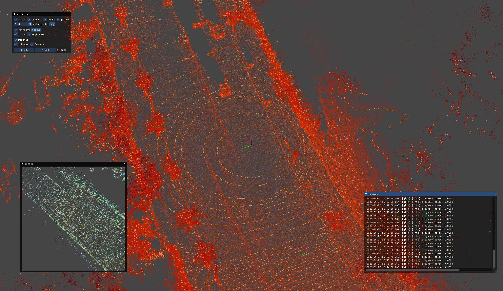
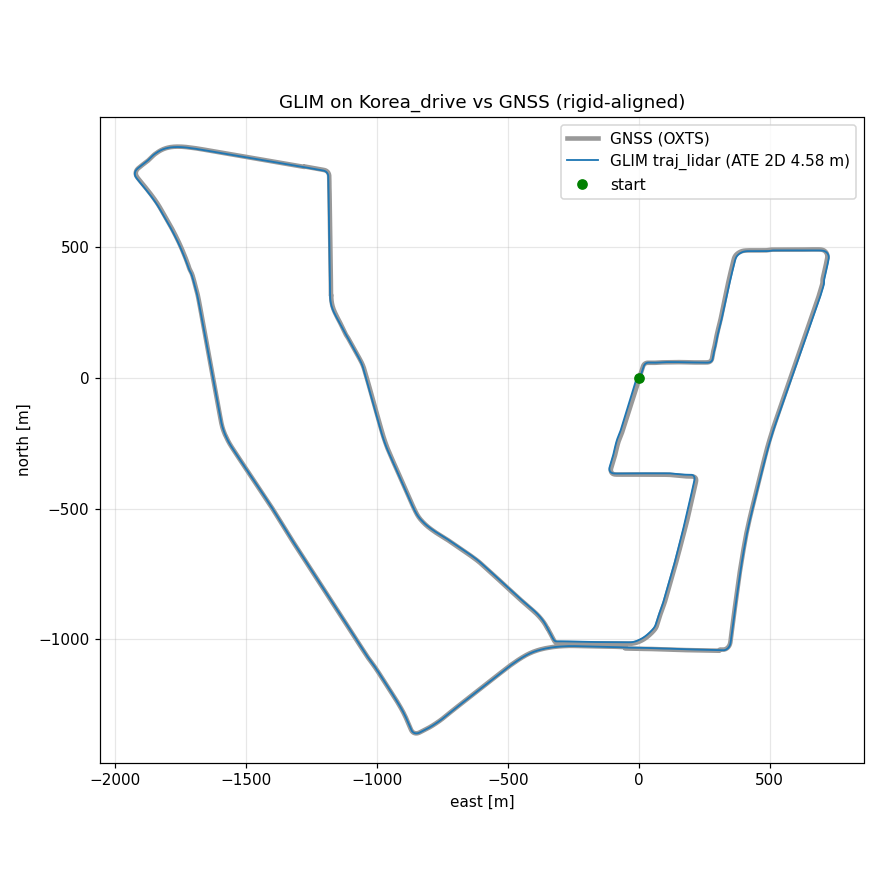

# GLIM

Versatile range-inertial SLAM on GTSAM factor graphs: fixed-lag smoothing odometry, submap-based local mapping, and global factor-graph optimization with GPU-accelerated scan-matching factors.

- **Repo**: [koide3/glim](https://github.com/koide3/glim) (`v1.0.0`) + [koide3/glim_ros2](https://github.com/koide3/glim_ros2) (`v1.0.0`)
- **Paper**: [GLIM: 3D Range-Inertial Localization and Mapping with GPU-Accelerated Scan Matching Factors](https://arxiv.org/abs/2407.10344) — Koide et al., Robotics and Autonomous Systems 2024
- Underlying registration: [Voxelized GICP for Fast and Accurate 3D Point Cloud Registration](https://doi.org/10.1109/ICRA48506.2021.9560835) — ICRA 2021

The default dataset is **Korea_drive**, a ROS 2 bag of a 27-minute, 11 km vehicle drive with a Hesai LiDAR (109k points/scan), a 100 Hz OXTS IMU and GNSS. With a real IMU, GLIM's **GPU odometry** (`libodometry_estimation_gpu.so`) runs, and that is the configuration used here.



## Data

```bash
ls ~/data/Korea_drive/KOREA_DRIVE      # KOREA_DRIVE.db3 (49 GB) + metadata.yaml
```

The bag is 1638 s long and holds 520,271 messages: `/surf/hesai_lidar` (16,379 × PointCloud2), `/surf/oxts/imu` (163,765 @ 100 Hz) and `/surf/oxts/gnss/fix` (163,765). There is no public download link and no `download_*.py` for it; it was copied onto this host by hand. KITTI (secondary) comes from `python3 download_kitti.py` at the repo root.

## Build

```bash
podman build -t slam_zero_to_hero:glim .
```

The image uses CUDA 12.9.1 for sm_120 (RTX 5090), GTSAM 4.2.0, gtsam_points v1.0.0, glim v1.0.0, ROS 2 Jazzy and glim_ros2 v1.0.0. A cold build takes about 35 min. Why 12.9.1 and not 13.x is explained in [NOTES.md](NOTES.md).

## Run — Korea_drive with the viewer (default)

```bash
mkdir -p results/korea_drive
podman run --rm \
  --runtime=/usr/bin/nvidia-container-runtime \
  -e NVIDIA_VISIBLE_DEVICES=all -e NVIDIA_DRIVER_CAPABILITIES=compute,utility,graphics \
  -e DISPLAY=$DISPLAY -v /tmp/.X11-unix:/tmp/.X11-unix \
  -v ~/data/Korea_drive/KOREA_DRIVE:/bag:ro \
  -v "$PWD/results/korea_drive":/tmp/dump \
  slam_zero_to_hero:glim \
  glim_rosbag /bag --ros-args -p config_path:=/usr/local/share/glim_korea/config_viewer -p auto_quit:=true
```

An iridescence window (`screen`) shows the current scan, the odometry keyframes and the growing submap map, with a top-down `submap` inset. The viewer config plays the bag in **real time** (27 min for the full drive); see [Smooth viewer](#smooth-viewer--what-was-tuned-and-why). With `auto_quit:=true` the process saves the map to `results/korea_drive/` and exits when the bag ends. Drop it to keep the window open afterwards; you then stop the process with Ctrl-C, and the map is still saved. No `xhost` and no `--net=host` are needed (rootless podman).

For a **headless** run, use `config_path:=/usr/local/share/glim_korea/config` and leave out the `DISPLAY`/X11 lines.

Evaluate against the GNSS track. The script reads NavSatFix from the `.db3` directly, with no ROS needed:

```bash
python3 scripts/eval_korea_gnss.py results/korea_drive ~/data/Korea_drive/KOREA_DRIVE results/korea_trajectory_vs_gnss.png
```

Four things are easy to get wrong here, and all of them fail silently:

- Mount the bag **directory**, not the `.db3`. The `.db3`'s embedded `metadata` table names a different filename than the file on disk.
- The dump path is **hard-coded to `/tmp/dump`**, so bind-mount that or you get no output.
- Parameters need `--ros-args -p …`. A bare `-p config_path:=…` is parsed as a *remap rule*: it silently falls back to the default config and then segfaults with no display.
- Without `-p auto_quit:=true`, `glim_rosbag` calls `rclcpp::spin()` after the bag and never exits.

## Results — Korea_drive, full bag (GPU odometry, viewer on)

Measured on 2026-09-27 with the command above, before the viewer tuning below: playback was unthrottled (`playback_speed` 0.0) and `librviz_viewer.so` was still loaded, so this run shows the pipeline's throughput with rendering on:

| | value |
|---|---|
| poses | 16,367 of 16,379 scans (the first 12 are consumed by IMU initialisation) |
| submaps / matching-cost factors | 126 / 113 (`vgicp_gpu`) |
| path | 10,989 m (GNSS 11,012 m) |
| ATE vs GNSS, rigid alignment (`traj_lidar`) | **4.58 m rmse 2D**, 12.9 m rmse 3D, max 42 m |
| wall time | 835 s for 1638 s of data (**1.96× real time**), exit 0 |



The horizontal track follows GNSS closely. The residual is vertical: the SLAM start-to-end gap is 43 m, against 2.0 m for GNSS. The loop does not close in height, and `T_lidar_imu` yaw and lever arm are uncalibrated (see [NOTES.md](NOTES.md)).

## Smooth viewer — what was tuned and why

The viewer config (`/usr/local/share/glim_korea/config_viewer`, derived from `config_korea/` in the Dockerfile) differs from the headless one in three ways:

| Setting | Value | Why |
|---|---|---|
| `glim_ros/playback_speed` (`config_ros.json`) | **1.0** | Real time. With 0.0 the bag is read as fast as GLIM can go, about 2× real time with the viewer on, so the map jumps ahead instead of building at the speed the car drove. The headless config keeps 0.0. |
| `glim_ros/extension_modules` | `libstandard_viewer.so` only | `librviz_viewer.so` is dropped. rviz2 is not installed, so it only serialized every scan and the map to ROS topics that nobody subscribed to. |
| `standard_viewer/enable_partial_rendering` (`config_viewer.json`) | **true** | iridescence draws the accumulated submaps within a per-frame point budget (`partial_rendering_budget` 1024) instead of redrawing every point each frame. |

Does odometry keep up at 1.0? It does. Verified on 2026-09-28 with the **Run command above, verbatim**, on the rebuilt image (`slam_zero_to_hero:glim` 1b031f4e5307, whose `config_viewer` loads only `libstandard_viewer.so` and has partial rendering on). The run was stopped after 600 s of wall time with SIGINT (`podman kill -s INT`), which still saves the map:

| Check | Result |
|---|---|
| Modules loaded (log) | `libodometry_estimation_gpu.so`, `libsub_mapping.so`, `libglobal_mapping.so`, `libstandard_viewer.so`. No `librviz_viewer.so` |
| `playback speed` log (114 samples, one every 5 s) | 87 at 1.000×, every other sample within 0.995–1.005× except the first (5.0×, the startup burst before pacing locks on) |
| Backlog at stop | 10 ms from `waiting for odometry estimation` to `waiting for local mapping`, so the odometry queue was empty; exit 0 two seconds after SIGINT |
| Output | 5,940 poses over 594 s of bag, 0 NaN |
| Accuracy on that segment | 4,984 m path 2D (GNSS 4,998 m), ATE **2.38 m** 2D / 8.92 m 3D (`traj_lidar`), 17 caught ISAM2 exceptions |
| Load | glim_rosbag 0.7–2.9 CPU cores (mostly 1–1.5), 4.1 GB RSS after 10 min, whole-GPU utilisation 3–34 % (shared with other jobs) |

An earlier 617 s run of the same config (bind-mounted before the rebuild) gave RTF 1.00 and ATE 2.70 m 2D / 5.88 m 3D; the difference is run-to-run variance of the threaded pipeline.

**Before/after on a fixed slice.** These runs used the first 300 s of the bag (3,000 scans) with the viewer on and `-p debug:=true`. Per-scan odometry time is the gap between `insert_frame` and `frames updated` in `glim_odom.log`. Queue depth is the number of scans the reader had inserted that odometry had not yet started. Each run was started only at a 1-min load average below 10 (4–6 measured), pinned to 16 cores:

| Config | odometry ms/scan (median / p95) | real-time factor | queue max | gap between viewer updates (p99 / max) | ATE 2D / 3D |
|---|---|---|---|---|---|
| before: rviz + standard viewer, no partial rendering, playback 0.0 | 9 / 21 | 5.2× | 12 | 53 / **608 ms** (3 stalls > 300 ms) | 1.62 / 2.05 m |
| standard viewer only + partial rendering, playback 0.0 | 10 / 22 | 8.0× | 57 | 33 / 40 ms | 1.57 / 2.29 m |
| same, `random_downsample_target` 10000 | 7 / 16 | 10.3× | 16 | 27 / 74 ms | 1.65 / 2.06 m |
| **shipped: standard viewer + partial rendering, playback 1.0** | 10 / 21 | **1.00×** | **2** | **117 / 144 ms** (one update per scan) | 1.60 / 2.01 m |

GLIM itself was never the bottleneck. Odometry needs about 10 ms of the 100 ms scan period, and the queue drains within 0.1 s of the end of the bag in every row. What looked like lag had two causes. First, playback 0.0 feeds the viewer in bursts at 5–8× real time, and dropping `librviz_viewer.so` also removes stalls of up to 0.6 s. Second, the host itself was saturated: a 1-min load of 30–48 on 32 cores from other containers, which slows both the reader and the renderer. With playback 1.0, updates arrive at an even 10 Hz and the queue stays at 1–2 scans. `random_downsample_target` stays at 20000, because 10000 buys headroom that is not needed and does not change accuracy.

## Supported datasets

| Dataset | Config | Status |
|---|---|---|
| **Korea_drive** — ROS 2 bag, 27 min drive (Hesai 109k pts/scan + 100 Hz IMU + GNSS) | `/usr/local/share/glim_korea/config_viewer` (viewer) or `…/config` (headless) | ✅ **default**: 16,367 poses over 11.0 km, ATE **4.6 m 2D** / 12.9 m 3D vs GNSS; the viewer config keeps up at real time (README command re-verified on 600 s: ATE 2.38 m 2D) |
| KITTI odometry seq 04 | `glim_kitti /usr/local/share/glim_kitti/config` | ✅ 261 poses, 376.6 m estimated path (ground truth 393.7 m), ATE mean 2.60 m / rmse 3.57 m (`odom_lidar`) |
| KITTI odometry seq 00 | same, or `config_posegraph` | ✅ 4531 poses, 3708 m, ATE 11.5 m (10.2 m with `config_posegraph`) |
| KITTI, CUDA path | `config_gpu` | ✅ same accuracy, no speedup: GPU odometry needs an IMU, which KITTI lacks |
| Any other LiDAR **+ IMU** ROS 2 bag | copy `config_korea/` | Set the topics in `config_ros.json` and `T_lidar_imu` in `config_sensors.json` |

### KITTI (secondary)

KITTI has no IMU and no ROS bag, and upstream ships **no executable** that reads it. The image therefore adds `glim_kitti`, a driver that feeds velodyne `.bin` scans through the real GLIM pipeline. It needs `times.txt`; sequences 00 and 04 are extracted on this host.

```bash
podman run --rm --network none \
  -v ~/data/kitti_vo_slam/extracted/dataset/sequences/04:/data/seq04:ro \
  -v "$PWD/results":/output \
  slam_zero_to_hero:glim \
  glim_kitti /usr/local/share/glim_kitti/config /data/seq04 /output/dump_seq04
python3 kitti/eval_kitti.py results/dump_seq04 ~/data/kitti_vo_slam/extracted/dataset/sequences/04 ~/data/kitti_vo_slam/extracted/dataset/poses/04.txt
```

Add the GPU/X11 flags from the Korea_drive command plus `-e GLIM_KITTI_VIEWER=1` to watch it. The KITTI numbers, the config edits and the CUDA details are in [NOTES.md](NOTES.md).
