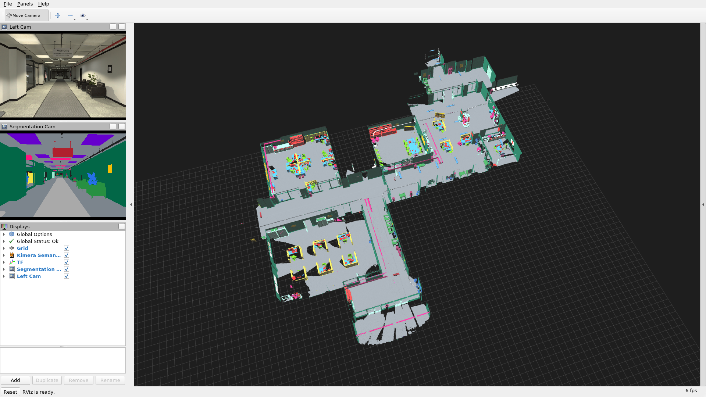
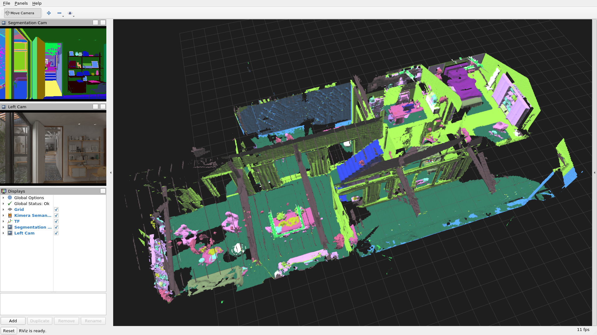

# Kimera-Semantics

Real-time metric-semantic 3D reconstruction from MIT SPARK. Each depth image is
back-projected into a point cloud whose colour is the **2D semantic segmentation**
label of that pixel; Kimera-Semantics fuses those labelled clouds into a voxblox TSDF,
keeps a per-voxel label probability (Bayesian update), and meshes the result with the
mesh coloured by the most likely class. Poses come from TF — here the simulator's
ground truth, so this demo isolates the mapping half of Kimera.

> **Dataset substitution.** The demo bag the Kimera-Semantics README asks for,
> `kimera_semantics_demo.bag`, is gone: its Google Drive file has been deleted (HTTP 404,
> checked 2026-09). This folder uses uHumans2 instead, from the same lab, the same
> TESSE simulator and the same `/tesse/*` topics. The default is the **office**
> (`office_s1_00h`, a whole office floor, 8.4 min); the small **apartment**
> (`apartment_s1_00h`, 2.3 min) is kept as a quick run. See
> [Download the dataset](#download-the-dataset).

- **Repo**: [MIT-SPARK/Kimera-Semantics](https://github.com/MIT-SPARK/Kimera-Semantics) (`1ed69c6`, built on [ethz-asl/voxblox](https://github.com/ethz-asl/voxblox) `c8066b0`)
- **Paper**: [Kimera: an Open-Source Library for Real-Time Metric-Semantic Localization and Mapping](https://arxiv.org/abs/1910.02490) — Rosinol, Abate, Chang and Carlone, ICRA 2020
- Also relevant: [Kimera: from SLAM to Spatial Perception with 3D Dynamic Scene Graphs](https://arxiv.org/abs/2101.06894) (IJRR 2021, which introduced the uHumans2 dataset used here); [Voxblox](https://arxiv.org/abs/1611.03631) (Oleynikova et al., IROS 2017)
- **Dataset**: [uHumans2](https://web.mit.edu/sparklab/datasets/uHumans2/) `office_s1_00h` (default) and `apartment_s1_00h` — Unity/TESSE simulator, the same one the original Kimera-Semantics demo bag was rendered with
- **GPU**: optional. With the NVIDIA runtime flags in [Run](#run), RViz renders on the GPU (11–15 % CPU); without them it falls back to Mesa's software GL (130–370 % CPU). Kimera itself is CPU-only



The final mesh of `uHumans2_office_s1_00h` after the whole bag, coloured by class:
floor grey, walls dark green, desk partition screens yellow, tables blue, chairs
lime, shelves mint, bookshelves red, sofas green, air vents pink (TESSE calls them
appliance). Three open-plan rooms, a meeting room, the lobby and the corridors
between them. Left: the segmentation image Kimera is fed, and the RGB view. The
ceiling is in the mesh too, but RViz culls back faces, so from above you look straight
through it.

Measured on this machine (all frames, ground-truth pose):

| | office (default) | apartment (quick) |
|---|---|---|
| Sequence | 506 s, 264 m ground-truth camera path | 138 s, 49 m |
| Input | 8307 depth + segmentation frames → 8307 labelled clouds | 1779 → 1779 |
| Mesh | **2.70 M vertices, 3.03 M faces** (2,695,367–2,695,729 over five runs, bz2 and LZ4) | 755 k vertices, 781 k faces |
| Extent | **54.6 × 52.8 × 3.4 m** (one floor) | 23.3 × 18.1 × 7.8 m (two floors) |
| Classes in the mesh | floor 49.4 % (half of it is the ceiling, see below), wall 24.8 %, furniture 4.5 %, appliance 3.9 %, screen 3.3 %, table 2.4 %, objects 1.7 %, chair 1.6 %, couch 1.4 %, books 1.2 %, ceiling 1.2 %, unknown (white) 1.2 %, 6 more below 1 % | wall 42.8 %, ceiling 16.5 %, floor 13.5 %, plant 7.8 %, furniture 5.4 %, … (17 classes + unknown) |
| Wall clock | **507 s for the 506 s bag (1.0× real time)** from the LZ4 copy; 1487–1557 s (0.33×) from the bz2 download | 139 s (1.0×) from LZ4; 374–401 s (0.34–0.37×) from bz2 |
| Peak RAM (whole container incl. RViz) | 8.6–9.9 GB | — |

The downloaded bags are bz2-compressed, and `rosbag play` spends one full core
decompressing them: that alone holds the office to 0.33× real time. Re-compressed as
LZ4 once (see [Download the dataset](#download-the-dataset)), the same bag plays at
1.0× with `rosbag play` at 12 % CPU, and the mesh is the same (2,695,729 vertices).
RViz is the other cost: software GL on 130–370 % CPU, against 11–15 % with the NVIDIA GL.

| Office run (same mesh every time) | Bag | RViz GL | Playback | rosbag play CPU | RViz CPU (`ps` samples) | Load avg at start |
|---|---|---|---|---|---|---|
| headless, Xvfb | bz2 | software (llvmpipe) | 1557 s, 0.33× | 100 % (bound) | 150–370 % | 18.8 |
| headless, Xvfb, second run in parallel | bz2 | software | 1487 s, 0.34× | 100 % (bound) | 150–370 % | 5.6 |
| on-screen | bz2 | software | 1525 s, 0.33× | 100 % (bound) | 150–370 % | 5.6 |
| headless, Xvfb | **LZ4** | software | **507 s, 1.0×** | 12 % | 130–190 % | 4.6 |
| **on-screen ([Run](#run) command)** | **LZ4** | **NVIDIA RTX 5090** | **508 s, 1.0×** | 12–15 % | 11–15 % (15 fps) | 2.5 |

Kimera keeps up at 1.0×: it integrates one labelled cloud per 0.2 s and runs at
~420 % CPU on average while doing so. Parameters are the same for both scenes (5 cm
voxels, 10 m rays); why the office did not need coarser ones is in
[NOTES.md](NOTES.md#office-parameters).

## Build

```bash
podman build -t slam_zero_to_hero:kimera .
```

ROS Noetic (`osrf/ros:noetic-desktop-full`) + catkin. Every catkin source — voxblox,
minkindr, the `*_catkin` wrappers and Kimera-Semantics itself — is pinned to a commit.
The lecture launch file, RViz configs, label csv and scripts are copied to `/kimera/`.

## Download the dataset

```bash
python3 ../download_kimera_semantics.py office_00h      # -> ~/data/kimera_semantics/uHumans2_office_s1_00h.bag (16.8 GB)
python3 ../download_kimera_semantics.py apartment_00h   # -> uHumans2_apartment_s1_00h.bag (2.7 GB), the quick run
python3 ../download_kimera_semantics.py --list          # the 12 uHumans2 bags
```

Then re-compress once to LZ4, which is what makes real-time playback possible (bz2
decompression pins `rosbag play` to one core at 0.33× real time):

```bash
podman run --rm -v ~/data/kimera_semantics:/data slam_zero_to_hero:kimera bash -c 'mkdir -p /data/lz4 && rosbag compress --lz4 --output-dir=/data/lz4 /data/uHumans2_office_s1_00h.bag && mv /data/lz4/uHumans2_office_s1_00h.bag /data/uHumans2_office_s1_00h_lz4.bag && rmdir /data/lz4'
```

That took 42 min for the office (→ 26.0 GB) and 8–11 min for the apartment (→ 4.5 GB;
same command with `apartment`). `run_uhumans2.sh` with no bag argument plays
`uHumans2_office_s1_00h_lz4.bag` if it exists, else the bz2 original. Once the LZ4
copy works, the bz2 original can go.

The Kimera-Semantics README points at a single demo bag, `kimera_semantics_demo.bag`.
**That Google Drive file no longer exists** (HTTP 404 for both ids ever published for
it, checked 2026-09). Run with no argument, the script still tries it first and then
falls back to the apartment bag. `_00h` means no humans in the scene.

What Kimera-Semantics reads from the office bag (506 s; 15.7 GB as downloaded (bz2),
26.0 GB as LZ4, 40.4 GB uncompressed):

| Topic | Type | Used for |
|---|---|---|
| `/tesse/depth_cam/mono/image_raw` | `sensor_msgs/Image` 720×480 `32FC1`, 8307 frames | geometry |
| `/tesse/seg_cam/rgb/image_raw` | `sensor_msgs/Image` 720×480 `rgb8`, 8307 frames | per-pixel class (colour-coded) |
| `/tesse/left_cam/camera_info` | `sensor_msgs/CameraInfo`, fx = fy = 415.7 | back-projection |
| `/tf`, `/tf_static` | `world → base_link_gt → left_cam` | ground-truth sensor pose |

The apartment bag has the same topics (138 s, 1779 frames of each).

Segmentation colours map to 21 classes through a csv. The office uses
[`config/uhumans2_office_segmentation_mapping.csv`](config/uhumans2_office_segmentation_mapping.csv):
TESSE's `office1` csv plus one row it lacks (the stairwell wall colour). The apartment
uses TESSE's `archviz1` csv from Kimera-Semantics. `run_uhumans2.sh` picks the csv and
the RViz view from the bag name. Why `office1` and not the `office2` csv upstream's
uHumans2 launch uses is in [NOTES.md](NOTES.md#label-mapping-for-the-office).

## Run

One command starts roscore, `depth_image_proc` (depth + segmentation → labelled
cloud), `kimera_semantics_node` and RViz, plays the bag, saves the mesh and prints the
statistics:

```bash
podman run --rm \
  --runtime=/usr/bin/nvidia-container-runtime \
  -e NVIDIA_VISIBLE_DEVICES=all -e NVIDIA_DRIVER_CAPABILITIES=graphics,compute,utility \
  -e DISPLAY=$DISPLAY -e QT_X11_NO_MITSHM=1 -v /tmp/.X11-unix:/tmp/.X11-unix \
  -v ~/data/kimera_semantics:/data:ro \
  -v $PWD/results:/out \
  slam_zero_to_hero:kimera \
  /kimera/scripts/run_uhumans2.sh /data/uHumans2_office_s1_00h_lz4.bag
```

For the quick run, pass `/data/uHumans2_apartment_s1_00h_lz4.bag` instead. The bz2
originals also work, at a third of real time.

RViz shows the semantic mesh growing room by room along with the segmentation and RGB
images. The script keeps RViz open after the bag ends; Ctrl-C to quit. No `xhost`
change or `--net=host` is needed. The `--runtime`/`NVIDIA_*` lines give RViz the GPU
(the script prints `RViz GL: NVIDIA ...`); leave them out on a machine without one and
RViz uses software GL. With plain Docker, `--gpus all` does the same job.

Mouse in RViz (course-wide scheme, [rviz_unified_controls](../rviz_unified_controls/)):
left drag rotates, wheel zooms, right or middle drag pans.

Headless (private Xvfb inside the container, software GL, screenshot at the end) —
this is how the image above was made:

```bash
podman run --rm -e HEADLESS=1 \
  -v ~/data/kimera_semantics:/data:ro \
  -v $PWD/results:/out \
  slam_zero_to_hero:kimera \
  /kimera/scripts/run_uhumans2.sh /data/uHumans2_office_s1_00h_lz4.bag
```

`run_uhumans2.sh [bag] [rate]` also takes `RVIZ=0` (no viewer) and `CSV=<label csv>`
(for another uHumans2 scene). Outputs in `results/`:

| File | Content |
|---|---|
| `kimera_semantics_mesh.ply` | final mesh, vertex colour = class colour (260 MB ASCII for the office) |
| `rviz_semantic_mesh.png` | RViz screenshot (headless mode; the copy in `docs/` is the one shown above) |
| `run_stats.txt` | GT path length, frames, labelled clouds, mesh updates, wall time |
| `mesh_stats.txt` | vertices, faces, bounding box, extent, share of each class |
| `kimera_semantics.log`, `rviz.log` | node logs |

To look at a finished mesh again without replaying the bag:

```bash
podman run --rm \
  -e DISPLAY=$DISPLAY -e QT_X11_NO_MITSHM=1 -v /tmp/.X11-unix:/tmp/.X11-unix \
  -v $PWD/results:/out \
  slam_zero_to_hero:kimera \
  /kimera/scripts/view_mesh.sh /out/kimera_semantics_mesh.ply
```

`view_mesh.py` turns the PLY back into a `voxblox_msgs/Mesh` message for the same RViz
config (add `/kimera/config/kimera_semantics_uhumans2_apartment.rviz` as a second
argument for the apartment).

To drive it by hand instead:

```bash
roslaunch /kimera/launch/kimera_semantics_uhumans2.launch     # sensor_frame:=, voxel_size:=, semantic_color_mode:=color
rosbag play --clock /data/uHumans2_office_s1_00h_lz4.bag
rviz -d /kimera/config/kimera_semantics_uhumans2.rviz
rosservice call /kimera_semantics_node/generate_mesh           # writes mesh_filename (default /out/kimera_semantics_mesh.ply)
```

## Supported datasets

| Dataset | Launch / label csv | Status |
|---|---|---|
| **uHumans2 `office_s1_00h`** (default) | `kimera_semantics_uhumans2.launch` + `config/uhumans2_office_segmentation_mapping.csv` | ✅ verified: 2.70 M-vertex semantic mesh of a 55 × 53 m office floor, 17 classes + unknown, 8.5 min from LZ4, see above |
| uHumans2 `apartment_s1_00h` (quick) | same launch + `tesse_multiscene_archviz1_segmentation_mapping.csv` (picked automatically) | ✅ verified: 755 k-vertex mesh, 23 × 18 m, two floors, 17 classes + unknown, 139 s from LZ4 |
| uHumans2 `office_s1_06h` / `_12h`, `apartment_s1_01h` / `_02h` | same | Not run. Same scenes with 6–12 (office) or 1–2 (apartment) simulated humans; label 20 (human) is listed in `dynamic_semantic_labels`. |
| uHumans2 subway / neighborhood | same launch, `CSV=` `…underground1…` / `…neighborhood1…` | Not run (13–21 GB each). |
| `kimera_semantics_demo.bag` (upstream README) | upstream `kimera_semantics.launch play_bag:=true` | ❌ unobtainable — Google Drive file deleted (HTTP 404) |
| EuRoC MAV (no semantics) | upstream `kimera_semantics_euroc.launch`, needs Kimera-VIO-ROS for pose + stereo depth | Not built here |

The apartment result:



Why this dataset instead of the demo bag, and what was measured, is in [NOTES.md](NOTES.md).
