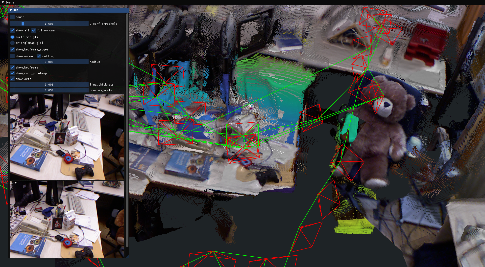
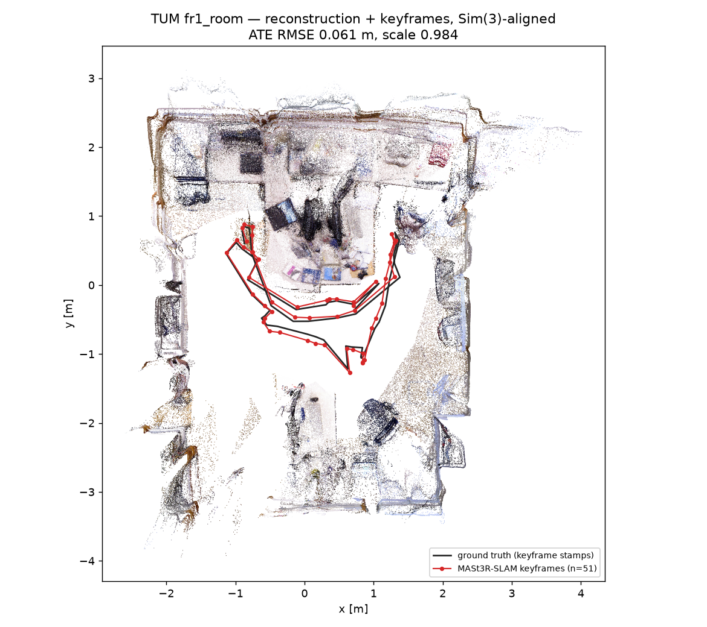
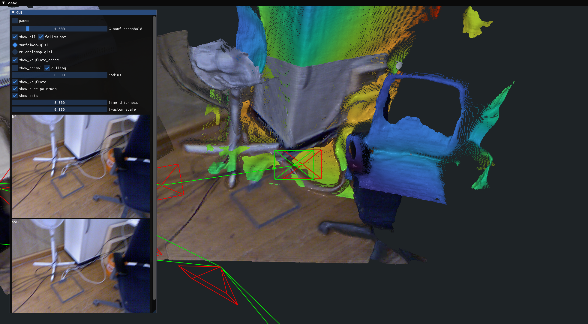

# MASt3R-SLAM

Dense monocular SLAM built on the MASt3R two-view 3D reconstruction prior. Every frame
is matched against the current keyframe with MASt3R pointmaps, tracked by a
ray/pixel Gauss-Newton solve, and keyframes are fused into a global pointmap; loops are
found with MASt3R's retrieval head and closed by a second-order global optimisation.
No depth sensor is used: TUM's depth images are ignored.

**Default dataset:** TUM RGB-D `rgbd_dataset_freiburg1_room` (`~/data/tum_rgbd/`, the
sequence upstream's own example uses).

- **Repo**: [rmurai0610/MASt3R-SLAM](https://github.com/rmurai0610/MASt3R-SLAM) (commit `e6f4e3d`)
- **Paper**: [MASt3R-SLAM: Real-Time Dense SLAM with 3D Reconstruction Priors](https://arxiv.org/abs/2412.12392) — Murai, Dexheimer and Davison, CVPR 2025
- Prior: [Grounding Image Matching in 3D with MASt3R](https://arxiv.org/abs/2406.09756) — Leroy, Cabon and Revaud, ECCV 2024
- **Dataset**: [TUM RGB-D](https://cvg.cit.tum.de/data/datasets/rgbd-dataset) — Sturm et al., IROS 2012



The MASt3R-SLAM viewer at the end of `fr1_room` (captured headless in the container):
the fused dense pointmap, keyframe frusta (red) and the factor-graph edges (green),
including the retrieval loop closures back to the desk. The panels on the left are the
current keyframe and the current frame.

## Build

```bash
podman build -t slam_zero_to_hero:mast3r_slam .
```

CUDA 12.8.1 + PyTorch 2.7.1 (cu128), Python 3.11. The three CUDA extensions
(MASt3R-SLAM's Gauss-Newton/matching backend, lietorch, MASt3R's `curope`) are compiled
for sm_86, sm_89 and **sm_120**, so the image runs on an RTX 5090 as well as 30xx/40xx
cards. Upstream targets torch 2.5 / sm_86 and does not build unchanged on this stack; the
source patches are applied with `sed` in the Dockerfile and listed in [NOTES.md](NOTES.md).

The MASt3R ViT-L metric checkpoint, the retrieval head and its codebook (3.0 GB) are
downloaded into the image at build time (`/checkpoints`, linked as
`/MASt3R-SLAM/checkpoints`). The image is 21.9 GB.

## Download the dataset

```bash
python3 ../download_tum_3d.py
```

This fetches and extracts all 15 TUM RGB-D sequences it knows into `~/data/tum_rgbd/`
(there is no `--list` and no per-sequence option; it downloads everything, then deletes
the archives). `rgbd_dataset_freiburg1_room` is 805 MB: 1362 RGB frames (640×480),
1360 depth frames and 4890 ground-truth poses.

## Run the algorithm

The dataloader picks TUM from a path component literally named `tum`, so the data is
mounted at `datasets/tum/`.

**With the viewer on your display:**

```bash
podman run --rm -it \
  --runtime=/usr/bin/nvidia-container-runtime \
  -e NVIDIA_VISIBLE_DEVICES=all -e NVIDIA_DRIVER_CAPABILITIES=compute,utility,graphics \
  -e DISPLAY=$DISPLAY -v /tmp/.X11-unix:/tmp/.X11-unix \
  --shm-size=16g \
  -v ~/data/tum_rgbd:/MASt3R-SLAM/datasets/tum:ro \
  -v "$(pwd)/results":/out \
  slam_zero_to_hero:mast3r_slam \
  python main.py --dataset datasets/tum/rgbd_dataset_freiburg1_room \
                 --config config/calib.yaml --save-as /out
```

The viewer (moderngl + imgui) shows the fused pointmap, keyframe frusta, loop-closure
edges, and the current frame / keyframe images. When SLAM finishes it prints `done` and
writes `/out/rgbd_dataset_freiburg1_room.txt` (keyframe poses, TUM format), `.ply`
(the reconstruction) and `keyframes/`; the window stays open until you close it.
This on-screen variant was not re-run for the numbers below (the headless run uses the
same image, `main.py` arguments and viewer, on Xvfb).

`--shm-size` matters: frames and keyframes are shared between the tracking, backend and
viewer processes through `/dev/shm`, and podman's 64 MB default is too small.

**Headless, with viewer screenshots and ATE** (this is the run the numbers below come
from; Xvfb + Mesa llvmpipe inside the container, no host display needed):

```bash
podman run --rm \
  --runtime=/usr/bin/nvidia-container-runtime \
  -e NVIDIA_VISIBLE_DEVICES=all -e NVIDIA_DRIVER_CAPABILITIES=compute,utility,graphics \
  --shm-size=16g \
  -v ~/data/tum_rgbd:/MASt3R-SLAM/datasets/tum:ro \
  -v "$(pwd)/results":/out \
  slam_zero_to_hero:mast3r_slam \
  /opt/mast3r_demo/run_headless_viz.sh datasets/tum/rgbd_dataset_freiburg1_room config/calib.yaml /out
```

[`scripts/run_headless_viz.sh`](scripts/run_headless_viz.sh) starts Xvfb, runs
`main.py` with the viewer, screenshots the viewer every 10 s
(`viewer_progress_NN.png`, at most 12) and once more after `done`
(`mast3r_viewer_<seq>.png`), then runs `evo_ape tum ... -as` against `groundtruth.txt`
(`ate_<seq>.txt`).

For a pure benchmark run add `--no-viz` to `main.py`; upstream's
`scripts/eval_tum.sh` does that with `config/eval_calib.yaml` (single-threaded).

## Results

Measured on an RTX 5090 (driver 580), headless run above, `config/calib.yaml`
(calibrated, every 2nd frame → 681 of 1362 frames, multi-process). Two runs gave the
same 51 keyframes, positions within 1e-5 m.

| | |
|---|---|
| Frames tracked | 681 (all; no tracking loss, no relocalisation) |
| Keyframes | 51 |
| Loop / retrieval edges | 21 `Database retrieval` events |
| Tracking rate | **16.5 FPS** (upstream's own counter; frame loop only) |
| Wall time until `done` | 56 s, including model load and writing the 134 MB `.ply` |
| **ATE RMSE** (keyframes, Sim(3), `evo_ape tum -as`) | **0.061 m** (mean 0.057, max 0.102 m), scale 0.984 |
| Keyframe path length | 14.4 m after the Sim(3) scale (14.68 raw); ground truth over all 4890 poses is 17.5 m |



The reconstruction (`.ply`, 400 k of its points) and the keyframes, aligned to ground
truth with the same Sim(3) as the ATE, seen from above. It is drawn by
[`scripts/plot_overview.py`](scripts/plot_overview.py):

```bash
podman run --rm \
  -v ~/data/tum_rgbd:/MASt3R-SLAM/datasets/tum:ro \
  -v "$(pwd)/results":/out \
  slam_zero_to_hero:mast3r_slam \
  python /opt/mast3r_demo/plot_overview.py \
    datasets/tum/rgbd_dataset_freiburg1_room/groundtruth.txt \
    /out/rgbd_dataset_freiburg1_room.txt /out/rgbd_dataset_freiburg1_room.ply \
    /out/overview_rgbd_dataset_freiburg1_room.png
```



Mid-run: the current frame's pointmap is drawn in a height colour map on top of the
already fused, RGB-coloured keyframes.

`results/` (git-ignored) holds the full output of the run: `run.log`,
`rgbd_dataset_freiburg1_room.{txt,ply}`, `keyframes/`, `ate_*.txt` and the screenshots;
`docs/` holds the copies the README shows.

## Supported datasets

| Dataset | Command | Status |
|---|---|---|
| **TUM RGB-D** `freiburg1_room` | `--dataset datasets/tum/rgbd_dataset_freiburg1_room --config config/calib.yaml` | ✅ verified: 681 frames, 51 keyframes, ATE RMSE **0.061 m** (Sim(3)), 16.5 FPS, viewer screenshots |
| TUM RGB-D, other `freiburg{1,2,3}_*` | same, change the sequence (intrinsics are picked from `freiburgN`) | not run here; 15 sequences are in `~/data/tum_rgbd/` |
| EuRoC MAV | `-v ~/data/euroc_mav:/MASt3R-SLAM/datasets/euroc:ro`, `--dataset datasets/euroc/MH_01_easy` | not run here (loader expects the ASL layout, `mav0/cam0`) |
| 7-Scenes, ETH3D SLAM | path component `7-scenes` / `eth3d` | not run here; upstream download scripts in `scripts/` |
| Any MP4 or folder of images | `--dataset <file.mp4 or dir> --config config/base.yaml [--calib config/intrinsics.yaml]` | uncalibrated mode unless `--calib` is given |
