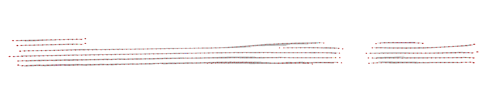
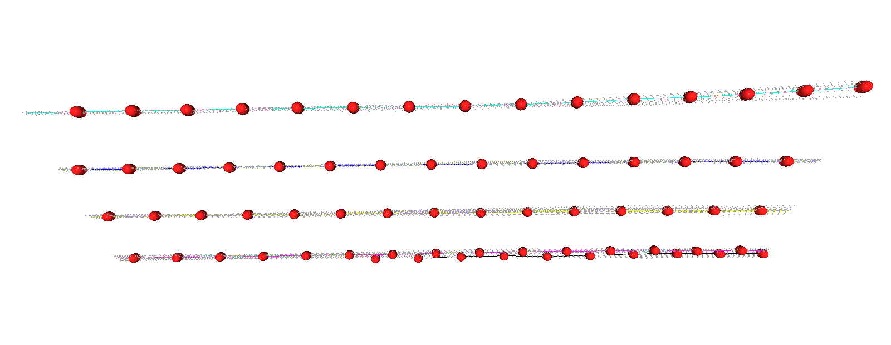

# MonoLaneMapping (MonoLaM)

Online lane mapping from a monocular camera. Per-frame 3D lane detections plus odometry go in; a global lane map comes out, with each lane marking stored as a **Catmull-Rom spline** rather than a point cloud. Lanes are associated across frames with Chamfer distance + pose uncertainty + lateral order consistency, and the control points are refined incrementally in a GTSAM factor graph together with the vehicle pose.

- **Repo**: [HKUST-Aerial-Robotics/MonoLaneMapping](https://github.com/HKUST-Aerial-Robotics/MonoLaneMapping)
- **Paper**: [Online Monocular Lane Mapping Using Catmull-Rom Spline](https://arxiv.org/abs/2307.11653) — Qiao, Yu, Yin, Shen, IEEE/RSJ IROS 2023 · [video](https://www.youtube.com/watch?v=9aHNV3TQ6xw)
- Rosbag converter: [qiaozhijian/openlane_bag](https://github.com/qiaozhijian/openlane_bag) (defines the `LaneList` messages)
- Dataset: [OpenLane](https://github.com/OpenDriveLab/OpenLane) · detector: [PersFormer](https://github.com/OpenDriveLab/PersFormer_3DLane)

**What this is not:** the monocular detector is *not* run here. The rosbags carry PersFormer's 3D lane predictions, the ground-truth lanes, and the vehicle pose — no images. This repository is the mapping and optimisation back end, which is what the paper contributes.

## Output

One 20-second OpenLane segment, top-down: 308 m of road sweeping through a 44 degree left-hand curve, about seven physical lane markings across. Grey = raw per-frame detections accumulated in the map frame, coloured line = the fitted Catmull-Rom spline, red spheres = the control points the factor graph actually optimises.



Detections are continuous on this segment, so the two central markings survive the whole drive as single landmarks — 339 m and 329 m, 121 and 117 control points. The remaining five run 131–237 m: the two on the far left only exist over the first 145 m and two others only appear later, which is the road genuinely changing lane count through the curve rather than tracking dropping out. The map also carries two spurious 4-control-point stubs that survived the NMS prune.

A 46 m close-up from three quarters of the way along — the control-point chord is 3 m, and the grey ribbon around each spline is the measurement spread it was fitted through:



## Build

```bash
podman build -t slam_zero_to_hero:monolane_mapping .
```

Clones MonoLaneMapping and `openlane_bag` into a catkin workspace inside the image and builds the `LaneList`/`Lane`/`LanePoint` messages.

## Download the dataset

The authors provide the OpenLane validation split already converted to rosbags — 202 segments, 433 MB zipped. This is all the demo needs; the original OpenLane image/annotation download is not required.

```bash
python3 ../download_openlane.py           # 433 MB -> 630 MB in ~/data/openlane/
python3 ../download_openlane.py --list    # what is in the zip, and the scenario splits
```

It is one archive, so there is no per-segment download. Once it is unpacked, `--scenario curve` (or `night`, `updown`, `intersection`, …) prints the bags in OpenLane's own scenario splits, which is how to pick a `--bag`. Note that the `?download=1` share link in the upstream readme now answers 403 without the share page's cookie; the script uses the `_layouts/15/download.aspx?share=…` form of the same file, which also resumes. A [Baidu mirror](https://pan.baidu.com/s/1Hrd8ashoiB4_f0B-iz6OHQ?pwd=2023) is in the upstream readme.

The image also carries one segment at `examples/data/`, so `run_mapping.py` with no `--bag` works before you download anything.

## Run

**Watch the map being built**, streamed to a [Rerun](https://rerun.io) viewer frame by frame:

```bash
podman run --rm -it -p 9090:9090 -p 9877:9877 \
  -v ~/data/openlane/OpenLane:/data/OpenLane:ro \
  -v "$(pwd)/results":/out \
  slam_zero_to_hero:monolane_mapping \
  python3 stream_mapping.py --output_dir /out/stream --rate 10 --odo_noise
```

Then open the URL it prints: **`http://localhost:9090/?url=ws://localhost:9877`**. Rendering happens in your browser, so this needs no X11 and no GPU in the container. The viewer stays up after the run so you can scrub back through the timeline; Ctrl-C to stop it.
