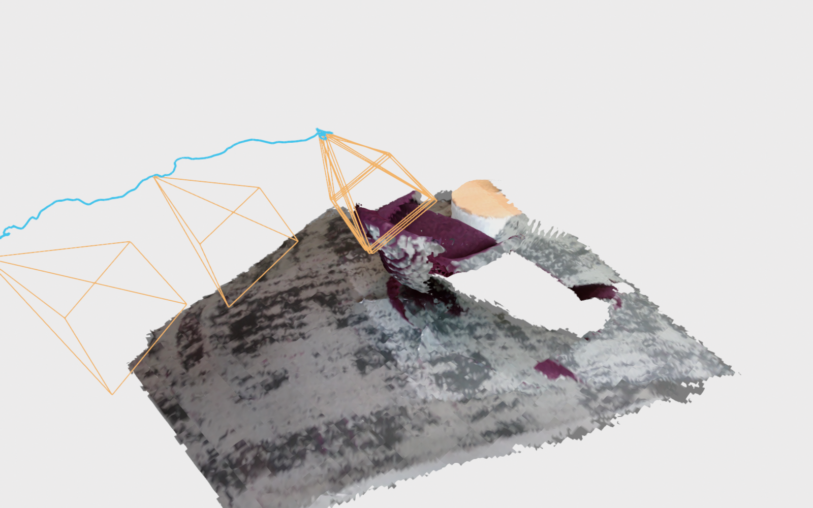
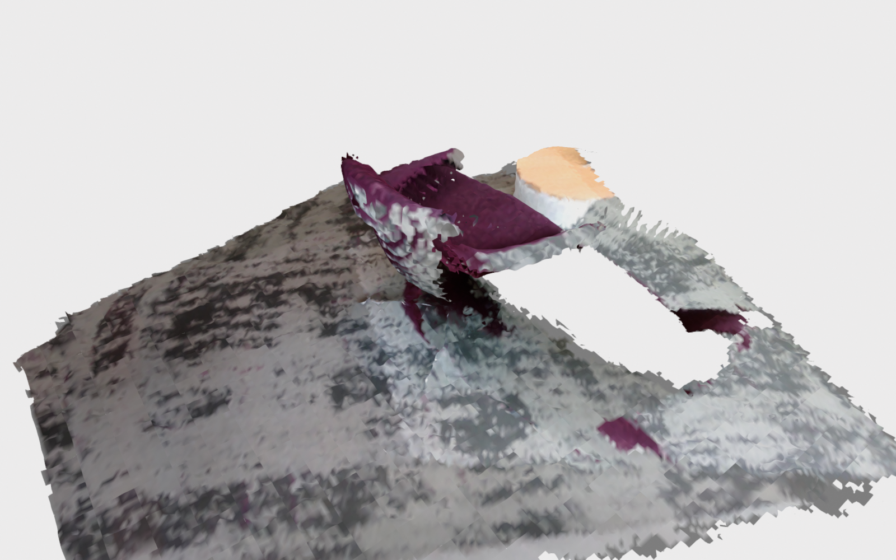
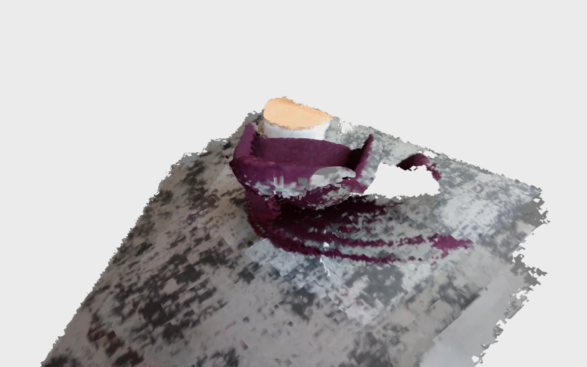
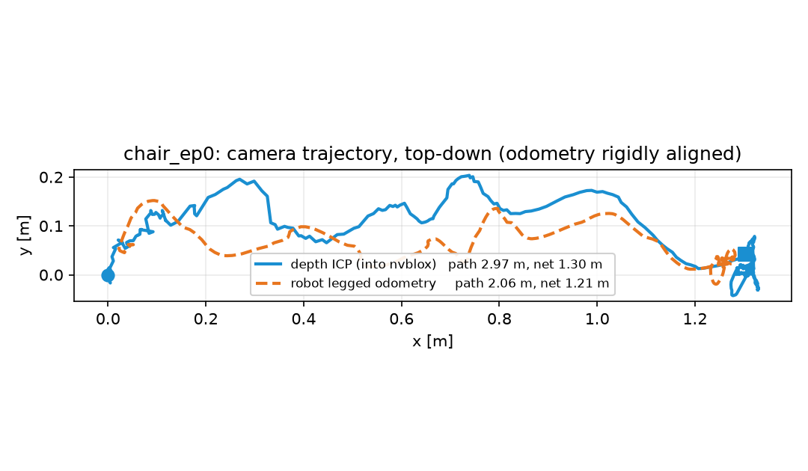
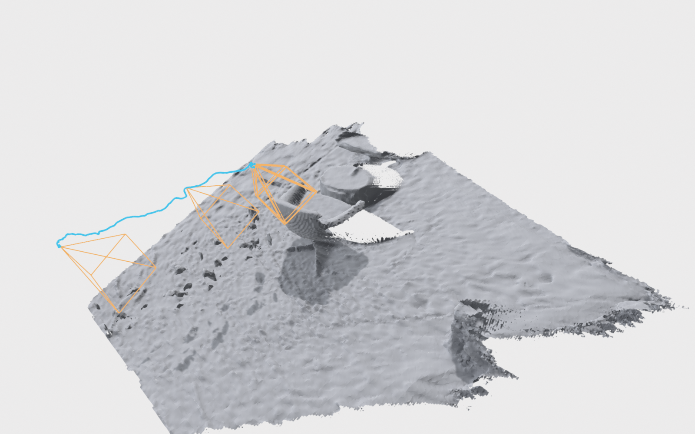
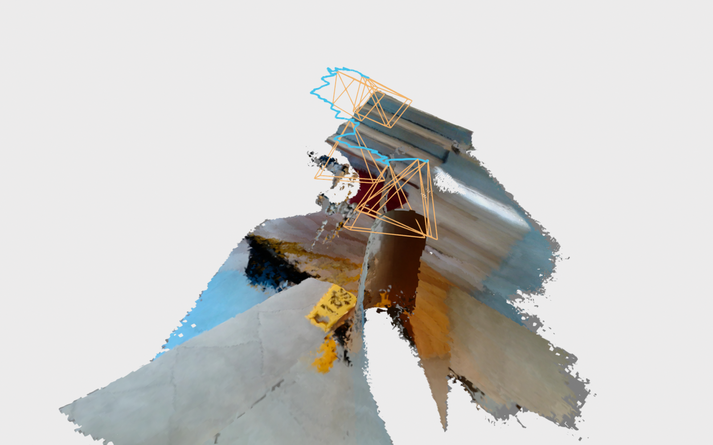

# nvblox

GPU-accelerated volumetric mapping: fuse posed depth images into a TSDF on the
GPU, mesh it, and sweep a Euclidean signed distance field out of it for
planning. This demo runs nvblox standalone (no ROS) on the **egocentric RealSense
D435 stream of a Unitree G1** as it walks up to a chair and turns it, from the
Humanoid Everyday dataset.

- **Repo**: [nvidia-isaac/nvblox](https://github.com/nvidia-isaac/nvblox) (pinned to `v0.0.10`)
- **Paper**: [nvblox: GPU-Accelerated Incremental Signed Distance Field Mapping](https://arxiv.org/abs/2311.00626) — Millane, Oleynikova, Wirbel, Steiner, Ramasamy, Tingdahl and Siegwart, ICRA 2024
- Also relevant: [Voxblox](https://arxiv.org/abs/1611.03631) (Oleynikova et al., IROS 2017), the CPU predecessor whose ESDF this replaces — the `voxblox/` folder in this repo covers it
- **Dataset**: [Humanoid Everyday](https://humanoideveryday.github.io/) — [Humanoid Everyday: A Comprehensive Robotic Dataset for Open-World Humanoid Manipulation](https://arxiv.org/abs/2510.08807), Zhao, Jing, Liu, Mao, Jha, Yang, Xue, Zakharov, Guizilini and Wang, 2025 ([code](https://github.com/physical-superintelligence-lab/Humanoid-Everyday))



581 frames of head-camera RGB-D fused at 1.5 cm voxels. The armchair, the beige
stool and the pattern in the carpet all survive into the mesh; blue is the camera
trajectory 1.24 m above the floor, orange the frusta, and the bite out of the
carpet is where the chair stood before the robot turned it.

## What nvblox is, and what it needs

nvblox is the **mapping** half of a SLAM system, not the whole thing. It takes
depth images that already have poses and turns them into a TSDF, a mesh and an
ESDF; it has no tracker of its own. In the Isaac stack the poses come from
cuVSLAM (`../cuvslam/` in this repo). Here they come from the recording, and
where exactly is the interesting part — see [Poses](#poses-where-the-trajectory-comes-from).

## Build

```bash
podman build -t slam_zero_to_hero:nvblox .
```

CUDA 12.8 is the floor, not a preference: sm_120 (GeForce RTX 50-series) only
exists from 12.8 onwards. The image compiles for sm_86, sm_89 and sm_120; trim
`--build-arg CUDA_ARCHS=89` to your own card to roughly halve the build. Verified
on an RTX 5090, driver 580.

## Download the dataset

```bash
python3 ../download_humanoid_everyday.py          # the two verified tasks, ~830 MB
python3 ../download_humanoid_everyday.py --list    # all 259 tasks by category
python3 ../download_humanoid_everyday.py --category loco_manipulation
```

Everything lands in `~/data/humanoid_everyday/<task>/episode_N/`. The full dataset
is ~500 GB, so the script pulls one task at a time from the per-task links in the
upstream spreadsheet (259 tasks are listed there; upstream quotes 260).

The default is **`walk_towards_chair_and_rotate_the_chair`**, from the
`loco_manipulation` category — the one where the robot walks rather than standing
still. Each episode holds:

| Path | Contents |
|---|---|
| `color/frame_NNNNNN.jpg` | 640×480 RGB from a head-mounted RealSense D435, 30 Hz |
| `depth/frame_NNNNNN.npy.lzma` | 640×480 **raw uint16 millimetres**, lzma-compressed, no npy header |
| `lidar/<timestamp>.pcd` | LiDAR scan, ~6.8 k xyz points, ASCII PCD (unused here; the dataset does not name the sensor) |
| `robot_data.jsonl` | per-frame joint state, IMU quaternion + rpy, legged odometry |

Two things about the depth are worth knowing before you use it, and both are
handled in `scripts/he_to_nvblox.py`:

- The `.npy.lzma` files are a **bare uint16 buffer**, not a `.npy` — `np.load`
  fails on them. The upstream loader reads them with `np.frombuffer`.
- Depth is stored in the **depth camera's** frame, not aligned to colour. The two
  D435 imagers have different intrinsics (depth ≈79° wide at fx 386, colour ≈56°
  at fx 606), and nvblox' Replica loader assumes one camera for both images, so
  one has to be resampled into the other.

## Run the algorithm

One command converts an episode and fuses it:

```bash
podman run --rm \
  --runtime=/usr/bin/nvidia-container-runtime \
  -e NVIDIA_VISIBLE_DEVICES=all -e NVIDIA_DRIVER_CAPABILITIES=compute,utility \
  -v ~/data/humanoid_everyday:/data:ro \
  -v "$PWD/results":/results \
  slam_zero_to_hero:nvblox \
  /nvblox_demo/scripts/run_nvblox.sh \
    /data/walk_towards_chair_and_rotate_the_chair/episode_0 /results/chair_ep0
```

No display needed. `results/chair_ep0/` then holds `mesh.ply`,
`mesh_ground_aligned.ply`, `tsdf.ply`, `esdf.ply`, `ground_plane.yaml`,
`map.nvblx` (nvblox' own serialised map), `timings.txt`, and the converted
dataset under `dataset/`.

Everything is an environment variable, and the conversion is cached — change only
a fusion parameter and the frames are reused:

```bash
-e VOXEL=0.03        # TSDF voxel size, m (default 0.015)
-e POSES=odom        # use the robot's legged odometry instead of depth ICP
-e FRAME=depth       # keep the depth camera's wider FOV instead of aligning to colour
-e FRAMES=200        # first 200 frames only
-e STRIDE=2          # every other frame
-e MAX_INT=3.0       # nvblox max integration distance, m
-e RECONVERT=1       # redo the conversion even if it is cached
```

Extra arguments after the output directory go straight to `fuse_replica`, so any
[nvblox gflag](https://github.com/nvidia-isaac/nvblox) works — for example
`--mapping_type_static_occupancy` or
`--projective_integrator_truncation_distance_vox=6`.

### Look at the map

Live in a browser, no X11 and no GPU needed on the viewer side:

```bash
podman run --rm -p 9090:9090 -p 9877:9877 \
  -v "$PWD/results":/results slam_zero_to_hero:nvblox \
  python3 /nvblox_demo/scripts/viz_nvblox.py /results/chair_ep0
```

Then open the URL it prints, **`http://localhost:9090/?url=rerun+http://localhost:9877/proxy`**.
The mesh, the ESDF voxels, the trajectory and the per-frame colour and depth all
land in the [Rerun](https://rerun.io) viewer, which stays up after the replay so
you can scrub the timeline.

To push into a viewer you already have open on the host instead of serving one,
add `--network=host` to the `podman run` and
`--connect rerun+http://127.0.0.1:9876/proxy` to the script.

The same script writes the stills in this README, offscreen through Open3D's EGL
backend (needs the GPU flags, no display):

```bash
python3 /nvblox_demo/scripts/viz_nvblox.py /results/chair_ep0 --png out.png
python3 /nvblox_demo/scripts/viz_nvblox.py /results/chair_ep0 --plot traj.png
```

## Poses: where the trajectory comes from

The recording carries the G1's own legged odometry, so the obvious thing is to
compose it with the pelvis-to-camera extrinsic and hand that to nvblox. It does
not work well. Left, `POSES=icp`; right, `POSES=odom`, same episode, same
everything else:

| depth ICP | legged odometry |
|---|---|
|  |  |

The odometry gets the *net* displacement about right — 1.21 m against ICP's
1.30 m over this episode — but it smears the TSDF: the armchair drags into
concentric arcs across the carpet. Its path length is also 30 % short (2.06 m
against 2.97 m), because it does not see the head oscillating at every footfall,
which is exactly the motion a 30 Hz camera integrates over.

So the default pose source is **depth frame-to-model ICP** (Open3D,
point-to-plane) inside the converter. Frame-to-model rather than
frame-to-frame — consecutive-frame ICP compounds its error at every step and
pulls the map apart over 581 frames. The first pose is anchored with the IMU:
roll and pitch are gravity-referenced, so the world comes out z-up with the
floor at z = 0, which also gives nvblox' ground-plane RANSAC (which only looks
between z = −0.1 and z = 0.15 m) something to find.



`config/humanoid_everyday_d435.json` holds the intrinsics and the depth-to-colour
extrinsic verbatim from the dataset README, plus a pelvis-to-camera extrinsic
that is **not** in the dataset and was measured here: the rotation by hand-eye
between the ICP trajectory and the odometry orientation (1.4° median residual
over 10-frame steps), the height from a RANSAC floor plane. It comes out as a
forward-looking camera pitched **56.1° down** — which is why so much of every
frame is floor and tabletop, and why sequence choice matters so much below.

## Output

Fusion runs at **136 Hz** end to end on an RTX 5090 — depth integration, colour
integration, meshing and ESDF for every one of the 581 frames, at 1.5 cm voxels.
Means per frame from `timings.txt`:

| Stage | Mean per frame |
|---|---|
| `fuser/integrate_depth` | 0.21 ms |
| `fuser/integrate_color` | 0.98 ms |
| `fuser/mesh` | 0.77 ms |
| `fuser/integrate_esdf` | 2.26 ms |
| **`fuser/time_per_frame`** (all mapping) | **4.22 ms — 237 Hz** |
| `fuser/file_loading` (JPEG + PNG off disk) | 2.94 ms |

The ESDF dominates and the mapping itself is 4.2 ms; the 136 Hz figure is what
you get once reading the frames off disk is counted, which a live sensor would
not pay.

Three independent checks that the map is actually right, not just pretty:

- **The floor lands where gravity says it should.** nvblox' own ground-plane
  RANSAC puts it 2 mm from z = 0 with its normal 2.1° off vertical, after 581
  frames tracked from an IMU-anchored first pose. That 2.1° is the accumulated
  roll/pitch drift of the whole run. (One run — the RANSAC is stochastic, so
  expect a few mm and about 2°.)
- **Heights are metric.** On the `walk_towards_outside_chair_and_pull_it_out`
  episode, the reconstructed café tabletop sits **0.735 m** above the
  reconstructed brick paving — standard table height, from nothing but stereo
  depth and ICP.
- **ICP stays locked.** Median point-to-plane fitness 1.000 with 0.6–0.9 cm
  inlier RMSE across every frame.

`FRAME=depth` keeps the depth camera's 79° field of view instead of cropping to
the colour camera's 56°, which **triples the mapped floor area** — 20.9 m²
against 6.8 m², counting the middle 98 % of vertices so the odd stereo streak
does not flatter it — at the cost of colour in the periphery, which the colour
camera never saw. Shaded rather than coloured, for that reason:



## Choosing a sequence: most of this dataset cannot be tracked

The head camera is pitched 56° down, so the average frame is a single plane of
floor. That is *degenerate* for depth ICP: on one plane the camera can slide
freely within it and spin about its normal at no cost, and the tracker drifts
without the residual ever complaining.

The symptom is unmissable once it happens. `pick_up_a_caution_sign_stand_and_walk_to_put_it_agaist_wall`
covers the most ground of any task here, and its map collapses into a cone as the
floor gets swept around the camera:



That is predictable before running anything, from the conditioning of the
point-to-plane ICP normal equations — the ratio of largest to smallest eigenvalue
of the 6×6 Hessian, over a sample of frames. Measured across every episode
downloaded:

| Task | ICP cond. | Non-planar | Verdict |
|---|---|---|---|
| `walk_towards_outside_chair_and_pull_it_out` | 11–13 | 0.35–0.39 | tracks; smallest map (2.3 × 2.3 m) |
| `walk_towards_trashbin_and_throw_trash_inside` | 12–15 | 0.47–0.55 | tracks; very short, close range |
| `walk_towards_fire_extinguisher_and_open_door` | 15–17 | 0.39–0.41 | tracks; white walls, glass |
| **`walk_towards_chair_and_rotate_the_chair`** | **36–45** | 0.18–0.21 | **tracks; the one used here** |
| `pick_up_a_caution_sign_stand_and_walk_to_put_it_agaist_wall` | 34–41 | 0.14–0.33 | **fails**, 6.6° gravity drift |
| `walk_towards_elevator_and_push_button` | 66–138 | 0.15–0.22 | worst conditioned; corridor wall is one plane |

Conditioning alone is not the whole story — `walk_towards_chair_and_rotate_the_chair`
scores mid-table but reconstructs cleanly, because its patterned carpet, armchair
and stool break the plane where it counts, while it also walks further than the
better-conditioned tasks. The end-to-end drift number is what settles it, and the
cheapest one to read is the tilt of nvblox' own fitted ground plane, since the
world frame started out gravity-aligned:

| Episode | ICP path | Ground-plane tilt | Map extent |
|---|---|---|---|
| `walk_towards_chair_and_rotate_the_chair/episode_0` | 2.97 m | 2.2° | 3.0 × 2.9 m |
| `walk_towards_chair_and_rotate_the_chair/episode_2` | 3.79 m | 1.7° | 3.0 × 3.3 m |
| `walk_towards_outside_chair_and_pull_it_out/episode_0` | 2.67 m | 1.0° | 2.3 × 2.3 m |
| `pick_up_a_caution_sign_stand_and_walk_to_put_it_agaist_wall/episode_1` | 7.07 m | **6.6°** | 5.0 × 4.3 m, collapsed |

One honest limitation: Humanoid Everyday is a *manipulation* dataset with
locomotion attached, so even the walking tasks only travel about 1.2 m net per
episode. These are room-corner maps, not building tours.

## Supported datasets

`fuse_replica` is one of five fusers the image builds; all of them are on the
`PATH`.

| Fuser | Layout | Notes |
|---|---|---|
| **`fuse_replica`** | `cam_params.json`, `seq/traj.txt`, `seq/results/{frame,depth}NNNNNN.{jpg,png}` | What this demo converts into. `../download_replica.py` gets the original Replica sequences. |
| `fuse_3dmatch` | `camera-intrinsics.txt`, `seq-NN/frame-NNNNNN.{pose.txt,depth.png,color.png}` | Applies a Y-up→Z-up rotation to every pose, unlike the others. |
| `fuse_redwood` | Redwood Indoor LiDAR-RGBD | `../download_redwood.py`. |
| `fuse_cusfm` | cuSFM output | |
| `fuse_lidarply` | PLY scans + poses | The one to use for the LiDAR clouds this demo ignores. |

To point the converter at another Humanoid Everyday task, pass the episode
directory; `--robot h1` switches to the H1 intrinsics (its pelvis-to-camera
extrinsic is *not* measured, so `POSES=odom` on H1 is indicative only).
