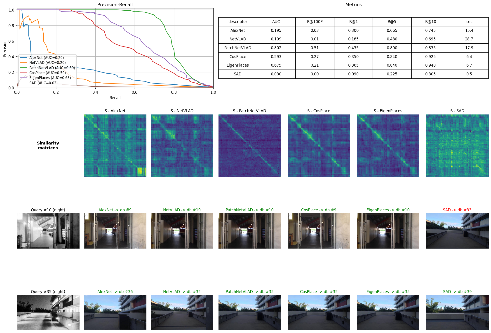
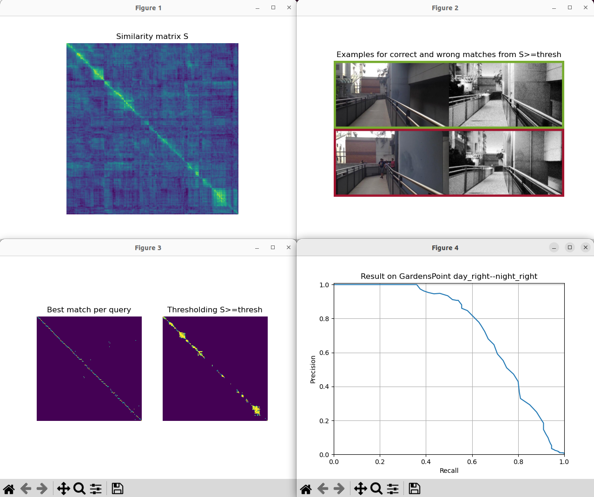

# Deep Learning based Visual Place Recognition Tutorial

- uses Python codes (Mostly because VPR codes are supported in python natively)
- Switchable descriptors (HDC-DELF, AlexNet-conv, NetVLAD, PatchNetVLAD, CosPlace, EigenPlaces)
- Switchable day/night datasets (GardensPoint, StLucia, SFU)

---

# How to build & run

The current `Dockerfile` is uv-based (Python 3.11 slim + CUDA torch wheels). It
clones `stschubert/VPR_Tutorial` into `/VPR_Tutorial`, installs the venv at
`/opt/venv`, and pre-activates it via `PATH`, so there is no `conda activate`
step. TensorFlow is intentionally skipped — six of the seven descriptors
(AlexNet, NetVLAD, PatchNetVLAD, CosPlace, EigenPlaces, SAD) are torch-based
and work without it. PyQt5 is bundled so `plt.show()` opens real X11 windows
(`MPLBACKEND=qt5agg` is baked into the image).

## Build

```bash
docker build . -t slam:vpr
```

## Run (Docker w/ NVIDIA Container Toolkit)

```bash
xhost +local:docker
docker run -it --rm \
    --gpus all \
    --shm-size=2g \
    --env DISPLAY=$DISPLAY \
    -v /tmp/.X11-unix/:/tmp/.X11-unix:ro \
    slam:vpr
```

## Run (Podman, e.g. RTX 5090 / sm_120 host)

```bash
xhost +local:
podman run -it --rm \
    --runtime=/usr/bin/nvidia-container-runtime \
    --security-opt=label=disable \
    --shm-size=2g \
    -e NVIDIA_VISIBLE_DEVICES=all \
    -e NVIDIA_DRIVER_CAPABILITIES=all \
    -e DISPLAY=$DISPLAY \
    -e QT_X11_NO_MITSHM=1 \
    -v /tmp/.X11-unix:/tmp/.X11-unix \
    slam:vpr
```

`--shm-size=2g` is required: the torch `DataLoader` shares tensors via
`/dev/shm`, and the default 64 MB is not enough for the demo's batch size.

## Inside the container

The working directory is already `/VPR_Tutorial` and the venv is on `PATH`.

### Single-descriptor demo

```bash
python3 demo.py --descriptor CosPlace --dataset GardensPoint
# other descriptors: AlexNet, NetVLAD, PatchNetVLAD, EigenPlaces, SAD
# other datasets:    GardensPoint, StLucia, SFU
```

This pops up four matplotlib windows: similarity matrix `S`, correct/wrong
match examples, the `M1` vs `M2` matching decisions, and the precision/recall
curve.

### Multi-descriptor comparison

```bash
python3 /workspace/compare_descriptors.py
```

Runs every torch-based descriptor on GardensPoint sequentially and renders
**one** window combining:

- precision/recall curves overlaid for all descriptors,
- a metrics table (AUC, R@100P, R@K, wall time),
- the six similarity matrices side-by-side,
- two query→prediction example rows, with each predicted db image bordered
  green (correct) or red (wrong).

If the container is mounted with `-v $PWD/visualizations:/out`, the combined
figure is also dumped to `visualizations/all_descriptors_comparison.png`.

### Headless runs

Set `MPLBACKEND=Agg` before invoking the scripts to skip GUI windows when no
X server is reachable.

## Results

Reference outputs from a representative run are checked into
[`visualizations/`](visualizations/). The combined comparison panel:



Single-descriptor screenshots (`output.png` is the upstream tutorial figure,
the rest are from this Dockerfile's run on an RTX 5090):


