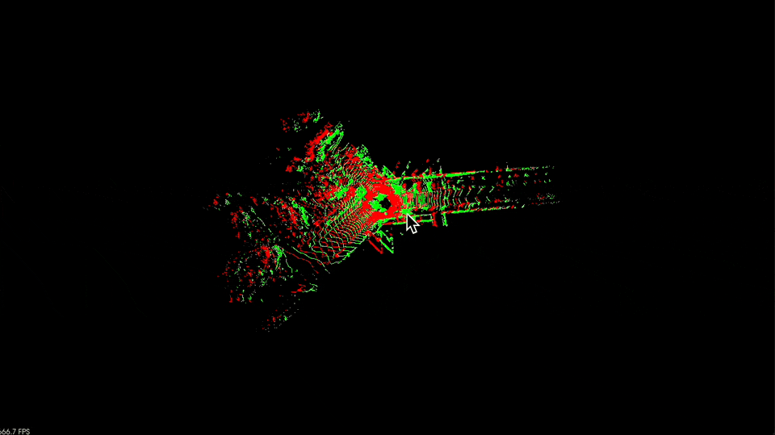
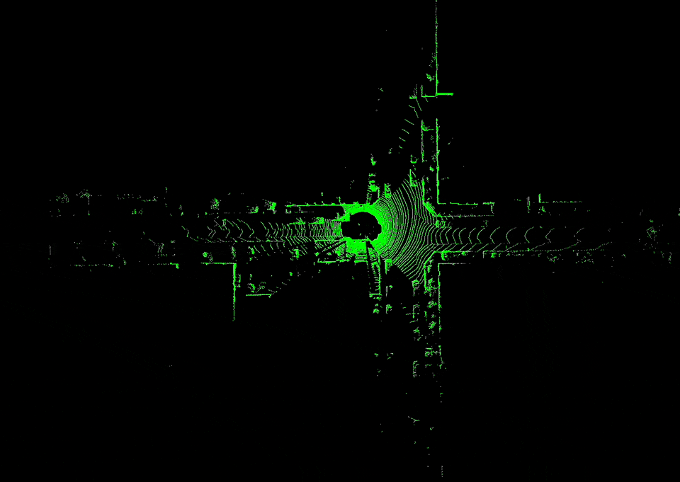

# Introduction to Point Cloud Processing

Code exercise for loading a KITTI LiDAR scan into PCL's basic point cloud structures and visualizing it — one frame next to a translated copy of itself, and a whole sequence played back frame by frame.

---

## Project Structure

```
part2_ch03_02/
├── README.md
├── CMakeLists.txt
├── Dockerfile
├── 000000.bin                   # KITTI Velodyne scan, loaded by visualization
└── examples/
    ├── visualization.cpp        # One scan in red + a copy shifted 5 m in x in green
    └── visualization_kitti.cpp  # Plays back a KITTI velodyne directory frame by frame
```

`000000.bin` sits at the exercise root rather than under `data/`, because `visualization` opens `./000000.bin` relative to the working directory.

Both programs read the KITTI `.bin` format directly: four floats per point, of which x, y, z are kept and the intensity value is skipped.

---

## Build

Dependencies:
- **PCL** (`common`, `io`, `visualization`) — required.

```bash
# Local
mkdir build && cd build
cmake ..
make -j4

# Docker
docker build . -t slam_zero_to_hero:part2_ch03_02
```

---

## Run

### Local

Run from the exercise root, not from `build/`, since `visualization` reads `./000000.bin`:

```bash
# One scan in red, the same scan translated 5 m in x in green
./build/visualization

# Play back a KITTI sequence
./build/visualization_kitti /data/sequences/00/velodyne
```

`visualization` takes no arguments. `visualization_kitti` requires exactly one — the directory holding the frames — and advances up to 4000 of them, or until you close the viewer window. Frames must be named `%06d.bin` starting at `000000.bin`; the playback loop does not stop early on a missing file.

KITTI odometry Velodyne scans can be fetched with `download_kitti.py` at the `SLAM_zero_to_hero/` root.

### Docker

```bash
docker run -it --rm \
    -e DISPLAY=$DISPLAY \
    -v /tmp/.X11-unix:/tmp/.X11-unix:ro \
    -v /kitti:/data \
    slam_zero_to_hero:part2_ch03_02

# Inside the container
./build/visualization
./build/visualization_kitti /data/sequences/00/velodyne
```

---

## Output

### Two point clouds



### KITTI sequence playback



---

## References

- [PCL Documentation](https://pointclouds.org/documentation/)
- [PCL Visualization tutorials](https://pcl.readthedocs.io/projects/tutorials/en/latest/#visualization)

### 코드 크레딧

두 예제는 임형태님의 `pcl_tutorial` 코드를 참고했습니다.
https://github.com/LimHyungTae/pcl_tutorial
