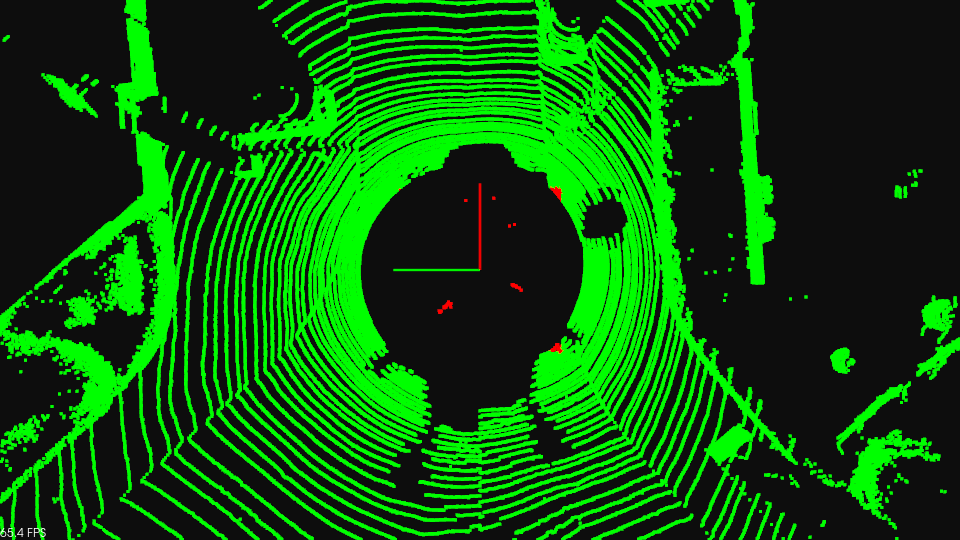
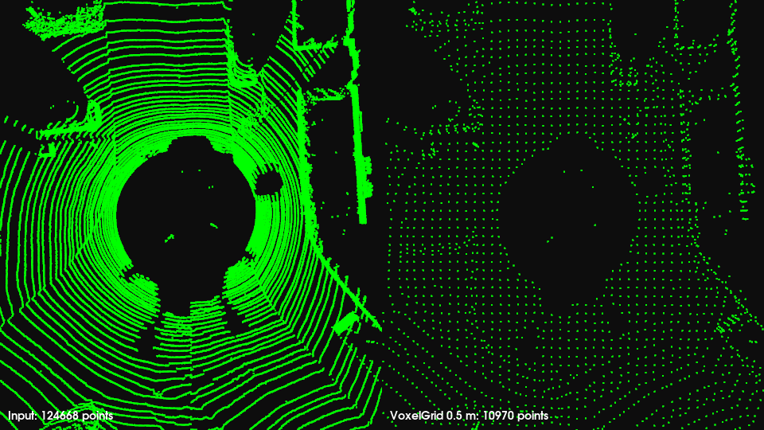
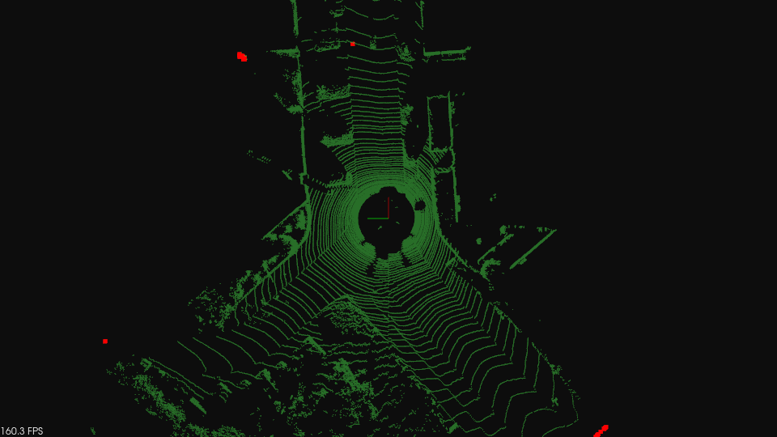
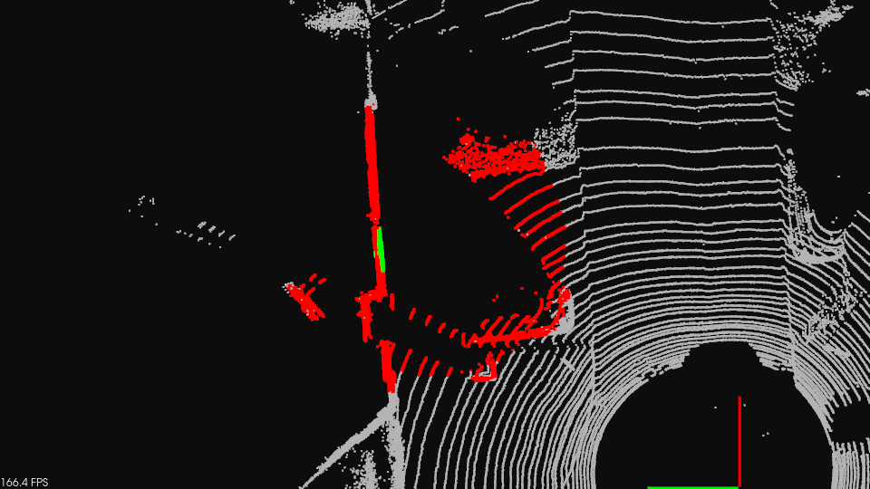
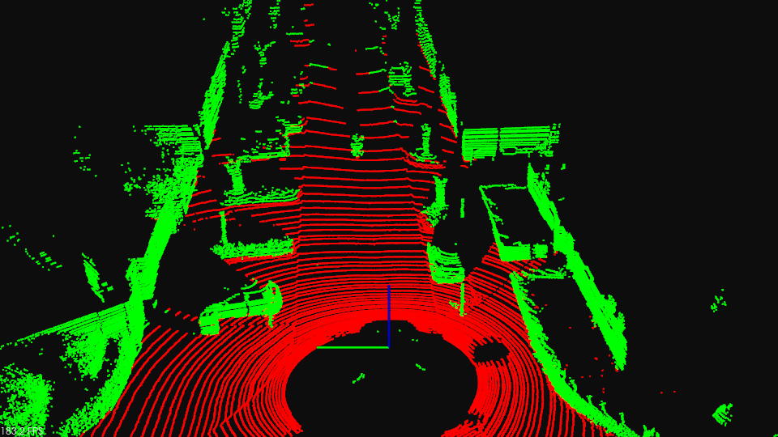
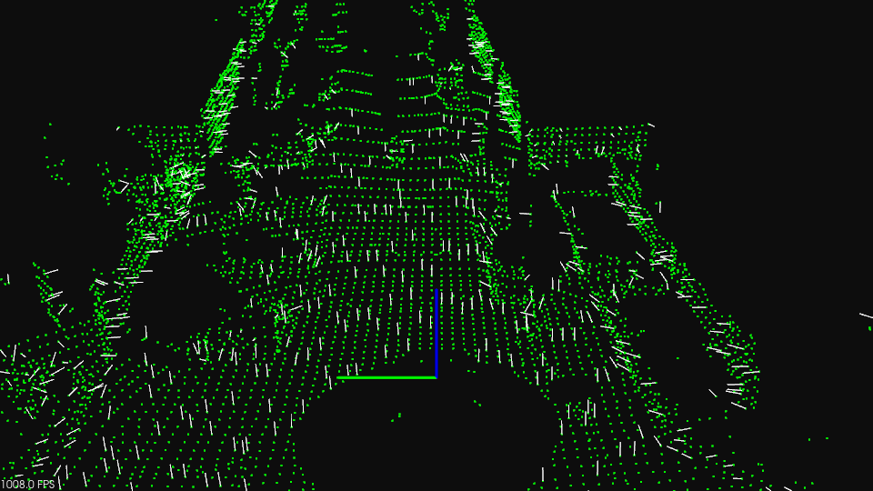

# Point Cloud Preprocessing with PCL

Six hands-on demos covering the preprocessing steps every LiDAR SLAM front-end
performs before registration: cropping, downsampling, outlier removal,
neighbour search, ground-plane detection, and normal estimation.

Every demo runs on the **same real KITTI Velodyne scan** — `data/000000.bin`,
124,668 points from an HDL-64E. Nothing here is generated: the numbers each demo
prints are properties of an actual scan, which is the point. RANSAC recovers a
ground plane 1.76 m below the sensor because that is where KITTI mounted it.

---

## Project Structure

```
part2_ch03_04/
├── README.md
├── CMakeLists.txt
├── Dockerfile
├── data/
│   └── 000000.bin              # KITTI Velodyne scan — the input to all six demos
├── images/                     # Viewer output of each demo, shown below
└── examples/
    ├── kitti_cloud.hpp         # Shared .bin loader, colourizer, timing, viewer setup
    ├── passthrough.cpp         # PassThrough filter — crop the ego-vehicle out
    ├── downsampling.cpp        # VoxelGrid downsampling, raw vs downsampled side by side
    ├── sor.cpp                 # StatisticalOutlierRemoval — drop sparse noise
    ├── kdtree.cpp              # KdTreeFLANN — K-nearest-neighbour and radius search
    ├── plane_det.cpp           # RANSAC plane detection — find the road surface
    └── normal_estimation.cpp   # Surface normals, single-threaded vs OpenMP
```

The KITTI `.bin` format is four `float32` per point — x, y, z, intensity. These
demos read the geometry and skip intensity.

---

## Build

Dependencies:
- **PCL 1.10+** (`common`, `io`, `kdtree`, `search`, `filters`, `features`, `segmentation`, `visualization`) — required.
- **MPI** (`mpi-default-dev`) — not used by the code, but Ubuntu's VTK 9.1 needs `MPI::MPI_C` to exist before `find_package(PCL)` will configure.
- **Eigen3** — pulled in transitively by PCL.

PCL is the only library these demos call, and nothing here links OpenMP itself —
see the `normal_estimation` note below.

```bash
# Local
mkdir build && cd build
cmake ..
make -j4

# Docker
docker build . -t slam_zero_to_hero:part2_ch03_04
```

---

## Run

### Local

```bash
./build/passthrough
./build/downsampling
./build/sor
./build/kdtree
./build/plane_det
./build/normal_estimation
```

Each demo takes no arguments and loads `data/000000.bin`, looked up both from the
exercise root and from `build/`, so either working directory works. To run one on
a different scan, pass its path:

```bash
./build/plane_det ~/data/kitti_vo_slam/extracted/dataset/sequences/04/velodyne/000100.bin
```

KITTI odometry Velodyne scans can be fetched with `download_kitti.py` at the
`SLAM_zero_to_hero/` root.

Every demo opens a PCL viewer window; close it to exit. Without a display the
demos still print their results and skip the window, so they are safe to run in a
headless container.

### Docker

```bash
docker run -it --rm \
    -e DISPLAY=$DISPLAY \
    -v /tmp/.X11-unix:/tmp/.X11-unix \
    slam_zero_to_hero:part2_ch03_04

# Inside the container (the working directory is the exercise root)
./build/passthrough
./build/downsampling
./build/sor
./build/kdtree
./build/plane_det
./build/normal_estimation
```

If the X server refuses the container, run `xhost +local:` on the host first.

---

## What each demo shows

The console blocks below are from one run inside the Docker image on an 8-core
desktop. Point counts are deterministic — you should see exactly the same ones —
while the timings move between runs and machines. The OpenMP speedup in
`normal_estimation` is the noisiest: anything from 2× to 6× on the same machine,
because the serial pass it is measured against only takes ~20 ms.

### `passthrough` — crop by coordinate range

Two `pcl::PassThrough` passes carve a 6 m × 6 m box around the sensor and drop
what falls inside it. This is how the ego-vehicle — roof, hood, mirrors — gets
removed: those points sit at the same place in every frame and would otherwise be
registered as if they were part of the world. Red is the input, green is what
survives.



Seen from above, the concentric laser rings and the empty disc around the sensor
are the scan's real structure — and the red specks near the middle are the
ego-vehicle returns the filter dropped.

```
Box removed:  |x| < 3 m and |y| < 3 m
Input:        124668 points
Kept:         124441 points
Removed:      227 points
Filter time:  2.3 ms
```

### `downsampling` — VoxelGrid

Space is divided into 0.5 m cubes and the points in each occupied cube are
replaced by their centroid. That cuts the point count by more than 10× and evens
out the density bias of a spinning LiDAR, whose rings are packed tightly near the
sensor and metres apart at range. Registration front-ends (ICP, NDT, GICP)
almost always run on a downsampled cloud for exactly this reason. The viewer
splits into two panes — raw on the left, downsampled on the right.



The rings on the left become an even lattice on the right: same scene, an eighth
of the points, and no remaining bias towards the sensor.

```
Leaf size:    0.5 m
Input:        124668 points
Downsampled:  10970 points (8.8% of the input)
Filter time:  3.0 ms
```

### `sor` — statistical outlier removal

For each point, SOR measures the mean distance to its 200 nearest neighbours,
fits a Gaussian over those means, and rejects points more than 5σ from the mean —
the sparse noise a LiDAR always returns off glass, wet asphalt, and dust. Green
is what survives, red is what was rejected. Note the cost: ~2.5 s, because every
one of the 124k points needs a 200-neighbour query.



The inliers are dimmed and the view pulled back to 115 m, because that is where
the rejected points are — the console makes it concrete: the outliers average
62 m from the sensor against 13 m for the inliers. Sparse-by-distance is exactly
what a neighbour-distance statistic finds.

```
MeanK:        200 neighbours
Threshold:    5 sigma
Inliers:      123632 points
Outliers:     1036 points
Filter time:  2578.8 ms
Mean range, inliers:  13.2 m
Mean range, outliers: 62.3 m
```

That is worth pausing on: SOR on a spinning LiDAR does not just remove noise, it
preferentially removes long-range points, whose neighbours are genuinely far
apart because the beams diverge. Loosening `stddev_mul` keeps more of the far
field; tightening it trims the scan inwards.

### `kdtree` — the neighbour search underneath everything else

A k-d tree recursively splits space along coordinate axes, turning "which points
are near this one?" into a logarithmic descent. SOR, normal estimation,
clustering and ICP's correspondence step all call the two queries shown here.
White is the scan, red is the radius result, green is the KNN result.



The view looks straight down, centred on the search point, with the sensor origin
at the bottom right. The red ball is everything within 5 m; the bright green
streak is the 100 nearest points, all of them on the pole the search point
happens to sit beside — 1.79 m to 1.92 m away, as the console reports.

```
Search point: (8.000, 10.000, 0.100)
Tree build:   8.476 ms for 124668 points

nearestKSearch, K=100: 100 points in 0.027 ms
  closest neighbour:  1.790 m
  farthest of the K:  1.924 m

radiusSearch, r=5.000 m: 6438 points in 0.327 ms
```

Building the tree costs ~10 ms; each query then costs microseconds. Both queries
start from the same closest neighbour, but KNN stops at a fixed count while the
radius query returns everything inside the ball — 6438 points here.

### `plane_det` — RANSAC ground plane

RANSAC samples three points, forms their plane, counts inliers within 0.2 m, and
keeps the best-supported model. The largest flat structure in a driving scan is
the road, so the ground falls out without ever being told where it is — the usual
first step before clustering obstacles, which the road would otherwise connect
into one blob. Red is the plane, green is everything else.



The road comes out red all the way down the street, while the parked cars, walls
and vegetation stay green — a clean split from a model with four parameters.

```
Model:        -0.011x + 0.029y + 1.000z + 1.763 = 0
Tilt from z:  1.784 deg
Sensor height above the plane: 1.763 m
Plane:        68626 points
Off-plane:    56042 points
Segment time: 29.4 ms
```

The recovered model is a good sanity check on the data: near-vertical normal
(1.8° off z) and d = 1.76 m, matching KITTI's Velodyne mounting height of ~1.73 m.
Over half the scan is road.

### `normal_estimation` — per-point surface orientation

A plane is fitted to each point's 1 m neighbourhood and its normal is taken from
the smallest-eigenvalue eigenvector of the neighbourhood covariance. Normals are
what point-to-plane ICP, GICP and NDT minimise against. The scan is
voxel-downsampled to 0.4 m first — not cosmetic: on the raw cloud the ring
spacing, not the surface, dominates the fit.



Every 10th normal is drawn as a white 0.5 m arrow. On the road they stand
straight up; along the walls and parked cars they lie flat — which is the signal
point-to-plane ICP exploits.

```
Downsampled to 14467 points (0.4 m voxels)
Search radius: 1 m

NormalEstimation:     22.4 ms
NormalEstimationOMP:  3.6 ms  (6.15x speedup)

Valid normals:            14157 / 14467
NaN (too few neighbours): 310
Horizontal surfaces (|n_z| > 0.9): 6058 points (42.8% of valid)
```

Two details worth noticing: points with too few neighbours produce NaN normals
(310 here) and must be filtered downstream, and `setViewPoint(0,0,0)` orients
every normal towards the sensor so neighbouring normals do not flip sign.

`NormalEstimationOMP` is a PCL class, not a separate dependency, and the exercise
does not compile with `-fopenmp` or link `libgomp`. The threading comes from
`libpcl_features.so`: PCL explicitly instantiates these templates for
`PointXYZ`/`Normal` and Ubuntu builds that library with OpenMP, so `compute()` is
already parallel by the time we call it. Only an uninstantiated point type would
compile the header locally and need the flag.

---

## Things to try

- `passthrough`: raise `car_size`, or filter on `z` instead to keep only points near the road surface.
- `downsampling`: sweep `leaf` from 0.1 m to 1.0 m and watch the point count and the walls thin out.
- `sor`: drop `mean_k` to 20 and `stddev_mul` to 1.0 — far more aggressive, and much faster.
- `kdtree`: move `search_point` onto a car or a wall and compare how far the 100th neighbour is.
- `plane_det`: tighten `distance_threshold` to 0.05 m — the plane gets cleaner but loses the far road, which curves away from a single plane.
- `normal_estimation`: shrink `search_radius` to 0.3 m and watch the NaN count climb as neighbourhoods empty out.

---

## References

- [PCL Documentation](https://pointclouds.org/documentation/)
- [PCL Filtering tutorials](https://pcl.readthedocs.io/projects/tutorials/en/latest/#filtering)
- [PCL k-d tree tutorial](https://pcl.readthedocs.io/projects/tutorials/en/latest/kdtree_search.html)
- [PCL RANSAC plane segmentation](https://pcl.readthedocs.io/projects/tutorials/en/latest/planar_segmentation.html)
- [PCL normal estimation](https://pcl.readthedocs.io/projects/tutorials/en/latest/normal_estimation.html)

### 코드 크레딧

`passthrough`, `downsampling`, `sor`, `kdtree` 예제는 임형태님의 `pcl_tutorial`
코드를 참고했습니다.
https://github.com/LimHyungTae/pcl_tutorial
