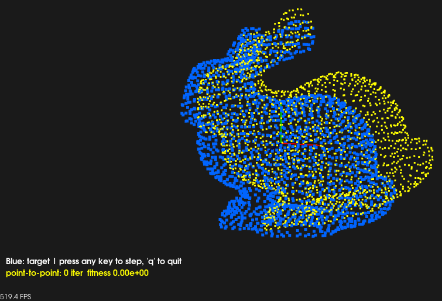
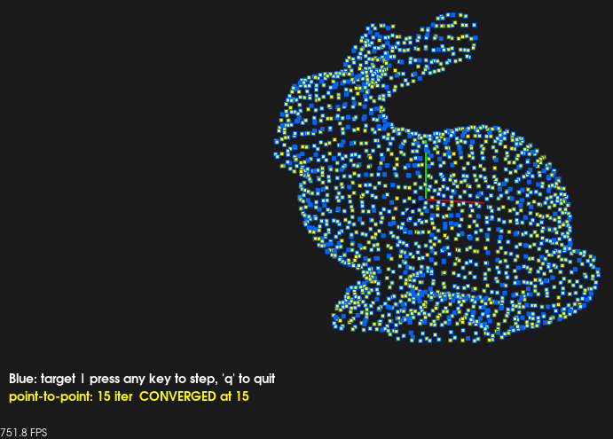
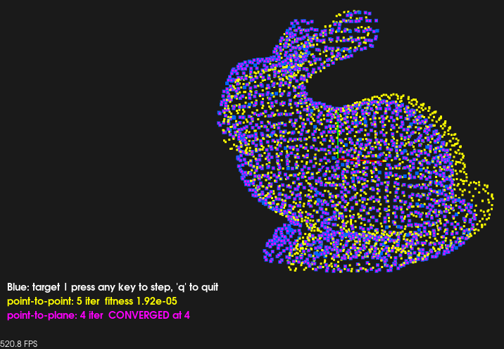
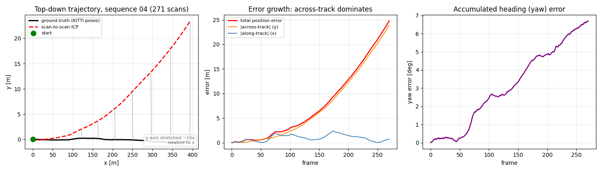

# ICP Point Cloud Registration using PCL

Code exercise for point-to-point and point-to-plane ICP registration and
sequential LiDAR odometry using PCL.

The two registration demos run on the **Stanford bunny** and the odometry demo
runs on a **KITTI odometry sequence**, so every exercise has ground truth to
score against. Both registration demos open an interactive viewer and step their
ICP one iteration per keystroke.

---

## Project Structure

```
part2_ch03_06/
├── README.md
├── CMakeLists.txt
├── Dockerfile
├── data/
│   ├── bun_zipper_res3.ply    # Stanford bunny - input for demos 1-2
│   ├── 000000.bin             # KITTI velodyne scan (single frame)
│   └── scene.pcd
├── images/                     # Demo output, shown under Output below
└── examples/
    ├── demo_common.hpp           # Cloud loading (.ply/.pcd/.bin), scale helpers, pose error
    ├── demo_viz.hpp              # Interactive viewer and per-keystroke ICP steppers
    ├── icp_basic.cpp             # Point-to-point ICP registration
    ├── icp_point_to_plane.cpp    # Point-to-plane vs point-to-point, side by side
    └── lidar_odometry.cpp        # Sequential scan registration for LiDAR odometry
```

---

## Build

Dependencies:
- **PCL 1.10+** (`common`, `io`, `filters`, `registration`, `features`, `visualization`, `kdtree`, `search`) — required.
- **Eigen3 3.3+** — required.
- **MPI** — required (used by VTK/PCL visualization).

All three executables are always built; there are no optional targets.

```bash
# Local
mkdir build && cd build
cmake ..
make -j4

# Docker
docker build . -t slam_zero_to_hero:part2_ch03_06
```

---

## Run

Neither registration demo takes arguments: they load `data/bun_zipper_res3.ply`,
centre it, and build the source cloud by applying a known transform, so the
estimate is compared against the exact answer. Only `lidar_odometry` has options
(`--help` lists them).

### 1-2. ICP on the Stanford bunny

```bash
# Point-to-point ICP
./build/icp_basic

# Point-to-plane ICP, stepped side by side with point-to-point
./build/icp_point_to_plane
```

Both open a viewer and **advance one ICP iteration per keystroke**, so you watch
the source converge onto the target rather than seeing only the end state. Target
is blue, point-to-point yellow, point-to-plane magenta; any key steps, `q` quits,
and the window stays open once every method has settled. An X display is
required — run headless and the demos print the full numeric report, then say why
the viewer could not open.

**Scale-relative parameters.** The bunny is only ~0.25 m across, so absolute
values tuned for LiDAR scans (0.5 m correspondence distance, 0.1 m normal
radius) would be larger than the whole model and make ICP meaningless. Voxel
size, correspondence distance, viewer camera distance and axis size are all
derived from the bounding-box diagonal instead, so the same code works on the
bunny and on room- or street-scale clouds.

**Why the bunny is a fair target for point-to-plane**, despite being nowhere near
planar: the advantage does not come from the surface being flat overall, but from
each normal's neighbourhood being locally smooth. Minimising distance to the
tangent plane lets correspondences slide along the surface instead of being
pinned point to point, and that is what costs point-to-point its iterations. On
this model, k=20 normals span ~4.4 % of the bounding-box diagonal (mean point
spacing 0.0043 m), so they are genuinely local and none come out invalid.

At a fixed iteration budget both methods reach the same answer on clean data —
0.0000 deg / 0.000000 m — so the demo reports **iterations to converge**, which
is what actually separates them:

| | point-to-point | point-to-plane |
|---|---|---|
| iterations to converge | 15 | **4** |
| alignment time | 20.7 ms | 7.0 ms |
| normal estimation | not needed | 2 ms |

Measured separately, the gap widens in the cases the demo does not ship: with
~half the source cropped away, point-to-plane still converges in 3 iterations
while point-to-point needs 50. Point-to-plane is not uniformly better, though —
at low noise its tangent-plane freedom lets the solution slide slightly along the
surface, so point-to-point ends up marginally more accurate in translation. Past
about 1 % noise that reverses.

### 3. LiDAR odometry on a KITTI sequence

Point the demo at a KITTI odometry sequence directory. It finds `velodyne/`,
`calib.txt`, and `../../poses/NN.txt` by itself:

```bash
./build/lidar_odometry ~/data/kitti_vo_slam/extracted/dataset/sequences/04

# Shorter run while experimenting
./build/lidar_odometry .../sequences/04 --max-frames 60

# A plain velodyne directory also works (no ground-truth comparison)
./build/lidar_odometry /path/to/velodyne/
```

Options: `--max-frames N`, `--voxel S`, `--no-prediction`.

What the demo does per frame:

1. crop returns closer than 2.5 m (the ego vehicle, which moves with the sensor
   and biases matching towards zero motion) and beyond 80 m,
2. voxel-downsample,
3. align current scan to previous with point-to-point ICP, seeded with the
   previous frame-to-frame motion as a constant-velocity initial guess,
4. accumulate `T_global = T_global * T_relative`.

KITTI ground truth is given in the left-camera frame, so it is mapped into the
velodyne frame with the calib `Tr` matrix before being compared.

Outputs: `trajectory_kitti.txt`, `trajectory_tum.txt` (with real timestamps from
`times.txt`), and `trajectory_gt_kitti.txt`.

```bash
evo_traj kitti trajectory_kitti.txt --plot
evo_ape kitti trajectory_gt_kitti.txt trajectory_kitti.txt -va --plot
```

**Voxel size drives both speed and drift.** Measured on sequence 04, 60 frames:

| Voxel size | Final position error |
|---|---|
| 0.2 m (default) | 1.0 % of path length |
| 0.3 m | 2.4 % |
| 0.5 m | 4.3 % |

Larger leaves are faster but discard the vertical structure that constrains
forward motion.

**What drifts is heading, not distance.** Over the full 271-frame sequence 04
(~52 s on 8 cores, voxel 0.2 m):

```
Ground-truth path length: 393.645 m
Estimated path length:    395.27 m     <- 0.4 % scale error
ATE (translation RMSE):   10.705 m
Rotation RMSE:            4.223 deg
Final position error:     24.762 m     (6.29 % of path length)
  along track:            0.655 m      <- distance is essentially right
  across track:           24.754 m     <- accumulated heading error
Final rotation error:     6.982 deg
```

The per-frame translation is accurate, but a fraction of a degree of yaw error
per frame integrates into a large across-track offset. Scan-to-scan ICP has no
loop closure and no local map, so nothing ever corrects it.
[part2_ch03_07](../part2_ch03_07) compares GICP / NDT / TEASER++ on the same
data.

### Docker

```bash
# Demos 1-2 (X11 required for the viewer)
docker run -it --rm \
    -e DISPLAY=$DISPLAY \
    -v /tmp/.X11-unix:/tmp/.X11-unix \
    slam_zero_to_hero:part2_ch03_06

# Demo 3 needs the KITTI dataset mounted
docker run -it --rm \
    -v ~/data/kitti_vo_slam:/kitti:ro \
    slam_zero_to_hero:part2_ch03_06 \
    ./lidar_odometry /kitti/extracted/dataset/sequences/04
```

---

## Output

### Point-to-point ICP on the bunny

The source (yellow) starts displaced from the target (blue) by a known 15 deg
rotation and 8 % of the model size — large enough that the misalignment is
actually visible, and still well inside ICP's basin of attraction. Every
keystroke runs one iteration.



After 15 iterations the two clouds interleave everywhere and the overlay reports
`CONVERGED at 15`. The recovered transform matches ground truth to 0.0000 deg and
0.000000 m.



### Point-to-plane vs point-to-point, stepped together

Both methods start from the same displaced source and advance together, one
iteration each per keystroke — point-to-point in yellow, point-to-plane in
magenta. This frame is five keystrokes in: magenta has already settled onto the
blue target (`CONVERGED at 4`), while yellow is still visibly short of it along
the right flank and the base.



That is the whole argument for point-to-plane in one picture — same data, same
correspondence distance, roughly a quarter of the iterations.

### LiDAR odometry on KITTI sequence 04

Plotted from the `trajectory_kitti.txt` and `trajectory_gt_kitti.txt` the demo
writes, over all 271 scans.



The estimate tracks the ground truth's *length* almost exactly (395.27 m against
393.645 m) but fans away from it sideways. The middle panel separates the two:
along-track error stays under ~2.5 m for the whole run while across-track error
grows quadratically to 24 m, and the right panel shows the cause — yaw error
climbing monotonically to 6.7 deg with nothing to correct it.

---

## Getting the KITTI odometry data

The odometry demo needs the velodyne laser data and, for the ground-truth comparison, the
poses and calibration from the
[KITTI odometry benchmark](https://www.cvlibs.net/datasets/kitti/eval_odometry.php):

- `data_odometry_velodyne.zip` (80 GB) — extract only the sequence you want
- `data_odometry_poses.zip` — ground truth for sequences 00-10 only
- `data_odometry_calib.zip` — provides the `Tr` velodyne-to-camera transform

Sequence 04 is a good starting point: 271 scans, 393 m, mostly straight driving.

---

## References

- [PCL `registration` module](https://pointclouds.org/documentation/group__registration.html) (`IterativeClosestPoint`, `IterativeClosestPointWithNormals`)
- [PCL ICP tutorial](https://pcl.readthedocs.io/projects/tutorials/en/latest/iterative_closest_point.html)
- [PCL `visualization` module](https://pointclouds.org/documentation/group__visualization.html)
- [Stanford 3D Scanning Repository](http://graphics.stanford.edu/data/3Dscanrep/) (source of the bunny)
- [KITTI odometry benchmark](https://www.cvlibs.net/datasets/kitti/eval_odometry.php)
