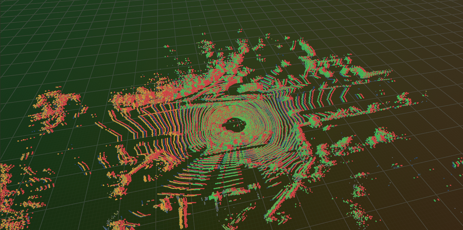
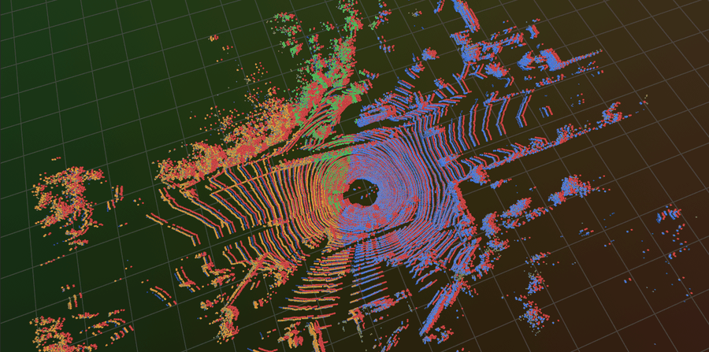
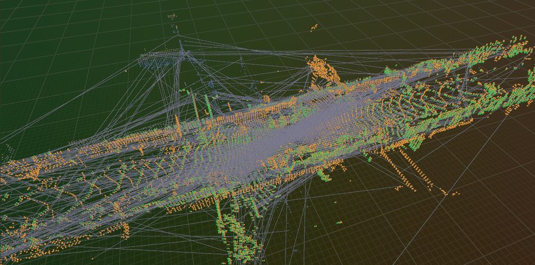

# Advanced ICP Methods on KITTI: GICP, NDT, and TEASER++

Code exercise for point cloud registration with GICP, NDT, and TEASER++.

Every demo runs on KITTI odometry scans and is scored against the KITTI
ground-truth poses, so each method is graded on how close it got rather than only
on its own fitness score. TEASER++ is linked as the real library — there is no
fallback implementation standing in for it.

---

## Project Structure

```
part2_ch03_07/
├── README.md
├── CMakeLists.txt
├── Dockerfile
├── images/                      # Demo output, shown under Output below
├── data/
│   └── sample_sequences/        # KITTI seq 04, frames 0-1, with calib + GT poses
└── examples/
    ├── demo_common.hpp          # KITTI loading, ground truth, rerun streaming
    ├── gicp_demo.cpp            # Generalized ICP vs standard ICP
    ├── ndt_demo.cpp             # Normal Distributions Transform + parameter studies
    ├── method_comparison.cpp    # ICP vs GICP vs NDT across four experiments
    └── teaser_demo.cpp          # TEASER++ global registration
```

---

## Data

`data/sample_sequences/` ships KITTI sequence 04 frames 0 and 1 together with that
sequence's `calib.txt` and the two matching ground-truth pose lines, so every demo
runs with no download when given no arguments.

The scan-separation sweep and the loop-closure pairs need whole sequences.
Download with `../download_kitti.py`, then extract `data_odometry_velodyne.zip`,
`data_odometry_calib.zip` and `data_odometry_poses.zip` into one tree:

```
dataset/
├── poses/               # 00.txt .. 10.txt (sequences 11-21 ship none)
└── sequences/
    └── 04/{velodyne/,calib.txt,times.txt}
```

Only the scan paths go on the command line — the demos find the sequence's
`calib.txt` and `poses/NN.txt` themselves.

---

## Build

| Dependency | Required? | Used for |
|---|---|---|
| **PCL 1.10+** and **MPI** | yes | ICP, GICP, NDT, FPFH |
| **TEASER++** | for `teaser_demo` | without it that one target is not built |
| **rerun** 0.33.0 C++ SDK | optional | live 3D streaming to a viewer on the host |

```bash
# Local
mkdir build && cd build
cmake ..            # USE_TEASER defaults to ON
make -j4

# TEASER++, if you do not have it yet
git clone https://github.com/MIT-SPARK/TEASER-plusplus.git
cd TEASER-plusplus
cmake -S . -B build -DCMAKE_BUILD_TYPE=Release -DBUILD_TESTS=OFF
cmake --build build -j8 --target install

# Docker: installs TEASER++ and the rerun SDK, then builds
docker build . -t slam_zero_to_hero:part2_ch03_07
```

---

## Run

Each demo takes two KITTI scans, or none at all to use the bundled pair.

```bash
# GICP vs standard ICP, plus a correspondence-randomness study
./build/gicp_demo

# NDT, plus resolution / step size / initial guess studies
./build/ndt_demo                              # optional 3rd argument: cell size (m)

# ICP vs GICP vs NDT: accuracy, initial guess, density, scan separation
./build/method_comparison <kitti>/sequences/04/velodyne/000000.bin \
                          <kitti>/sequences/04/velodyne/000001.bin

# TEASER++ global registration, no initial guess
./build/teaser_demo
```

`method_comparison`'s scan-separation experiment registers the source frame
against frames further ahead in the sequence, so give it a full sequence rather
than the two-scan sample.

Global registration is worth its cost on pairs no motion model can bridge.
Sequence 00 revisits streets, so these two frames see the same place from opposite
directions (7.3 m and 179.7 deg apart):

```bash
./build/teaser_demo <kitti>/sequences/00/velodyne/001539.bin \
                    <kitti>/sequences/00/velodyne/004540.bin
```

### Docker

```bash
docker run -it --rm -v $(pwd)/data:/data slam_zero_to_hero:part2_ch03_07

# On a full sequence, streaming live to a rerun viewer on the host (start it
# first: rerun &). --network=host lets the demo reach the viewer; without a
# viewer the demos run the same and skip streaming.
docker run --rm --network=host \
    -v ~/data/kitti_vo_slam/extracted/dataset:/kitti:ro \
    slam_zero_to_hero:part2_ch03_07 \
    ./method_comparison /kitti/sequences/04/velodyne/000000.bin \
                        /kitti/sequences/04/velodyne/000001.bin
```

Mount the dataset root — the directory holding `sequences/` and `poses/` — so the
ground truth is reachable, not just the `velodyne` folder.

---

## Output

All three views below are the rerun viewer. Override its address with `RERUN_URL`
if it is not at `rerun+http://127.0.0.1:9876/proxy`.

### GICP vs ICP on one scan pair

The target is coloured by height, the un-registered source is red, and the two
results sit on top of it — ICP in orange, GICP in green. The red offset is the
1.31 m the vehicle moved between the two scans, which registration has to recover
from an identity initial guess. Every optimization step also lands on an
`iteration` timeline, so scrubbing it plays the convergence back.



### ICP vs GICP vs NDT

The same overlay with all three methods at once — ICP orange, GICP green, NDT
blue — against the red starting position.



### TEASER++ on a KITTI loop closure

Sequence 00 frames 1539 and 4540, the same street driven in the opposite
direction. The grey web is the FPFH correspondences handed to TEASER++, most of
them wrong; the solver recovers the 179.7 deg reversal from them with no initial
guess, and GICP refines the result (orange).



---

## References

- [PCL `registration` module](https://pointclouds.org/documentation/group__registration.html)
- Segal et al., "Generalized-ICP", RSS 2009
- Biber & Strasser, "The Normal Distributions Transform", IROS 2003
- Yang et al., "TEASER: Fast and Certifiable Point Cloud Registration", T-RO 2020 — [TEASER++](https://github.com/MIT-SPARK/TEASER-plusplus)
