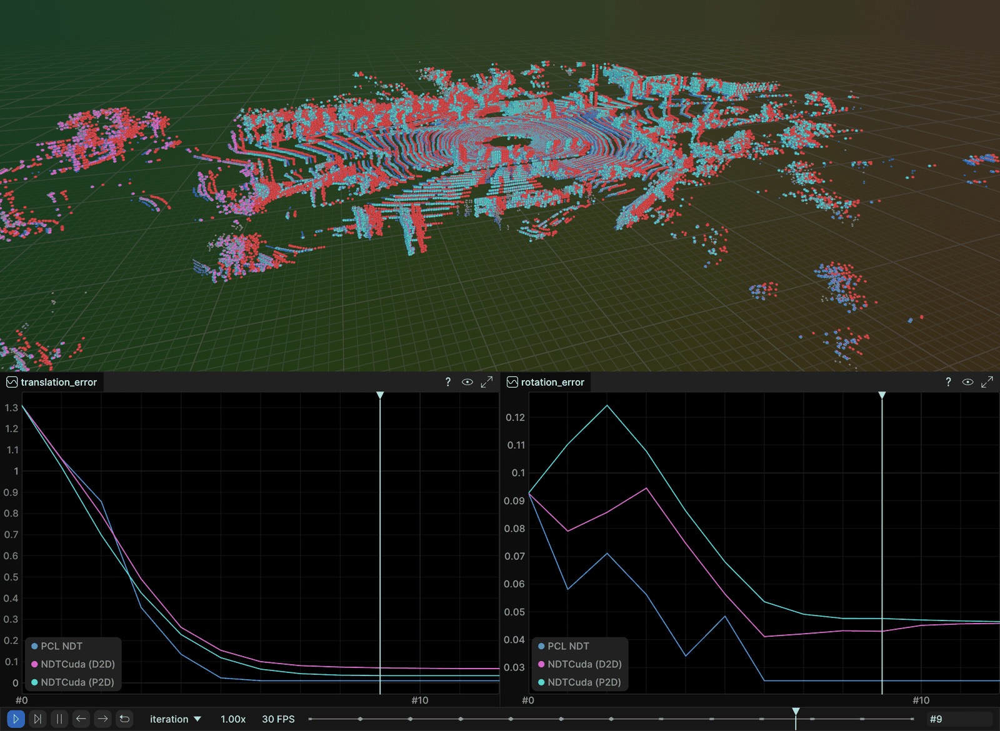

# Advanced Registration on KITTI: GICP, NDT, and TEASER++

Code exercise for point cloud registration, run as three experiments on KITTI
odometry scans and scored against the KITTI ground-truth poses — so every method
is graded on how close it got, not only on its own fitness score.

| | Experiment | Compares |
|---|---|---|
| 1 | **GICP** | PCL ICP · PCL GICP · small_gicp GICP (CPU) · fast_gicp VGICP (CUDA) |
| 2 | **NDT** | PCL NDT · fast_gicp NDTCuda, in both D2D and P2D modes |
| 3 | **TEASER++** | global registration where all of the above have no chance |

---

## Project Structure

```
part2_ch03_07/
├── README.md
├── CMakeLists.txt
├── Dockerfile
├── images/                      # Demo output, shown under Output below
├── data/
│   └── sample_sequences/        # KITTI seq 04, frames 0-1, with calib + GT poses
└── examples/
    ├── demo_common.hpp          # KITTI loading, ground truth, timing, iteration tracing
    ├── gicp_demo.cpp            # Experiment 1
    ├── ndt_demo.cpp             # Experiment 2
    └── teaser_demo.cpp          # Experiment 3
```

---

## Data

`data/sample_sequences/` ships KITTI sequence 04 frames 0 and 1 together with that
sequence's `calib.txt` and the two matching ground-truth pose lines, so every demo
runs with no download when given no arguments.

The loop-closure pair needs a whole sequence. Download with `../download_kitti.py`,
then extract `data_odometry_velodyne.zip`, `data_odometry_calib.zip` and
`data_odometry_poses.zip` into one tree:

```
dataset/
├── poses/               # 00.txt .. 10.txt (sequences 11-21 ship none)
└── sequences/
    └── 04/{velodyne/,calib.txt,times.txt}
```

Only the scan paths go on the command line — the demos find the sequence's
`calib.txt` and `poses/NN.txt` themselves.

---

## Build

| Dependency | Used for |
|---|---|
| **PCL 1.10+** and **MPI** | ICP, GICP, NDT, FPFH |
| **small_gicp** | the CPU GICP column in experiment 1 |
| **fast_gicp** + **CUDA 12.8** | the GPU columns in experiments 1 and 2 |
| **TEASER++** | `teaser_demo` |
| **rerun** 0.33.0 C++ SDK | live 3D streaming to a viewer on the host |

```bash
# Docker: installs CUDA, small_gicp, fast_gicp, TEASER++ and the rerun SDK
docker build . -t slam_zero_to_hero:part2_ch03_07

# for a non-Blackwell GPU, pass its compute capability (default is 120, RTX 50xx)
docker build . --build-arg CUDA_ARCH=86 -t slam_zero_to_hero:part2_ch03_07
```

---

## Run

Each demo takes two KITTI scans, or none at all to use the bundled pair.

```bash
./build/gicp_demo                             # experiment 1
./build/ndt_demo                              # experiment 2, optional 3rd arg: cell size (m)
./build/teaser_demo                           # experiment 3
```

Global registration is worth its cost on pairs no motion model can bridge.
Sequence 00 revisits streets, so these two frames see the same place from opposite
directions (7.3 m and 179.7 deg apart):

```bash
./build/teaser_demo <kitti>/sequences/00/velodyne/001539.bin \
                    <kitti>/sequences/00/velodyne/004540.bin
```

### Docker, with the GPU

```bash
docker run --rm \
    --runtime=/usr/bin/nvidia-container-runtime --security-opt=label=disable \
    -v ~/data/kitti_vo_slam/extracted/dataset:/kitti:ro \
    slam_zero_to_hero:part2_ch03_07 \
    ./gicp_demo /kitti/sequences/04/velodyne/000000.bin \
                /kitti/sequences/04/velodyne/000001.bin
```

---

## Results

### Experiment 1 — GICP

| Method | Trans err | Rot err | Prep | Align | **Total** |
|---|---|---|---|---|---|
| PCL ICP | 0.0568 m | 0.0478° | 0.0 ms | 405.6 ms | **405.6 ms** |
| PCL GICP | 0.0125 m | 0.0290° | 0.0 ms | 325.2 ms | **325.3 ms** |
| small_gicp GICP (CPU, 8 threads) | 0.0124 m | 0.0290° | 13.7 ms | 12.9 ms | **26.6 ms** |
| fast_gicp VGICP (CUDA) | 0.0098 m | 0.0268° | 14.3 ms | 4.2 ms | **18.5 ms** |

### Experiment 2 — NDT

| Method | Trans err | Rot err | Iters | Prep | Align | **Total** |
|---|---|---|---|---|---|---|
| PCL NDT | 0.0103 m | 0.0252° | 6 | 2.2 ms | 283.5 ms | **285.7 ms** |
| NDTCuda (D2D) | 0.0676 m | 0.0457° | 12 | 0.2 ms | 5.3 ms | **5.5 ms** |
| NDTCuda (P2D) | 0.0344 m | 0.0465° | 12 | 0.2 ms | 5.2 ms | **5.3 ms** |

At a shared 1.0 m resolution the GPU is 52× faster and 3–7× less accurate.

### Experiment 3 — TEASER++

Sequence 00 frames 1539 and 4540: the same street driven the other way, **7.324 m
and 179.700 deg apart**, no initial guess. Voxelized to 0.5 m, 1039 FPFH
correspondences.

| Stage | Trans err | Rot err | Time |
|---|---|---|---|
| TEASER++ (167 / 1039 max-clique inliers) | 1.8699 m | 0.3211° | 28 ms |
| + GICP refinement (coarse to fine) | 1.7552 m | **0.0788°** | 132 ms |

---

## Output

The views below are the rerun viewer. Override its address with `RERUN_URL` if it
is not at `rerun+http://127.0.0.1:9876/proxy`.

### All four GICP backends on one scan pair

The target is coloured by height, the un-registered source is red, and each
method's result sits on top of it — PCL ICP orange, PCL GICP green, small_gicp
blue, CUDA VGICP magenta. The red offset is the 1.31 m the vehicle moved between
the two scans, which registration has to recover from an identity initial guess.

Below the 3D view are the two convergence graphs. ICP is the orange curve still
descending at iteration 10 in `translation_error`, and the one whose
`rotation_error` climbs back to 0.063° around step 8 before settling — the other
three have converged and flattened by then.


### CPU NDT against CUDA NDT

The same overlay for experiment 2 — PCL NDT blue, NDTCuda D2D magenta, NDTCuda P2D
cyan, against the red starting position.

In `translation_error` the three settle in the order the table reports: PCL NDT
lowest, then P2D, with D2D highest. `rotation_error` is the more interesting one —
both CUDA curves climb above where they started before coming back down, so the
GPU version gets its heading worse before it gets it better.



### TEASER++ on a KITTI loop closure

Sequence 00 frames 1539 and 4540, the same street driven in the opposite
direction. The grey web is the FPFH correspondences handed to TEASER++, most of
them wrong; the solver recovers the 179.7 deg reversal from them with no initial
guess, and GICP refines the result (orange).


---

## References

- [PCL `registration` module](https://pointclouds.org/documentation/group__registration.html)
- Segal et al., "Generalized-ICP", RSS 2009
- Biber & Strasser, "The Normal Distributions Transform", IROS 2003
- Yang et al., "TEASER: Fast and Certifiable Point Cloud Registration", T-RO 2020 — [TEASER++](https://github.com/MIT-SPARK/TEASER-plusplus)
- Koide et al., "Voxelized GICP for Fast and Accurate 3D Point Cloud Registration", ICRA 2021 — [fast_gicp](https://github.com/SMRT-AIST/fast_gicp)
- [small_gicp](https://github.com/koide3/small_gicp) — Koide's newer, faster CPU rewrite
