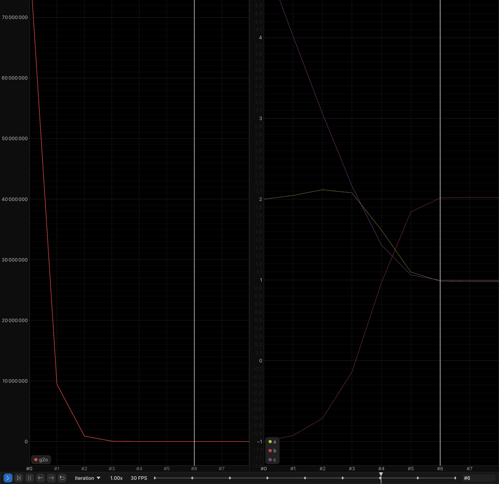
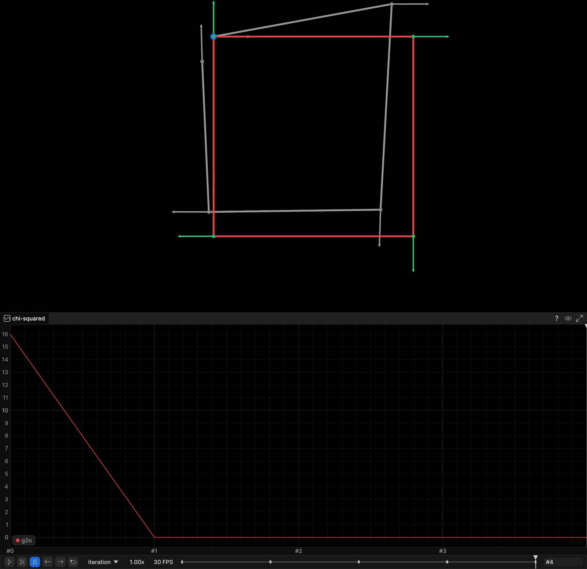
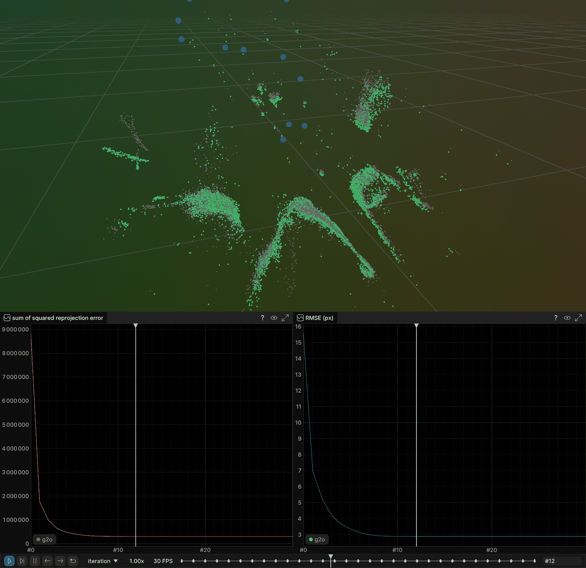

# g2o: General Graph Optimization

[g2o](https://github.com/RainerKuemmerle/g2o) is a C++ framework for optimizing
graph-based nonlinear least squares problems: vertices are the parameters, edges
are the constraints. It is the back end of ORB-SLAM, LSD-SLAM and many others.
This chapter solves the three canonical SLAM back-end problems with g2o, and
each demo **streams its own visualization live to a rerun viewer** while it
optimizes.

The same three problems are solved with GTSAM (`part3_ch01_14`), Ceres
(`part3_ch01_15`) and SymForce (`part3_ch01_16`) using the same data, the same
noise models, the same iteration budgets and the same reported metric formulas,
so the runs are directly comparable. (The C++ chapters share one RNG stream and
so land on bit-identical inputs; SymForce draws its noise from numpy, so its
pose-graph *realization* differs — see [Code notes](#code-notes).)
Every chapter logs into the same rerun
recording under its own library name, so running two of them against one viewer
overlays their solutions.

| Example | Source | Streams to the viewer |
|---|---|---|
| Curve fitting | `examples/g2o_curve_fitting.cpp` | `curve/*` (samples, true curve, fitted curve per iteration), `cost/g2o`, `params/g2o/{a,b,c}` |
| Pose-graph optimization | `examples/g2o_pose_graph.cpp` | `graph/*` (ground truth, initial estimate, optimized poses + headings, loop closure), `cost/g2o` |
| Bundle adjustment (BAL, Trafalgar Square) | `examples/g2o_bundle_adjustment.cpp` | `world/*` (initial cloud, landmarks, camera centres per iteration), `reprojection_error/g2o`, `rmse_px/g2o` |

---

## Build

The base image `slam:base` must exist first — build it from the course-root
Dockerfile in `SLAM_zero_to_hero/`:

```bash
cd ..                        # SLAM_zero_to_hero/ (where the base Dockerfile lives)
docker build . -t slam:base
```

Then this chapter (podman works too — substitute `podman` for `docker`):

```bash
cd part3_ch01_13             # back into this chapter, the build context
docker build . -t slam_zero_to_hero:part3_ch01_13
```

The image adds the rerun C++ SDK 0.33.0, builds the three executables under
`build/`, and downloads the BAL problem `problem-21-11315-pre.txt`.

Local build (needs g2o, Eigen3, and optionally the rerun C++ SDK):

```bash
mkdir build && cd build
cmake .. && make -j4
```

Without the rerun SDK the demos still build and print all their numbers; they
just say so and skip the streaming.

---

## Run

Start a viewer on the host **first**, then run the demos:

```bash
rerun &      # host viewer, listens on 127.0.0.1:9876

docker run -it --rm --network=host slam_zero_to_hero:part3_ch01_13 ./g2o_curve_fitting
docker run -it --rm --network=host slam_zero_to_hero:part3_ch01_13 ./g2o_pose_graph
docker run -it --rm --network=host slam_zero_to_hero:part3_ch01_13 ./g2o_bundle_adjustment
```

`--network=host` is what lets the container reach the viewer at
`127.0.0.1:9876`. Live gRPC streaming is version-sensitive: the container's
rerun SDK **must match** the host viewer's version (the Dockerfile pins
`0.33.0` — set it to whatever `rerun --version` prints on the host).

Streaming is automatic, with no flag to remember. The target address comes from
`RERUN_URL` (default `rerun+http://127.0.0.1:9876/proxy`), so a viewer on
another port or host is one environment variable away:

```bash
docker run -it --rm --network=host \
    -e RERUN_URL='rerun+http://127.0.0.1:9999/proxy' \
    slam_zero_to_hero:part3_ch01_13 ./g2o_pose_graph
```

If no viewer answers, each demo prints a note and runs normally.

`g2o_bundle_adjustment` takes an optional BAL file path; it defaults to
`problem-21-11315-pre.txt` in the working directory.

---

## Output

Each demo logs one frame per solver iteration on an `iteration` timeline —
drag the slider (or press play) in the viewer to watch the estimate converge.
Frame 0 is always the initial state, frame *k* the state after iteration *k*.
g2o's own Levenberg-Marquardt trace (chi2, lambda, `levenbergIter`) goes to
**stderr**, so stdout stays a clean, comparable report. The screenshots below
are from real runs streaming into the viewer; the strip along the bottom of each
is that `iteration` timeline.

### Curve fitting

Fits `y = exp(a x^2 + b x + c)` to 100 samples with `sigma = 0.2` (seed 42),
starting from `(a, b, c) = (2, -1, 5)`; ground truth is `(1, 2, 1)`.

```
Iter |      a       b       c |      chi2
---------------------------------------------
   0 |  2.0000 -1.0000  5.0000 | 80000165.0613
   1 |  2.0463 -0.9253  4.0160 | 9438212.4935
   ...
   7 |  0.9814  2.0221  0.9948 |   84.1805
   8 |  0.9814  2.0222  0.9948 |   84.1805

Estimated    : a=0.981351 b=2.02217 c=0.994798
chi2         : 80000165.0613 -> 84.1805  (99.9999% lower)
Iterations   : 8 of 30 (converged early)
```

`chi2 = 84.18` against 100 samples and 3 parameters (97 degrees of freedom) is
what a correct fit of data with this noise level looks like — the estimate is
not the ground truth because the samples are noisy, not because the solver
stopped short.



The two plots are the informative view here: `cost/g2o` on the left collapsing
from 8.0e7, and `params/g2o/{a,b,c}` on the right walking from the initial guess
`(2, -1, 5)` onto the ground truth `(1, 2, 1)` — `c` (purple) dropping from 5 to
1, `b` (red) climbing from -1 to 2, `a` (green) drifting up to 2.1 before settling
at 1. The cost is flat by frame 3, the parameters by frame 6.

The curve entities `curve/observations`, `curve/ground_truth`, `curve/g2o/initial`
and `curve/g2o/fitted` are logged too, and you can open them, but a rerun
`Spatial2DView` holds a 1:1 aspect ratio and sizes itself to everything logged:
`x` spans one unit while `y` reaches 391 at the initial guess, so that view
renders as an unreadable vertical sliver. It is left out of the screenshot on
purpose.

### Pose graph

5 poses around a square that returns to its start, 4 odometry edges plus one
loop closure `x4 -> x0`. The measurements are the **exact** relative transforms
from ground truth and only the initial estimate is perturbed (seed 7,
`sigma_xy = 0.15`, `sigma_theta = 0.08`, poses 1..4 only), so the optimum *is*
ground truth and any residual error is the solver's:

```
Poses: 5  edges: 5 (4 odometry + 1 loop closure)
Measurement sigma: (0.1, 0.1, 0.05) -> information diag(100, 100, 400)

Pose | ground truth        | initial             | optimized           | error
-------------------------------------------------------------------------------------
  x0 | ( 0.00, 0.00, 0.00) | ( 0.00, 0.00, 0.00) | ( 0.00, 0.00, 0.00) | 0.00e+00
  x1 | ( 1.00, 0.00, 0.00) | ( 0.89,-0.16,-0.00) | ( 1.00,-0.00, 0.00) | 3.27e-16
  x2 | ( 1.00, 1.00, 1.57) | ( 0.84, 0.87, 1.60) | ( 1.00, 1.00, 1.57) | 5.66e-16
  x3 | ( 0.00, 1.00, 3.14) | (-0.02, 0.88,-3.14) | (-0.00, 1.00, 3.14) | 2.61e-16
  x4 | ( 0.00, 0.00,-1.57) | (-0.06, 0.12,-1.60) | ( 0.00,-0.00,-1.57) | 2.31e-16

chi2       : 15.997341 -> 7.532e-29
Max position error vs ground truth: 5.661e-16 m
Iterations : 4 of 30 (converged early)
```

`x3`'s initial heading prints as `-3.14` rather than `+3.14`: the perturbation
pushed `pi + dtheta` just past `pi`, and headings are wrapped into `(-pi, pi]`.
It is the same angle.



In the viewer, `graph/ground_truth` (green) and `graph/g2o/initial` (grey) are
static; `graph/g2o/optimized` (red) snaps onto ground truth over 4 frames — at
the last frame it covers the green square exactly, which is what the `5.66e-16 m`
max position error looks like. The blue marker at the origin is where the loop
closure `x4 -> x0` lands, and the `cost/g2o` plot below ("chi-squared") drops
from 15.9973 to the floor of the axis on the first iteration; the remaining
three only confirm it. Heading arrows are logged with the positions because pose 4
sits exactly on pose 0 and differs only in orientation — the loop closure is
invisible in a position-only plot.

### Bundle adjustment

BAL Trafalgar Square: 21 cameras, 11315 points, 36455 observations. Camera 0's
pose is fixed, the per-camera intrinsics `(f, k1, k2)` are fixed at their
dataset values, and there is no robust kernel, so the reported error *is* the
objective:

```
Cameras: 21  Points: 11315  Observations: 36455
Intrinsics (f, k1, k2) are read from the dataset and held FIXED; only the 6-DoF poses and the 3D points are optimized.

Initial sq_error: 8.82648e+06   RMSE: 15.560200 px

  iter  1  sq_error 1.77027e+06  rmse 6.9685 px
  iter  2  sq_error 995288  rmse 5.2251 px
  ...
  iter 15  sq_error 303407  rmse 2.8849 px
  ...
  iter 30  sq_error 303407  rmse 2.8849 px

--- Results (raw least squares, no robust kernel) ---
sq_error : 8.82648e+06 -> 303407   (96.56% lower)
rmse_px  : 15.560200 -> 2.884925   (81.46% lower)
Iterations: 30 (logged frames 0..30 on the 'iteration' timeline)
```

The solver is essentially converged by iteration 15; the remaining iterations
only shuffle lambda (visible in the stderr trace as `levenbergIter` > 1).



In the viewer, `world/initial_points` (grey) is the starting cloud,
`world/g2o/landmarks` (green) and `world/g2o/cameras` (blue, larger dots) update
every iteration, and `reprojection_error/g2o` / `rmse_px/g2o` plot both metrics.
By the frame above the green landmarks sit on top of the grey cloud and the
structure of the square is recognisable, with the two plots below showing the
`8.83e6 -> 3.03e5` and `15.56 -> 2.88 px` drops already flat. The camera centres
sit inside the point cloud, 1.50–4.50 scene units from its centroid.

---

## Code notes

- **Curve fitting** defines a custom `CurveVertex` (the 3 parameters) and a
  custom unary `CurveEdge` with an **analytic Jacobian** in `linearizeOplus()`,
  solved with a dense **Levenberg-Marquardt** solver
  (`OptimizationAlgorithmLevenberg`). g2o also ships
  `OptimizationAlgorithmGaussNewton` and `...Dogleg`; LM is used here because
  the sibling chapters use LM and the iteration counts should be comparable.
- **The reported cost is computed in the example, not taken from the solver.**
  Every library in this series defines its internal "error"/"cost" a little
  differently (some carry a factor of 0.5), so each demo evaluates one shared
  formula itself: `chi2 = sum ((y_i - model(x_i)) / sigma)^2` for the curve, and
  `sum e^T * information * e` over the SE(2) tangent-space residuals for the
  pose graph. For this chapter those happen to coincide with g2o's own `chi2()`,
  which is a useful cross-check rather than a coincidence to rely on.
- **Per-iteration streaming and early exit** both hang off
  `optimizer.addPostIterationAction()`. The action logs the frame and sets the
  optimizer's force-stop flag once the relative chi2 decrease drops below
  `1e-6`. g2o ships `SparseOptimizerTerminateAction` for exactly this, but the
  criterion is spelled out by hand so it is bit-for-bit the test the sibling
  chapters use. Note that g2o fires the post-iteration actions once with
  `iteration = -1` before the first real iteration; that call must be ignored or
  the initial state gets logged twice.
- **Pose graph** uses g2o's built-in `VertexSE2` / `EdgeSE2`. Measurements come
  straight from ground truth (`gt[i].inverse() * gt[j]`), which is deliberate:
  the graph is perfectly consistent, so the optimum is ground truth. The gauge
  is fixed the idiomatic g2o way — `vertex(0)->setFixed(true)`, which removes
  the vertex from the linear system entirely. That is a genuine difference
  between the libraries: GTSAM uses a tight prior factor, Ceres
  `SetParameterBlockConstant`, SymForce omits the key from `optimized_keys`.
- **How far the comparability goes.** Pose 0 gets no noise draw, and the three
  deviates per pose are drawn into named locals in a fixed `dx, dy, dtheta`
  order — never inside a constructor's argument list, where C++ leaves the
  evaluation order unspecified. The four C++ chapters (g2o, GTSAM, Ceres,
  Kimera-RPGO) therefore share one `mt19937(7)` stream consumed identically and
  see the **same** initial estimate, hence the same initial `chi2 = 15.997341`.
  The SymForce chapter (`part3_ch01_16`) differs: its noise comes from numpy's
  PRNG, so it is a different realization of the same distribution. Model, pose
  count, sigmas, ground truth and the *nominal* initial guess are identical
  there; only the drawn numbers differ.
- **Bundle adjustment** implements the BAL camera model with custom types.
  `VertexCamera` is **6-DoF** — a quaternion rotation with a proper SO(3) update
  in `oplusImpl()` plus a translation. The intrinsics `(f, k1, k2)` are read
  from the dataset and held **fixed**: they are `const` members of the
  reprojection edge, not part of any vertex estimate. `VertexPoint` is
  marginalized so the block solver (`BlockSolverTraits<6, 3>`) can use the Schur
  complement. Jacobians are numeric.
- **No robust kernel in bundle adjustment.** g2o offers
  `edge->setRobustKernel(new g2o::RobustKernelHuber())` (also Cauchy, Tukey,
  ...), and it is deliberately off here so that the reported error is exactly
  the objective being minimized and the four chapters' numbers compare directly.
- **Gauge in bundle adjustment**: camera 0's pose is hard-fixed. That removes 6
  of the 7 gauge degrees of freedom; overall **scale stays free**, because the
  BAL projection is scale-invariant (scaling every translation and every point
  leaves the projection unchanged). LM damping handles that remaining direction,
  so there is no need to also fix a point — doing that would over-constrain the
  problem.
- **Camera centres** are recovered as `C = -R^T t`, since g2o stores the
  world-to-camera transform here.

BAL format: `<#cameras> <#points> <#observations>`, then one
`<cam> <pt> <x> <y>` line per observation, then 9 parameters per camera
(3 rotation + 3 translation + f, k1, k2), then 3 coordinates per point.
Projection convention: `P_cam = R X + t`, `p = (-P.x/P.z, -P.y/P.z)`,
`p' = f (1 + k1 r^2 + k2 r^4) p`. More problems:
https://grail.cs.washington.edu/projects/bal/

### One build constraint of this image: the static `libfmt.a` line

Nothing in this chapter uses `spdlog` or `fmt`, and there is nothing for you to
install — this is a quirk of `slam:base`, not a dependency of the exercise. g2o
logs through spdlog, so `find_package(g2o)` pulls `spdlog::spdlog` in as an
interface dependency and g2o's headers emit spdlog calls into every translation
unit that includes them. On this image `/usr/include/fmt` is fmt v8 while
`libfmt.so` is v9, so the shared library resolves none of those calls and the
link dies with hundreds of `undefined reference to fmt::v8::...` (verified:
delete the block and `g2o_bundle_adjustment` fails to link). `CMakeLists.txt`
therefore links the matching static `/usr/lib/libfmt.a`, hung off
`spdlog::spdlog` so it lands after `libspdlog.a` on the order-sensitive static
link line. On an image whose fmt headers and library agree, the block does
nothing and can be dropped.

---

## References

- [g2o GitHub](https://github.com/RainerKuemmerle/g2o)
- [BAL dataset](https://grail.cs.washington.edu/projects/bal/)
- [Rerun](https://rerun.io/)
