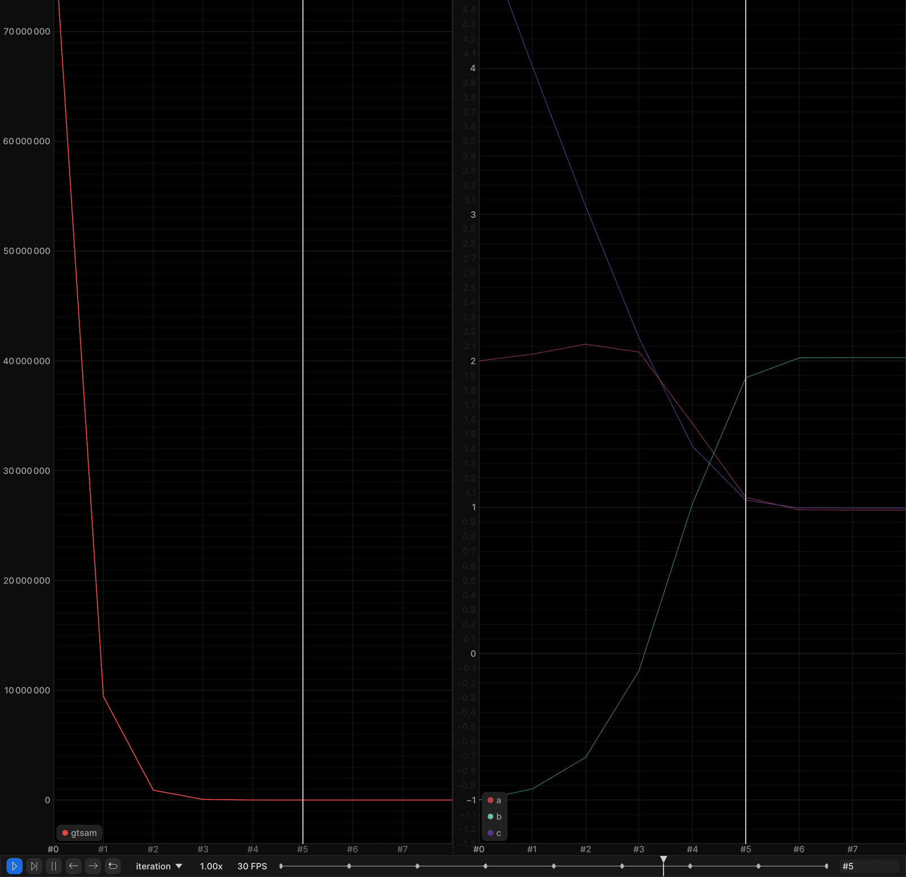
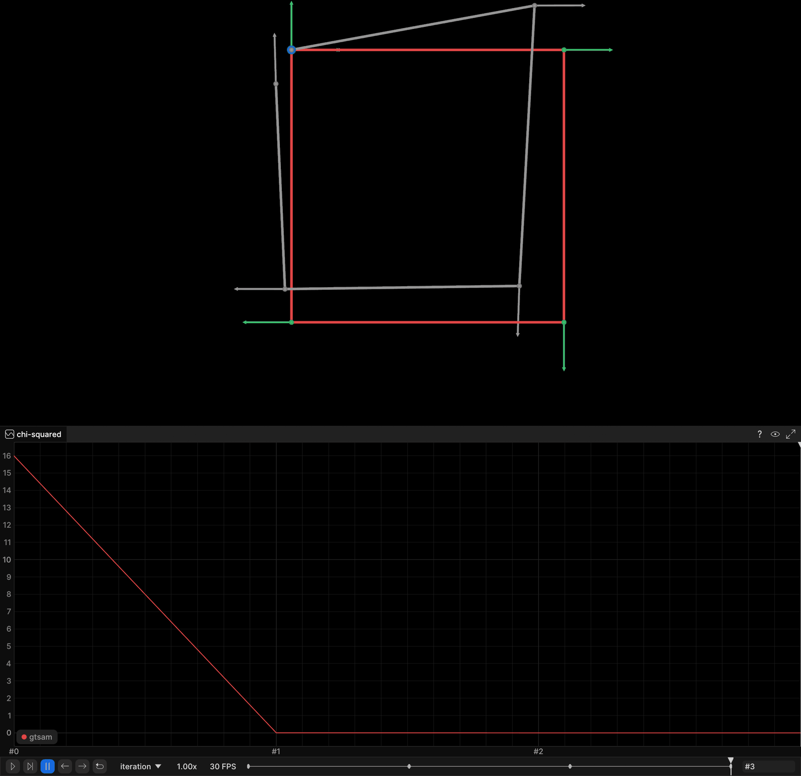
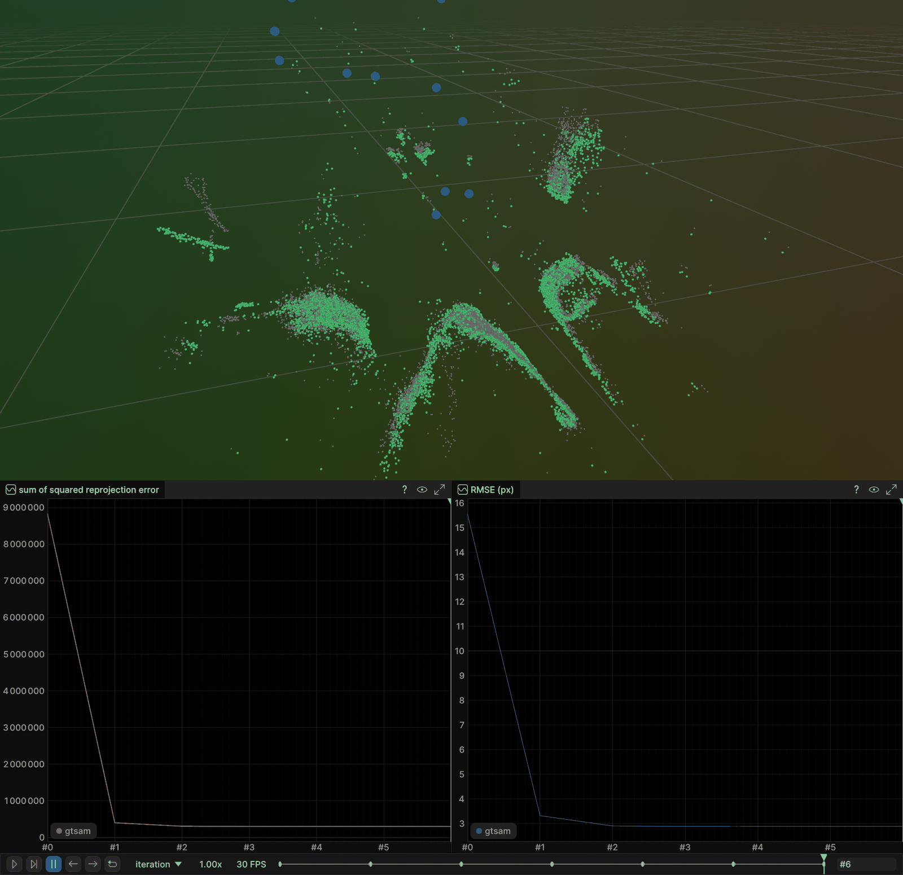

# GTSAM: Georgia Tech Smoothing and Mapping

[GTSAM](https://gtsam.org/) is a factor-graph optimization library widely used in
robotics and SLAM: variables are the unknowns, factors are the constraints, and
the solver (batch Levenberg-Marquardt here, iSAM2 for incremental work) finds the
maximum-a-posteriori estimate. This chapter solves the three canonical SLAM
back-end problems with GTSAM.

The same three problems are solved with g2o (`part3_ch01_13`), Ceres
(`part3_ch01_15`) and SymForce (`part3_ch01_16`) using the same data, the same
weights, the same iteration budget and the same reported metric formulas — so the
numbers below are directly comparable with those chapters. Every demo
**streams its iterations live to a rerun viewer** and logs into a recording
shared with its sibling chapters, so running two of them against one viewer
overlays the two solutions.

| Example | Source | Streams |
|---|---|---|
| Curve fitting | `examples/gtsam_curve_fitting.cpp` | samples, ground-truth curve, the fitted curve per iteration, chi-squared and `(a, b, c)` plots |
| Pose-graph optimization | `examples/gtsam_pose_graph.cpp` | ground truth / initial / optimized trajectory with heading arrows, loop-closure edge, chi-squared plot |
| Bundle adjustment (BAL, Trafalgar Square) | `examples/gtsam_bundle_adjustment.cpp` | 3D landmark cloud and camera centres per iteration, squared-error and pixel-RMSE plots |

---

## Build

The base image `slam:base` (built from the course-root `SLAM_zero_to_hero/Dockerfile`)
ships GTSAM 4.3a1; the chapter image adds the rerun C++ SDK 0.33.0 on top of it.
`docker build .` takes the current directory as its build context, so each block
below cd's to the directory holding the Dockerfile it builds:

```bash
# once
cd ..                        # SLAM_zero_to_hero/ (where the base Dockerfile lives)
docker build . -t slam:base

# this chapter
cd part3_ch01_14
docker build . -t slam_zero_to_hero:part3_ch01_14
```

Local build (needs GTSAM 4.x; the rerun C++ SDK is optional — without it the
demos still run and print their numbers, they just do not stream):

```bash
mkdir build && cd build
cmake .. && make -j4
```

The image builds the three executables in `/workspace/part3_ch01_14/build` and
downloads the BAL problem `problem-21-11315-pre.txt` next to them.

---

## Run

Start a viewer on the host **first**, then run the demos:

```bash
rerun &                 # host viewer, listens on 127.0.0.1:9876

docker run -it --rm --network=host slam_zero_to_hero:part3_ch01_14 ./gtsam_curve_fitting
docker run -it --rm --network=host slam_zero_to_hero:part3_ch01_14 ./gtsam_pose_graph
docker run -it --rm --network=host slam_zero_to_hero:part3_ch01_14 ./gtsam_bundle_adjustment
```

`--network=host` is what lets the container reach the viewer at
`127.0.0.1:9876`. Live gRPC streaming is version-sensitive: the container's rerun
SDK **must match** the host viewer's version (the Dockerfile pins `0.33.0` — set
it to whatever `rerun --version` prints on the host).

Streaming needs no flag and no opt-in. Each demo probes the viewer address
(`RERUN_URL`, default `rerun+http://127.0.0.1:9876/proxy`), prints
`Streaming to rerun viewer at ... as 'gtsam'` when one answers, and prints a note
and runs normally when none does. To target a viewer elsewhere:

```bash
docker run -it --rm --network=host \
    -e RERUN_URL='rerun+http://127.0.0.1:9999/proxy' \
    slam_zero_to_hero:part3_ch01_14 ./gtsam_pose_graph
```

`gtsam_bundle_adjustment` takes the BAL file as an optional argument
(default `problem-21-11315-pre.txt`, which the image already contains):

```bash
./gtsam_bundle_adjustment problem-21-11315-pre.txt
```

---

## Output

All three demos drive an `iteration` timeline in the viewer: scrub it (or press
play) to watch the estimate move. Entity paths carry the library name, so a
sibling chapter's run lands next to this one instead of overwriting it. The
screenshots below are frames from real runs streaming into a viewer.

### Curve fitting — recording `part3_curve_fitting`

100 samples of `y = exp(a x² + b x + c)` with ground truth `(1, 2, 1)`, Gaussian
noise `sigma = 0.2` (seed 42), started from `(2, -1, 5)`.

Plots: `cost/gtsam` (chi-squared) and `params/gtsam/{a,b,c}`. The curve is logged
as well — `curve/observations`, `curve/ground_truth`, `curve/gtsam/initial`
(static) and `curve/gtsam/fitted` (per iteration) — but read the note under the
screenshot before you go looking for it in a 2D view.

```
Ground truth : a=1 b=2 c=1
Initial guess: a=2 b=-1 c=5

Iteration 0: chi2 = 8.00002e+07
Iteration 1: chi2 = 9.43796e+06  a=2.04587 b=-0.924737 c=4.01585
...
Iteration 6: chi2 = 84.1834  a=0.982399 b=2.02048 c=0.995465
Iteration 7: chi2 = 84.1805  a=0.981348 b=2.02217 c=0.994796
Iteration 8: chi2 = 84.1805  a=0.981351 b=2.02217 c=0.994798

Estimated    : a=0.981351 b=2.02217 c=0.994798
chi2         : 8.00002e+07 -> 84.1805  (8 LM iterations)
```



The pair of plots is the informative view here: on the left chi-squared collapsing
from 8.0e7 to its final value, on the right the three parameters walking off the
initial guess `(2, -1, 5)` onto the ground truth `(1, 2, 1)`. There is
deliberately no scatter-plus-curve panel in the layout. A rerun `Spatial2DView`
keeps a 1:1 aspect ratio and sizes itself to the full extent of everything logged,
and this problem has x spanning 1 unit against y reaching 391 at the initial
guess, so the curve view renders as an unreadable sliver. The curve entities are
still logged if you want to open one anyway.

The estimate does not land exactly on `(1, 2, 1)` and should not: with
`sigma = 0.2` noise on 100 samples, `(0.981, 2.022, 0.995)` at `chi2 = 84.2`
(97 degrees of freedom) is the maximum-likelihood answer for *this* noise draw.

### Pose-graph optimization — recording `part3_pose_graph`

5 poses around a unit square, ending back at the start:
`(0,0,0) (1,0,0) (1,1,π/2) (0,1,π) (0,0,-π/2)`; odometry edges (0,1) (1,2) (2,3)
(3,4) plus the loop closure (4,0).

Entities: `graph/ground_truth/*` and `graph/gtsam/initial/*` (static),
`graph/gtsam/optimized/{poses,path,heading,loop_closures}` per iteration, and the
`cost/gtsam` plot. Heading arrows matter here: pose 4 sits exactly on pose 0 and
differs only in orientation, so the loop closure is invisible in a position-only
plot.

```
Iteration 0: chi2 = 15.9973
Iteration 1: chi2 = 0.00475186
Iteration 2: chi2 = 3.51709e-11
Iteration 3: chi2 = 1.15405e-26

chi2: 15.9973 -> 1.15405e-26  (3 LM iterations)

Pose | ground truth        | optimized           | position error
--------------------------------------------------------------------
  x0 | ( 0.00, 0.00, 0.00) | ( 0.00,-0.00,-0.00) | 0.000000
  x1 | ( 1.00, 0.00, 0.00) | ( 1.00,-0.00,-0.00) | 0.000000
  x2 | ( 1.00, 1.00, 1.57) | ( 1.00, 1.00, 1.57) | 0.000000
  x3 | ( 0.00, 1.00, 3.14) | (-0.00, 1.00,-3.14) | 0.000000
  x4 | ( 0.00, 0.00,-1.57) | (-0.00,-0.00,-1.57) | 0.000000

Max position error: 7.82629e-15 m
```



Green is the ground-truth unit square with a heading arrow at each pose, grey is
the noisy initial estimate, and red is the optimized trajectory — sitting exactly
on top of the green. The blue marker at the origin is where the loop-closure edge
`x4 -> x0` lands. Below, chi-squared drops from 15.9973 to 0.00475 in the first
iteration — indistinguishable from zero at that scale — and on down to 1e-26.

Driving the residual to 1e-26 is not a suspiciously good result — it is the
deliberate design of the exercise. The measurements are the **exact** relative
transforms from ground truth, so ground truth *is* the global optimum and the
only thing left to measure is how cleanly each library gets there. The noise is
in the initial estimate (seed 7, `sigma_xy = 0.15`, `sigma_theta = 0.08`, on
poses 1..4 only — pose 0 is the gauge anchor and starts exactly at ground truth).

### Bundle adjustment — recording `part3_bundle_adjustment`

BAL Trafalgar Square `problem-21-11315-pre.txt`: 21 cameras, 11315 points,
36455 observations.

Entities: `world/initial_points` (static, grey — where the landmarks started),
`world/gtsam/landmarks` and `world/gtsam/cameras` per iteration, and the
`reprojection_error/gtsam` (raw squared error) and `rmse_px/gtsam` plots.

```
Cameras: 21  Points: 11315  Observations: 36455
Intrinsics (f, k1, k2) are FIXED at the dataset values; only the 6-DoF poses and the 3D points are optimized.

Initial: sq_error = 8.82649e+06  rmse = 15.5602 px
Iteration 1: sq_error = 401748  rmse = 3.31969 px
Iteration 2: sq_error = 306842  rmse = 2.90121 px
Iteration 3: sq_error = 303723  rmse = 2.88643 px
Iteration 4: sq_error = 303419  rmse = 2.88498 px
Iteration 5: sq_error = 303407  rmse = 2.88493 px
Iteration 6: sq_error = 303407  rmse = 2.88492 px

Camera 0 drift from its prior: 1.41776e-17 (translation), 7.07527e-18 rad (rotation)

sq_error: 8.82649e+06 -> 303407
rmse    : 15.5602 px -> 2.88492 px
Reduction: 96.5625% of the squared error  (6 LM iterations)
```



The Trafalgar Square structure is plainly recognisable: green is the optimized
landmark cloud, sitting on top of the grey initial cloud it started from, and the
blue spheres are the 21 recovered camera centres. Below left, the sum of squared
reprojection error drops 8.83e6 -> 3.03e5; below right, RMSE 15.56 px -> 2.88 px,
almost all of it in the first iteration.

The budget is 30 iterations; LM stops after 6 because the relative decrease falls
below 1e-6 (the squared error is flat at 303407 from iteration 5 onwards).

Under `setVerbosityLM("SUMMARY")` the log also shows LM rejecting the first trial
of most iterations with `cost inf`: at `lambda = 1e-5` the normal equations come
out indeterminate, and GTSAM reports a failed linear solve as infinite cost. That
is the free scale direction of the gauge (see below) showing up in the linear
algebra — one step of extra damping (`lambda = 1e-4`) fixes it every time.

---

## Code notes

Deliberate choices, shared with the g2o / Ceres / SymForce chapters so the four
sets of numbers mean the same thing:

- **Intrinsics are fixed.** In bundle adjustment the per-camera BAL intrinsics
  `(f, k1, k2)` are read from the dataset and held constant; only the 6-DoF
  camera poses and the 3D points are optimized. That is why the factor is
  `GenericProjectionFactor<Pose3, Point3, Cal3Bundler>` — it takes the
  calibration as a constant `std::shared_ptr<Cal3Bundler>` constructor argument —
  rather than `GeneralSFMFactor<SfmCamera, Point3>`, which optimizes the
  calibration jointly with the pose over a 9-DoF `PinholeCamera<Cal3Bundler>`
  variable.
- **No robust kernel in bundle adjustment.** GTSAM has
  `noiseModel::Robust::Create(noiseModel::mEstimator::Huber::Create(k), model)`;
  it is deliberately unused here so the reported error *is* the objective being
  minimized and is comparable to the other three chapters.
- **Exact pose-graph measurements**, as described under Output.
- **One convergence test in all four chapters:** stop when the relative chi-squared
  decrease falls below `1e-6` (`cost - next <= 1e-6 * max(1, cost)`). That matches
  Ceres' default `function_tolerance` and SymForce's `early_exit_min_reduction`, so
  the printed iteration counts are comparable rather than an artifact of four
  different thresholds.
- **The initial-estimate perturbation is drawn into named locals**, one deviate per
  line, before the pose is constructed. Writing it inline as
  `Pose2(gt.x() + nxy(rng), gt.y() + nxy(rng), gt.theta() + nth(rng))` compiles and
  looks identical, but argument evaluation order in a function call is
  *unspecified* — GCC evaluates right-to-left — and `nxy`/`nth` draw from one
  shared `mt19937` stream, so the same seed would yield a different perturbation
  than the sibling chapters get. This is the exact bug that would silently make
  four "identical" exercises four different problems.
- **Chi-squared is computed in the example, not read from the library.**
  `NonlinearFactorGraph::error()` is `0.5 * chi2` (visible above: the SUMMARY
  line prints half of what the demo prints), g2o reports `chi2`, Ceres reports
  `0.5 * chi2`. The demos compute
  `chi2 = sum_i ((y_i - model(x_i)) / sigma)^2` for curve fitting and, for the
  pose graph, `delta = measured^-1 (T_i^-1 T_j)` with the angle wrapped to
  `(-π, π]`, weighted by `diag(100, 100, 400)` — summed over edges only, so the
  gauge anchor does not contaminate the comparison.
- **Gauge anchors are where the libraries genuinely differ.** GTSAM has no
  "hold this variable fixed" flag, so a tight prior stands in for one: sigma
  `(0.01, 0.01, 0.005)` on pose 0 in the pose graph, isotropic sigma `1e-6` on
  camera 0 in bundle adjustment. (g2o uses `setFixed(true)`, Ceres
  `SetParameterBlockConstant`, SymForce simply omits the key from
  `optimized_keys`.) The BA demo prints camera 0's drift so the reader can check
  the prior really is doing a hard constraint's job — 1.4e-17 above.
  Pinning camera 0 removes 6 of the 7 gauge degrees of freedom; **overall scale
  stays free**, because the BAL projection is scale-invariant. No point is pinned
  as well — that would over-constrain the problem. LM's damping term absorbs the
  remaining direction, which is exactly what the `cost inf` rejections above are.

GTSAM API traps this chapter exists to teach:

- **`setVerbosity` and `setVerbosityLM` are two different knobs.**
  `setVerbosity()` takes `NonlinearOptimizerParams::Verbosity`
  (`SILENT`/`TERMINATION`/`ERROR`/`VALUES`/`DELTA`/`LINEAR`), while `"SUMMARY"`
  is a `LevenbergMarquardtParams::VerbosityLM` value. Passing `"SUMMARY"` to
  `setVerbosity()` compiles, runs, and silently leaves the optimizer at
  `SILENT` — nothing is printed. All three demos call `setVerbosityLM("SUMMARY")`.
- **A custom factor needs a `clone()` override.** The inherited
  `NonlinearFactor::clone()` is a stub that throws, and it is what runs the
  moment the factor gets copied — which is exactly what `ISAM2` and
  `NonlinearFactorGraph::clone()` do internally. `CurveFactor` implements it
  with `std::static_pointer_cast`; GTSAM builds with boost features enabled use
  `boost::static_pointer_cast` instead.
- **GTSAM's verbosity output changes `cout`'s precision** while it prints, so the
  demos reset it (`msg()`) before each of their own lines.
- **Pose conventions.** `SfmData::FromBalFile` converts BAL's camera parameters
  (world-to-camera rotation/translation, camera looking down `-z`) into GTSAM's
  convention: a `Pose3` that is **camera-to-world** with the camera looking down
  `+z`. So the camera centre is `pose.translation()` directly, with no `-Rᵗt`
  as in the g2o / Ceres / SymForce chapters, and the standard
  `PinholeCamera<Cal3Bundler>` projection is algebraically equivalent to BAL's
  negated projection. The arithmetic path is not identical, though: this chapter
  goes through `SfmData::FromBalFile`'s camera-to-world poses and
  `Cal3Bundler::uncalibrate`, while the g2o / Ceres / SymForce chapters evaluate
  `p = (-X/Z, -Y/Z)`, `p' = f (1 + k1 r² + k2 r⁴) p` directly. So the initial
  squared error prints 8.82649e+06 here against 8.82648e+06 there (15.5602 px
  RMSE in all four) — agreement to five significant figures, about 1e-6
  relative. The final values land on 303407 / 2.88492 px in every chapter.
- **Iteration counting.** `LevenbergMarquardtOptimizer::iterate()` is called
  once per logged step, and frame 0 on the `iteration` timeline is the *initial*
  state, not the first iteration — the printed LM iteration count excludes it.

Metric formulas, identical in all four chapters:
`sq_error = Σ_obs |projected - measured|²` (raw, no robust weighting) and
`rmse_px = sqrt(sq_error / num_observations)` — **per observation**, not per
residual component.

BAL dataset: https://grail.cs.washington.edu/projects/bal/

---

## References

- [GTSAM website](https://gtsam.org/) · [intro tutorial](https://gtsam.org/tutorials/intro.html)
- [BAL dataset](https://grail.cs.washington.edu/projects/bal/)
- [Rerun](https://rerun.io/)
