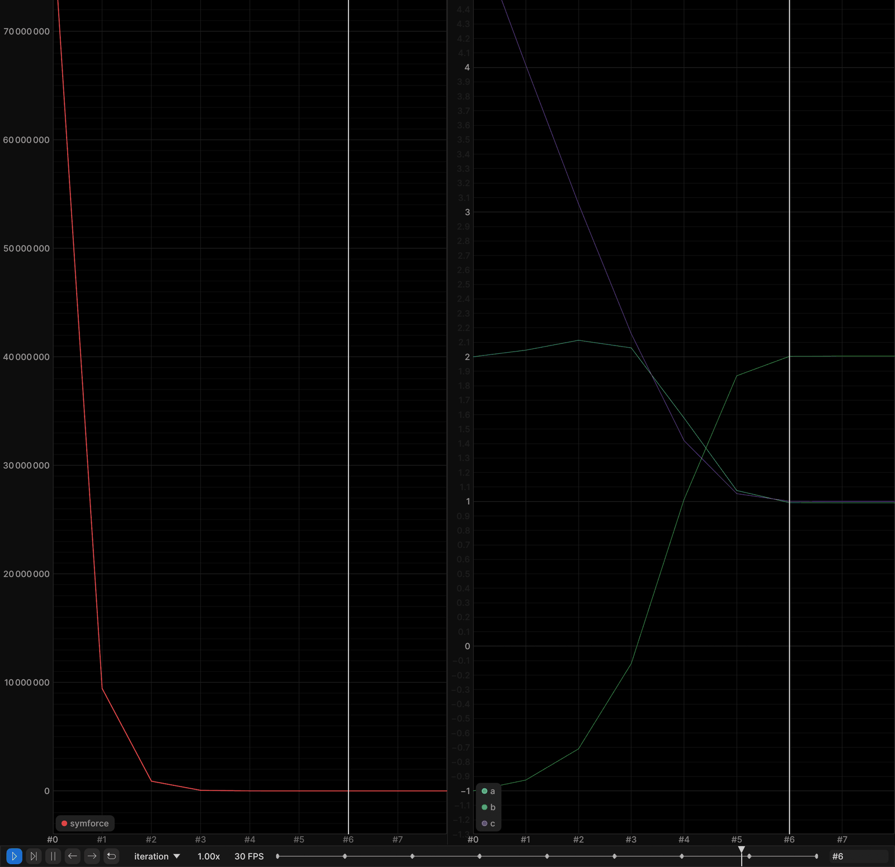
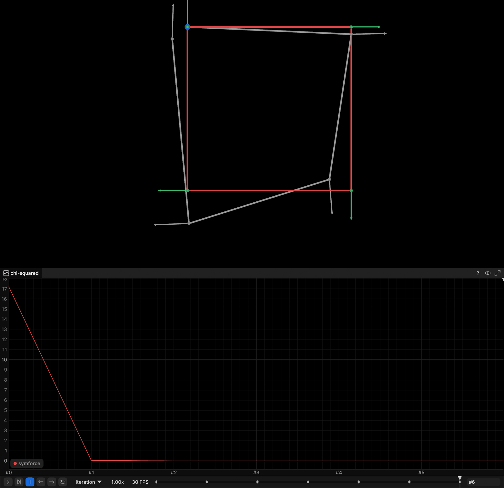
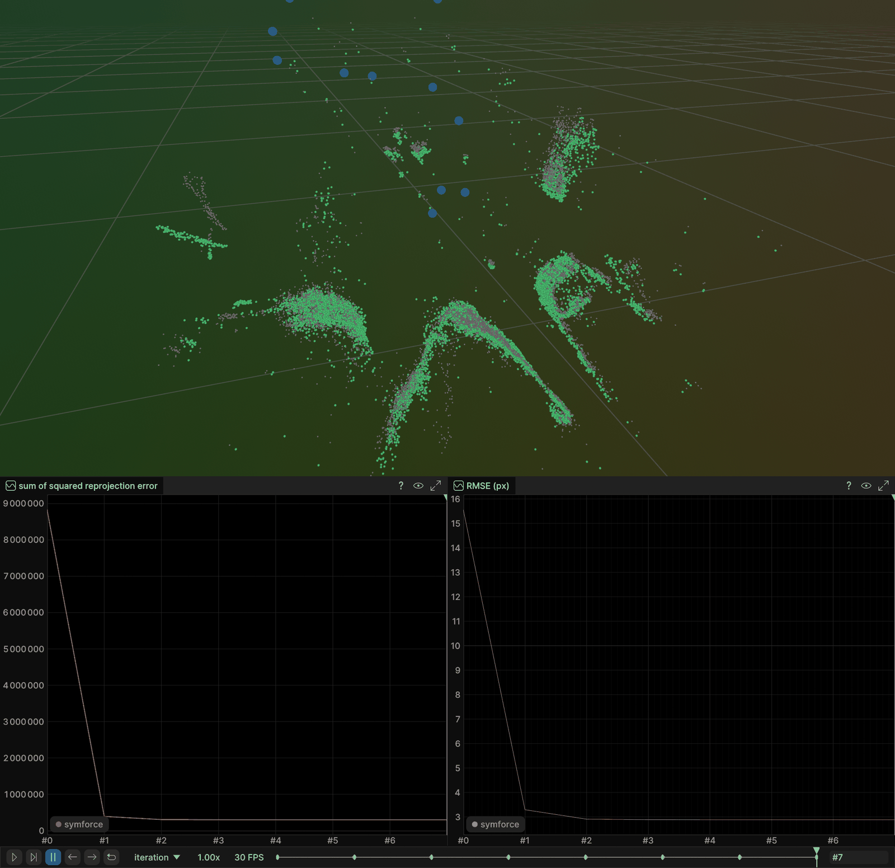

# SymForce: Symbolic Computing for Robotics

Code exercise for the three canonical SLAM back-end problems solved with
[SymForce](https://github.com/symforce-org/symforce) (Skydio): residuals are
written as symbolic Python functions, SymForce derives their Jacobians and
compiles them, and its Levenberg-Marquardt optimizer solves the factor graph.

This is the SymForce entry in the chapter-1 back-end series (g2o, GTSAM, Ceres,
SymForce, Kimera-RPGO). g2o (`part3_ch01_13`), GTSAM (`part3_ch01_14`), Ceres
(`part3_ch01_15`) and this chapter all solve the same three problems; Kimera-RPGO
(`part3_ch01_17`) contributes only the shared pose graph. Every chapter streams
into the **same rerun recordings** under its own library name, so running two of
them against one viewer overlays their solutions for a direct comparison. The
examples here are pure Python.

| Example | Source | What the demo streams |
|---|---|---|
| Curve fitting | `examples/symforce_curve_fitting.py` | fitted curve per iteration, chi-squared and `a, b, c` plots |
| Pose-graph optimization | `examples/symforce_pose_graph.py` | poses + heading arrows + loop closure per iteration, chi-squared plot |
| Bundle adjustment (BAL, Trafalgar Square) | `examples/symforce_bundle_adjustment.py` | landmark cloud + camera centres per iteration, squared-error and pixel-RMSE plots |

### What is identical to the C++ chapters, and what is not

The **problem** is identical: same model, same sample count (100), same
measurement sigma (0.2), same ground truth, same initial guess, same weights /
information matrices, same 30-iteration Levenberg-Marquardt budget, same
chi-squared and reprojection formulas, same reported metrics.

What differs is the **noise realization**. These examples are Python, so they
draw with numpy's `default_rng(42)` (curve fitting) and `default_rng(7)`
(pose-graph initial estimate). That is a different generator from the C++
chapters' `std::mt19937`, and numpy's Gaussian transform is not libstdc++'s
either, so the same seed produces a different noise sample. The problem is the
same; the particular draw is not. That shifts the reported chi-squared values and
the fitted parameters slightly:

| | this chapter (numpy) | g2o / GTSAM / Ceres (libstdc++) |
|---|---|---|
| Curve fitting, initial chi2 | 80015976.9902 | 80000165.0613 |
| Curve fitting, final chi2 | 56.0874 | 84.1805 |
| Curve fitting, estimate | a=0.9907 b=2.0050 c=1.0011 | a=0.981351 b=2.02217 c=0.994798 |
| Pose graph, initial chi2 | 17.218417 | 15.9973 |

Both are correct solutions to the same problem, fitted to different draws of the
same noise distribution. Hand-rolling libstdc++'s generator in numpy just to
force bit-identical noise would cost more in readability than exact
cross-language agreement is worth here, so each chapter keeps the idiomatic RNG
of its language and the difference is documented instead.

Bundle adjustment is unaffected — it reads cameras, points and observations from
the BAL file and uses no RNG at all — so its numbers **do** match the other
chapters' digit for digit.

---

## Build

`slam:base` must be built first, from `SLAM_zero_to_hero/Dockerfile` — every
chapter image builds `FROM slam:base`:

```bash
cd ..               # SLAM_zero_to_hero, where the base Dockerfile lives
docker build . -t slam:base
```

Then this chapter (it adds `rerun-sdk==0.33.0` and downloads the BAL problem):

```bash
cd part3_ch01_16
docker build . -t slam_zero_to_hero:part3_ch01_16
```

`podman` works too — substitute it for `docker` in both commands.

There is nothing to compile — the examples are Python. `CMakeLists.txt` is only a
layout placeholder that prints the run commands. To run outside Docker:
`pip install symforce 'rerun-sdk==0.33.0'`.

---

## Run

Start a viewer on the host **first**, then run the demos — they stream into it
while they run:

```bash
rerun &     # on the host
```

```bash
# The image lands in /workspace/part3_ch01_16/run, which holds the BAL problem.
docker run -it --rm --network=host slam_zero_to_hero:part3_ch01_16 bash

python3 ../examples/symforce_curve_fitting.py
python3 ../examples/symforce_pose_graph.py
python3 ../examples/symforce_bundle_adjustment.py problem-21-11315-pre.txt
```

`--network=host` lets the container reach the viewer at `127.0.0.1:9876`. Live
gRPC streaming is version-sensitive: the container's rerun SDK **must match** the
host viewer's version (the Dockerfile pins `0.33.0` — set it to whatever
`rerun --version` prints on the host). Note `slam:base` itself ships rerun-sdk
0.28.1, so that pin is load-bearing.

Point the demos at another viewer with `RERUN_URL`:

```bash
docker run --rm --network=host -e RERUN_URL='rerun+http://127.0.0.1:9999/proxy' \
    slam_zero_to_hero:part3_ch01_16 \
    bash -lc 'python3 ../examples/symforce_pose_graph.py'
```

With no viewer reachable the demos print a note and run exactly the same — every
result also goes to stdout.

Each example compiles its symbolic residual before the solver starts. Curve
fitting and the pose graph finish in seconds; bundle adjustment is the slow one —
roughly six minutes end to end on the full Trafalgar problem (14 s to build the
factors, 363 s inside `optimize()` when measured here; it scales with your CPU).
See `## Code notes`.

---

## Output

Three recordings, shared with the sibling chapters: **part3_curve_fitting**,
**part3_pose_graph**, **part3_bundle_adjustment**. Each carries an `iteration`
timeline; scrub it (or press play) to watch the solver converge. Frame 0 is the
initial state, frame *n* the result of LM step *n*. Every per-library entity path
carries a `symforce` segment (`curve/symforce/fitted`, `cost/symforce`,
`world/symforce/landmarks`, ...), so a g2o / GTSAM / Ceres run lands beside this
one in the same recording instead of overwriting it.

### Curve fitting

The informative view here is the pair of plots: `cost/symforce` (chi-squared) and
`params/symforce/{a,b,c}`. The curve entities are logged too —
`curve/observations` (the 100 noisy samples) and `curve/ground_truth` static,
`curve/symforce/initial` the initial guess, `curve/symforce/fitted` redrawn per
iteration — and you can open them, but the 2D panel does not render usefully: a
rerun `Spatial2DView` keeps a 1:1 aspect ratio and sizes itself to the full
extent of everything logged, and here x spans a single unit while y reaches 391
at the initial guess, so the view collapses into an unreadable sliver. The plots
say the same thing and say more, so that is what the screenshot below shows.

```
Ground truth : a=1.0000 b=2.0000 c=1.0000
Initial guess: a=2.0000 b=-1.0000 c=5.0000
Estimated    : a=0.9907 b=2.0050 c=1.0011

Solver: Levenberg-Marquardt, 8 iterations (max 30), status SUCCESS
Initial chi2: 80015976.9902
Final chi2:   56.0874
Reduction:    99.9999%
```



Left, chi-squared falling off 8.0e7 and, by step 3, flat against the axis — the
final 56.0874 is indistinguishable from zero at that scale. Right, `a, b, c`
walking from the initial guess (2, -1, 5) onto the ground truth (1, 2, 1): the
purple `c` descends 5 -> 1 (it enters from above the visible range) while `b`
climbs -1 -> 2. The `iteration` timeline is the strip along the bottom.

The C++ chapters report 80000165.0613 -> 84.1805 with
`a=0.981351 b=2.02217 c=0.994798` for this same problem. Same model, same
sigma = 0.2, same 100 samples, same seed 42, different PRNG — see *What is
identical to the C++ chapters, and what is not* above.

### Pose-graph optimization

`graph/ground_truth`, `graph/symforce/initial` (static) and
`graph/symforce/optimized` (per iteration), each as positions + path + heading
arrows, plus the `4-0` loop closure in blue. The heading arrows matter here: the
square loop ends where it started, so pose 4 sits on top of pose 0 and differs
only in orientation. Plot: `cost/symforce` (chi-squared).

```
Solver: Levenberg-Marquardt, 6 iterations (max 30), status SUCCESS
Initial chi2: 17.218417
Final chi2:   7.625e-27   (measurements are exact, so the optimum is ground truth)

Pose | ground truth        | initial             | optimized           | error
-------------------------------------------------------------------------------------
  x0 | ( 0.00, 0.00, 0.00) | ( 0.00, 0.00, 0.00) | ( 0.00, 0.00, 0.00) | 0.0000
  x1 | ( 1.00, 0.00, 0.00) | ( 1.00, 0.04,-0.02) | ( 1.00, 0.00,-0.00) | 0.0000
  x2 | ( 1.00, 1.00, 1.57) | ( 0.87, 0.93, 1.49) | ( 1.00, 1.00, 1.57) | 0.0000
  x3 | ( 0.00, 1.00, 3.14) | ( 0.01, 1.20, 3.10) | (-0.00, 1.00, 3.14) | 0.0000
  x4 | ( 0.00, 0.00,-1.57) | (-0.09, 0.07,-1.54) | (-0.00,-0.00,-1.57) | 0.0000

Position RMSE vs ground truth: 0.1257 m -> 5.59e-17 m
```



Green is the ground-truth unit square with a heading arrow at each pose, grey the
noisy initial estimate visibly off it, red the optimized trajectory sitting
exactly on ground truth. The blue marker at the corner is where the `4-0` loop
closure lands, the corner where x4 comes back onto x0. Below, chi-squared drops
from 17.2 to effectively zero in the first step.

The measurements are the **exact** relative transforms of ground truth, on
purpose: only the initial estimate is perturbed, so the optimum is ground truth
itself and any leftover error is the solver's, not the data's. That perturbation
is the only place noise enters, and it is drawn with numpy, so the initial
chi-squared is 17.218417 here against 15.9973 in the C++ chapters. The final
chi-squared agrees regardless: both land on ground truth, because the
measurements are noise-free.

### Bundle adjustment

`world/initial_points` is the static reference cloud;
`world/symforce/landmarks` and `world/symforce/cameras` redraw per iteration.
Plots: `reprojection_error/symforce` (raw sum of squared pixel error) and
`rmse_px/symforce`.

```
Problem: 21 cameras, 11315 points, 36455 observations (full, no subsampling)
Intrinsics (f, k1, k2) are fixed; camera 0's pose is fixed; no robust loss.
Building factors (one per observation; this can take a while)...
Built 36455 factors in 13.7 s
Optimizing (max 30 LM iterations; the first run compiles the symbolic residual)...
Optimized in 363.4 s, status SUCCESS

Iterations: 7 (max 30)
Initial: sq_error 8826478.63  RMSE 15.560 px
Final:   sq_error 303407.30  RMSE 2.885 px
Reduction: 96.56% of squared error, 81.46% of pixel RMSE
```



Grey is the initial landmark cloud, green the optimized landmarks sitting on top
of it, blue the 21 recovered camera centres — Trafalgar Square is clearly
recognisable. Below, `sum of squared reprojection error` 8.83e6 -> ~3.03e5 and
`RMSE (px)` 15.56 -> 2.88, both essentially done after one LM step.

Those match the g2o and Ceres chapters, which evaluate the same raw BAL
projection: initial sq_error 8.82648e+06 (15.5602 px RMSE) falling to 303407
(2.8849 px). No RNG is involved anywhere in this example — the data comes
straight out of the BAL file — so this is a useful check that the fixed
intrinsics, the gauge and the BAL sign convention match across the series. The
GTSAM chapter prints 8.82649e+06 for the initial value rather than 8.82648e+06,
a ~1e-6 relative difference: it reaches the same projection through
`SfmData::FromBalFile` and `Cal3Bundler::uncalibrate` instead, so the arithmetic
path differs even though the model does not. Expect the LM step count to differ by one or two: the libraries damp
differently. The wall-clock times above are from this machine and will differ on
yours.

Both metrics use the formulas shared by the whole series:
`sq_error = sum over observations of |projected - measured|^2` and
`rmse_px = sqrt(sq_error / num_observations)` — per observation, not per residual
component.

---

## Code notes

- **Residuals are symbolic Python functions.** Each `Factor` names its inputs by
  key; SymForce derives the Jacobian from the symbolic expression, compiles it
  once, and reuses it for every factor of that type.
- **A key is optimized only if it is listed in `optimized_keys`.** That single
  mechanism does three jobs the other libraries spread over three APIs: it fixes
  the pose-graph gauge (g2o `setFixed(true)`, Ceres
  `SetParameterBlockConstant`, GTSAM a tight prior), it fixes BAL camera 0, and
  it keeps the intrinsics constant. Anything left out is a constant input to the
  residual, exactly like a measurement.
- **The noise model lives inside the residual.** SymForce has no information
  matrix object, so the residuals are pre-whitened: curve fitting multiplies by
  `1/sigma = 5` (sigma = 0.2, information 25), the pose graph multiplies each
  tangent component by `1/sigma` for sigma = (0.1, 0.1, 0.05), i.e. information
  `diag(100, 100, 400)`. Watch the ordering: `sf.Pose2.to_tangent()` returns
  `(theta, x, y)` — rotation first, the reverse of the `(x, y, theta)` layout the
  other chapters' SE(2) types use.
- **No per-iteration callback.** With `debug_stats=True` SymForce keeps the
  `Values` of every iteration, so the demos replay those frames to the viewer
  after `optimize()` returns instead of logging from inside the loop. SymForce
  numbers the initial state `-1`; it is streamed as frame **0** so the
  `iteration` timeline lines up with the C++ chapters.
- **Metrics are recomputed in numpy, not read off the optimizer.** SymForce
  reports `0.5 * sum of squares`; the four chapters must plot the same number, so
  each example computes the shared chi-squared / reprojection formula itself.
- **Bundle adjustment**: each camera is an `sf.Pose3` (world-to-camera) with the
  BAL projection `p' = f (1 + k1 r^2 + k2 r^4)(-P/P.z)`. Camera centres for the
  viewer come from `pose.inverse().position()` (`-R^T t`), which is what puts the
  cameras inside the point cloud rather than mirrored away from it.
  - **Intrinsics are fixed.** `f, k1, k2` are read from the dataset and never
    optimized (the `calib{c}` keys are deliberately absent from
    `optimized_keys`); only the 6-DoF poses and the 3D points move.
  - **Gauge.** Camera 0's pose is fixed, which removes 6 of the 7 gauge degrees
    of freedom. Overall **scale stays free** — the BAL projection is
    scale-invariant — and LM damping handles that one remaining direction. No
    point is fixed; that would over-constrain the problem.
  - **No robust loss.** SymForce ships one
    (`symforce.opt.noise_models.BarronNoiseModel`, which covers Huber, Cauchy and
    Geman-McClure), and it is deliberately switched off here so the reported
    error IS the minimized objective and is comparable with the other chapters.
  - **Full problem, no subsampling:** all cameras, points and observations are
    used. SymForce builds one Python factor per observation, so constructing the
    full Trafalgar problem (36455 observations) takes a while before the solver
    runs — measured at 13.7 s to build the factors and 363 s (about six minutes)
    inside `optimize()`, which is the price of the Python factor-graph front end.
- Fixed seeds throughout: 42 for the curve-fitting noise, 7 for the pose-graph
  initial estimate, both through numpy's `default_rng`. Every run of *this*
  chapter reproduces the numbers above exactly; they differ slightly from the C++
  chapters' because `default_rng` is not `std::mt19937` — see *What is identical
  to the C++ chapters, and what is not*. Bundle adjustment uses no RNG, so it
  agrees with the other chapters exactly.

BAL dataset: https://grail.cs.washington.edu/projects/bal/

---

## References

- [SymForce GitHub](https://github.com/symforce-org/symforce) · [paper](https://arxiv.org/abs/2204.07889) · [docs](https://symforce.org/)
- [BAL dataset](https://grail.cs.washington.edu/projects/bal/)
- [Rerun](https://rerun.io/)
