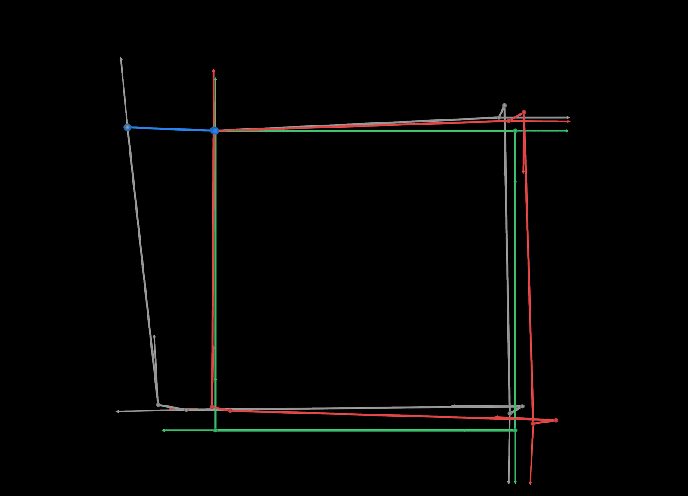
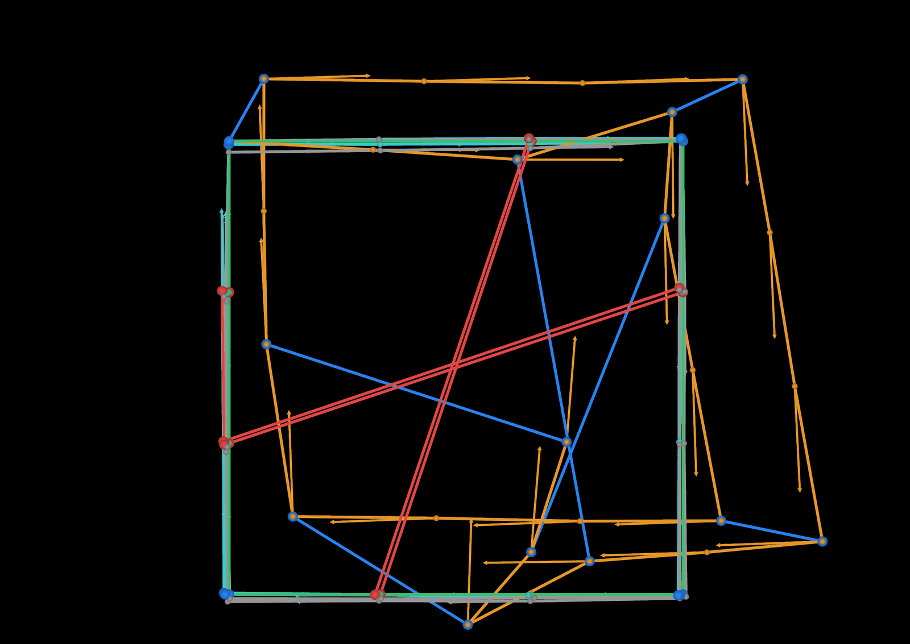
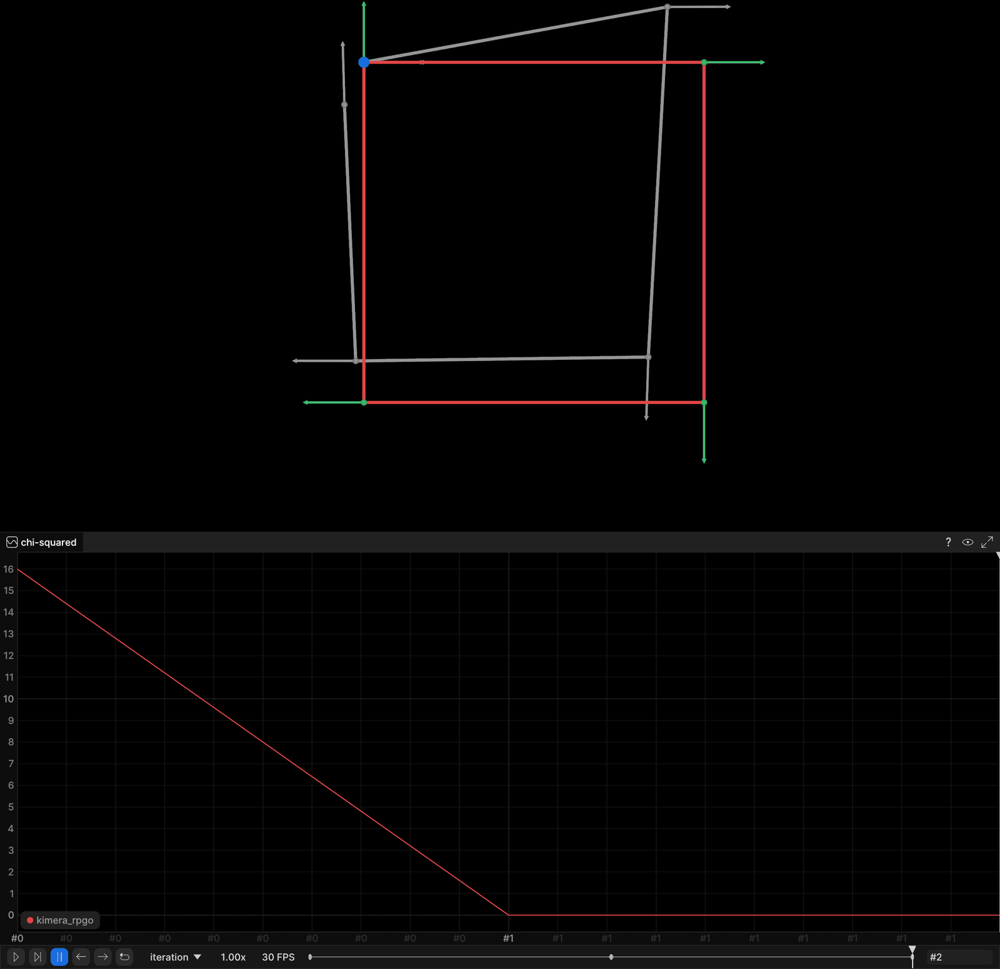

# Kimera-RPGO: Robust Pose Graph Optimization

[Kimera-RPGO](https://github.com/MIT-SPARK/Kimera-RPGO) wraps GTSAM in a
`RobustSolver` that throws bad loop closures away before optimizing, using
**PCM** (pairwise consistent measurement maximization) or **GNC** (graduated
non-convexity). This chapter builds pose graphs by hand, corrupts them the way
a real place-recognition front end would, and watches the outlier rejection
work. All three demos **stream live to a rerun viewer** while they run.

| Example | Source | Streams |
|---|---|---|
| Pose graph basics (square loop, noisy odometry) | `examples/rpgo_basics.cpp` | ground truth / drifted odometry / optimized trajectory, with per-pose heading |
| Outlier rejection (no rejection vs PCM vs GNC) | `examples/rpgo_outlier_rejection.cpp` | three solved trajectories, loop closures coloured by kept/rejected |
| Shared 2D pose graph (5-pose square loop) | `examples/rpgo_pose_graph.cpp` | 2D trajectory + chi-squared plot, into the recording shared with chapters 13-16 |

The third example solves the **same** 5-pose SE(2) problem as the g2o (13),
GTSAM (14), Ceres (15) and SymForce (16) chapters — same poses, same edges, same
noise model, same chi-squared formula — and logs into the same
`part3_pose_graph` recording, so running two chapters against one viewer
overlays their solutions for comparison. The four C++ chapters (13, 14, 15, 17)
share one initial guess bit for bit: the same `mt19937(7)` stream drawn in the
same order, so all four start from initial chi2 **15.9973**. Chapter 16 is
SymForce and perturbs with numpy's PRNG, which is a different generator, so its
seed-7 realization differs (initial chi2 17.218417) even though the problem,
the noise sigmas and the chi-squared formula are identical.

---

## Build

`slam:base` must exist first — it is built from the course-root
`SLAM_zero_to_hero/Dockerfile` and supplies GTSAM 4.3a1, Boost, Eigen and TBB.
`docker build .` takes the current directory as its build context, so each block
below cd's to the directory holding the Dockerfile it builds:

```bash
cd ..                        # SLAM_zero_to_hero/ (where the base Dockerfile lives)
docker build -t slam:base .
```

Then this chapter (the image adds the rerun C++ SDK 0.33.0 and Kimera-RPGO):

```bash
cd part3_ch01_17
docker build -t slam_zero_to_hero:part3_ch01_17 .
```

Local build, if GTSAM, Kimera-RPGO and (optionally) the rerun C++ SDK are
installed:

```bash
mkdir build && cd build
cmake .. && make -j4
```

`CMAKE_BUILD_TYPE` defaults to Release. Without the rerun SDK the demos still
build and print all their numbers, they just do not stream.

---

## Run

Start a viewer on the host **first** — the demos stream into it as they go:

```bash
rerun &
```

Then run all three examples:

```bash
docker run -it --rm --network=host slam_zero_to_hero:part3_ch01_17 bash -lc \
    './rpgo_basics && ./rpgo_outlier_rejection && ./rpgo_pose_graph'
```

`--network=host` is what lets the container reach the viewer at
`127.0.0.1:9876`. Live gRPC streaming is version-sensitive: the container's
rerun SDK **must match** the host viewer's version (the Dockerfile pins
`0.33.0` — set it to whatever `rerun --version` prints on the host). Set
`RERUN_URL` to stream somewhere else, e.g.
`-e RERUN_URL='rerun+http://127.0.0.1:9999/proxy'`. With no viewer listening
each demo prints a one-line note and runs normally.

---

## Output

Three recordings, all under the entity prefix `graph/kimera_rpgo/`. All three
graphs lie in the z = 0 plane, so each pose is logged as (x, y, yaw) into a 2D
view: a rerun 3D view will not frame a perfectly planar graph — its bounding box
is degenerate — and the projection loses nothing.

**`part3_rpgo_basics`** — `graph/kimera_rpgo/{ground_truth, initial,
optimized}`, each with `/poses`, `/path`, `/heading` and `/loop_closures`
children. Green is ground truth, grey the drifted odometry chain, red the
optimized result. Everything is logged static: Kimera-RPGO optimizes inside
`update()` and exposes no per-iteration callback, so there is nothing to sweep a
timeline over.

```
   Graph error before: 207.2526          (GTSAM's 0.5 x chi-squared)
   Graph error after:  4.3427
   Translation RMSE vs ground truth before: 0.1650 m
   Translation RMSE vs ground truth after:  0.0887 m
   Loop closure gap |t7 - t0| : initial 0.3538 m -> optimized 0.0066 m
   Loop closures seen: 1, kept as inliers: 1
```

The square is corrupted deliberately: the odometry carries noise (seed 7) so the
loop does not close, while the loop closure itself is exact. The optimum is
therefore *not* ground truth — it is the maximum-a-posteriori compromise, which
is why the final RMSE settles at 0.089 m rather than zero. What the demo proves
is that the solver moved: the 0.354 m gap between pose 7 and pose 0 closes to
0.007 m.



Grey is the drifted odometry chain, and the drift is the point: follow it
anticlockwise from the origin and it misses its own start by 0.354 m at the top
left. Green is the square it should have been, red the optimized result pulled
back towards it, and the blue segment with the two round endpoints is the
`X(7) -> X(0)` loop closure doing the pulling. Red does not land on green because
it should not — the loop closure is exact but the odometry is not, so the optimum
is the compromise between them.

**`part3_rpgo_outliers`** — `graph/kimera_rpgo/{ground_truth, initial,
no_rejection, pcm, gnc}`. Loop closures are split into `/loop_closures` (blue,
kept) and `/loop_closures_rejected` (red, discarded), one group per solver, so
toggling them in the viewer shows exactly which measurements each method threw
out. The trajectory drives twice around a 3 m square, so pose 12 revisits pose
0, pose 15 revisits pose 3, and so on — four correct loop closures, plus three
outliers wrong by 3.4-4.7 m.

```
   PCM  getNumLC()        = 7   (loop closures that reached the adjacency matrix)
   PCM  getNumLCInliers() = 4   (max-clique survivors)
   GNC  getNumLC()        = 7
   GNC  getNumLCInliers() = 4

   GNC weights for the 7 loop closures:
     X(12) -> X( 0)  weight 1.000   [correct] kept
     X(15) -> X( 3)  weight 1.000   [correct] kept
     X(18) -> X( 6)  weight 1.000   [correct] kept
     X(21) -> X( 9)  weight 1.000   [correct] kept
     X(22) -> X( 4)  weight 0.000   [outlier] rejected
     X(23) -> X(10)  weight 0.000   [outlier] rejected
     X(20) -> X( 2)  weight 0.000   [outlier] rejected

   no rejection  loops kept 7/7 | factors 31 | translation RMSE   0.967 m | final pose error   2.441 m
   PCM           loops kept 4/7 | factors 28 | translation RMSE   0.034 m | final pose error   0.062 m
   GNC           loops kept 4/7 | factors 31 | translation RMSE   0.034 m | final pose error   0.062 m
   odometry only                translation RMSE   0.065 m
```

Three numbers to read off that table. Trusting the loop closures costs a metre
of accuracy — worse than using no loop closures at all. Both robust methods
recover the trajectory to 3 cm, better than odometry alone. And PCM's graph
*shrinks* from 31 factors to 28 because it deletes the outliers, whereas GNC
keeps all 31 and drives their weights to zero — the same answer by two
different mechanisms.



The same three numbers, seen rather than read. Orange is the no-rejection
solution and it is visibly wrecked — dragged off the square in several
directions by loop closures it had no business trusting. Cyan (GNC) and magenta
(PCM) both sit on top of the green ground truth, indistinguishable at this
scale, which is what 3 cm of RMSE looks like against a 3 m square. The four blue
segments are the loop closures the robust solvers kept; the three red diagonals
crossing the middle of the square are the outliers they threw out. Each
trajectory is its own entity, so the viewer's blueprint tree can isolate any one
of them.

**`part3_pose_graph`** — the recording shared with chapters 13-16.
`graph/ground_truth` and `graph/kimera_rpgo/{initial, optimized}` carry
`/poses`, `/path` and `/heading` (heading arrows matter here: pose 4 sits
exactly on pose 0 and differs only in orientation), and `cost/kimera_rpgo` plots
chi-squared against the `iteration` timeline.

```
Initial chi2 : 15.9973
chi2 after odometry stage : 2.5e-25
Loop closures seen : 1, kept as inliers : 1
Factors in the graph : 6 (1 prior + 4 odometry + 1 loop closure)

Pose | ground truth        | optimized           | error
---------------------------------------------------------------
  x0 | ( 0.00, 0.00, 0.00) | (-0.00, 0.00,-0.00) | 0.0000
  x1 | ( 1.00, 0.00, 0.00) | ( 1.00, 0.00, 0.00) | 0.0000
  x2 | ( 1.00, 1.00, 1.57) | ( 1.00, 1.00, 1.57) | 0.0000
  x3 | ( 0.00, 1.00, 3.14) | (-0.00, 1.00,-3.14) | 0.0000
  x4 | ( 0.00, 0.00,-1.57) | (-0.00,-0.00,-1.57) | 0.0000

Final chi2   : 1.7e-29
Stages       : 3 (0 = initial, 1 = after odometry, 2 = after loop closure)
```



The 2D view on top holds all three trajectories: green is the ground-truth unit
square with a heading arrow at each pose, grey the noisy initial estimate
visibly off it, and red the optimized result sitting exactly on the green. The
blue marker at the origin is where the loop closure x4 -> x0 lands — pose x4 is
at the same position as pose x0 and differs only in orientation, which is why
the heading arrows are logged at all. Below, `cost/kimera_rpgo` falls from
15.9973 to ~0 across the three stages.

---

## Code notes

- **The measurements in the shared 2D problem are exact.** Odometry and the loop
  closure are the true relative transforms; only the initial estimate is
  corrupted (seed 7, `sigma_xy = 0.15`, `sigma_theta = 0.08`, poses 1-4 only).
  The optimum is therefore ground truth itself, and the chi-squared curve shows
  purely how the solver gets there. Chi-squared is computed in the example with
  the series' shared formula — per edge, the tangent-space residual between the
  measured and current relative pose with the angle wrapped to `(-pi, pi]`,
  weighted by information `diag(100, 100, 400)` — rather than read from GTSAM,
  whose graph error carries a factor of 0.5 and also includes the gauge prior.
- **The `iteration` timeline carries solver stages, not LM steps.** Every
  sibling chapter can hook its optimizer and log one frame per iteration.
  Kimera-RPGO cannot: `RobustSolver::update()` runs outlier rejection and then
  optimizes to convergence internally, with no callback. `rpgo_pose_graph`
  therefore logs three frames — initial estimate, after the odometry, after the
  loop closure — and the two 3D demos log static frames only.
- **Gauge freedom.** A pose graph built only from relative constraints is
  invariant under a global rigid transform. g2o removes this with
  `setFixed(true)` and Ceres with `SetParameterBlockConstant`; Kimera-RPGO
  offers neither, because it hands the graph to GTSAM's optimizer. The gauge is
  removed the GTSAM way instead: a tight prior on pose 0
  (`sigma = (0.01, 0.01, 0.005)`).
- **`Pose3` sigma ordering is (rotation, translation).** GTSAM's `Pose3` tangent
  space puts the three rotation components first, so
  `Sigmas((0.02, 0.02, 0.02, 0.05, 0.05, 0.05))` means 0.02 rad of rotation
  noise and 0.05 m of translation noise — backwards from how the problem is
  usually described, and silently wrong if you swap them. `Pose2`, used by
  `rpgo_pose_graph`, is ordered `(x, y, theta)` and reads naturally.
- **Configuring GNC is a trap.** `RobustSolverParams` defaults to
  `OutlierRemovalMethod::PCM3D`, and `setGncInlierCostThresholdsAtProbability()`
  only flips `use_gnc_` on. Configure "GNC" that way and you get PCM followed by
  GNC: PCM has already deleted the outliers, so GNC provably does nothing and
  `getGncWeights()` returns all ones. `rpgo_outlier_rejection` disables PCM's two
  checks with negative thresholds — `setPcm3DParams(-1.0, -1.0, ...)` — which
  keeps the outlier-removal object alive while letting every loop closure reach
  GNC. `setNoRejection()` would *not* work here: it nulls that object out, and
  `RobustSolver::optimize()` gates GNC on `use_gnc_ && outlier_removal_`.
- **`setNoRejection()` must be paired with `Verbosity::QUIET`.** With rejection
  off the outlier-removal object is null, and the solver's own log line
  dereferences it. Any verbosity other than `QUIET` therefore segfaults —
  upstream marks it `TODO(yun) this seg faults we disable outlier removal`. The
  no-rejection baseline consequently runs silently.
- **Verbosity levels.** `QUIET` silences both the solver and PCM; `UPDATE`
  (the default) keeps the solver's own logs but silences PCM's per-loop-closure
  diagnostics; only `VERBOSE` prints the
  `odometry consistency ... distance` / `total loop closures registered` /
  `number of inliers` lines. The outlier demo uses `VERBOSE` for exactly that
  reason.
- **Why the outliers have to be far apart along the trajectory.** PCM screens a
  loop closure against the odometry chain first, with a budget expressed *per
  node*. A wrong loop between poses 18 steps apart is allowed to disagree with
  the odometry by 18 x the per-node budget, so it sails through that gate and is
  only caught when the pairwise consistency check compares it against the other
  loop closures — which is the case PCM was invented for. The demo uses the
  four-argument `setPcmSimple3DParams(0.5, 0.1, 0.05, 0.02, ...)`: a loose
  odometry budget and a tight pairwise one. A worthwhile subtlety: loop closures
  killed at the odometry gate never enter the adjacency matrix, so `getNumLC()`
  does not count them either.
- **Two laps, not a straight line.** The outlier demo drives the same square
  twice so that poses 12/0, 15/3, 18/6 and 21/9 really are the same place. A
  "loop closure" between two poses a few steps apart on a straight trajectory is
  not a loop closure at all, and PCM's max-clique step never gets to run on it.
- Fixed seeds throughout (seed 7), so the printed numbers above reproduce
  exactly.

---

## References

- [Kimera-RPGO](https://github.com/MIT-SPARK/Kimera-RPGO) — pinned to commit
  `d28b4df0570d642a2bb00e511344ce1110f87519`, which matches the GTSAM 4.3a1 in
  `slam:base`
- Mangelson et al., *Pairwise Consistent Measurement Set Maximization for Robust
  Multi-Robot Map Merging* (PCM), ICRA 2018
- Yang et al., *Graduated Non-Convexity for Robust Spatial Perception* (GNC),
  RA-L 2020
- [GTSAM](https://github.com/borglab/gtsam)
- [Rerun](https://rerun.io/)
