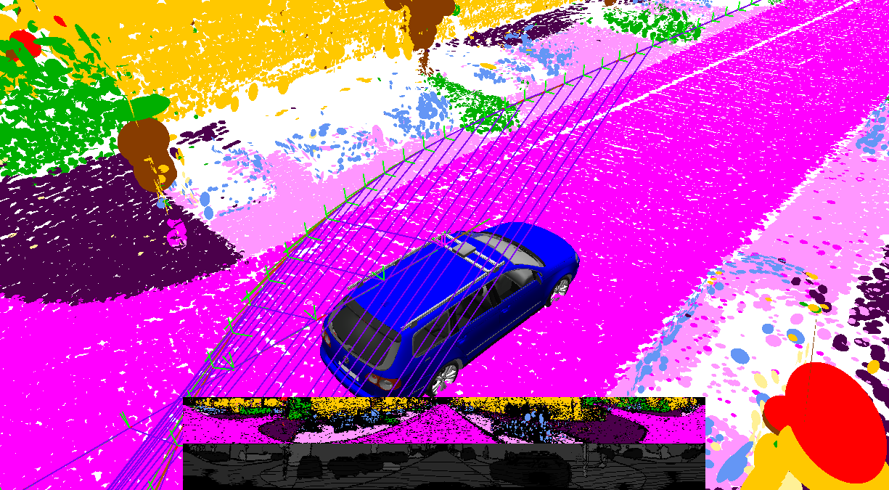
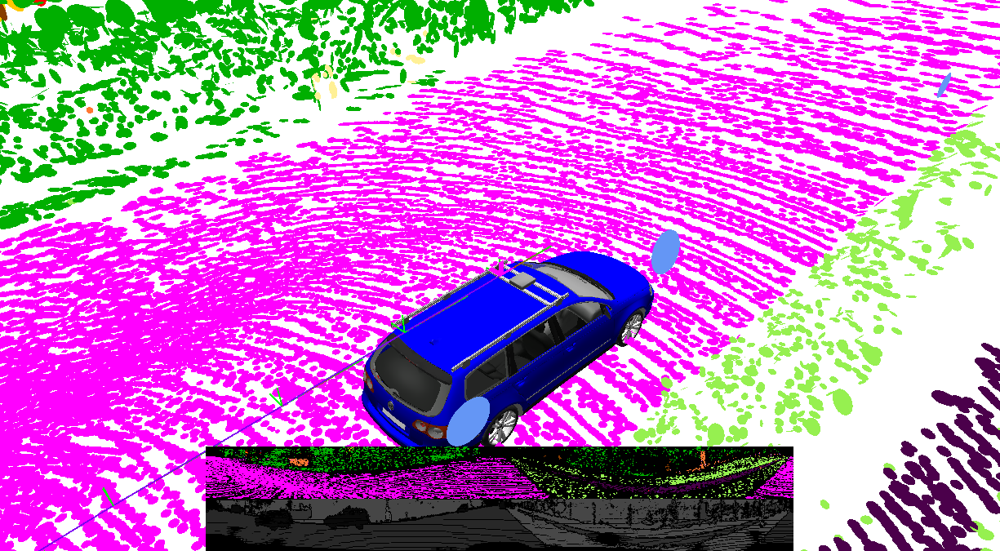
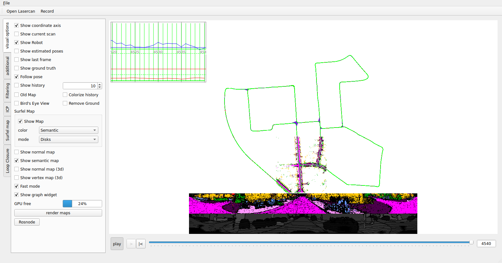
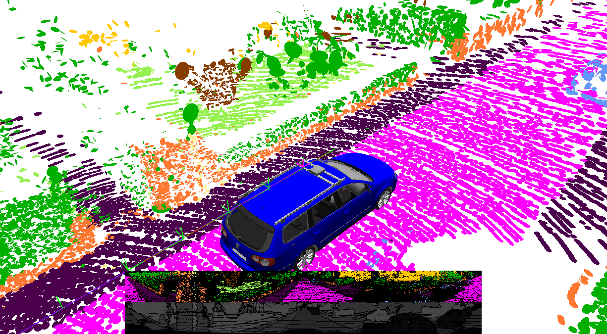

# SuMa++

Semantic surfel-based LiDAR SLAM. Every scan passes through **RangeNet++**, a DarkNet53 network
over the spherical range image that labels each point with one of 20 SemanticKITTI classes. **SuMa**
then builds a surfel map with frame-to-model ICP in OpenGL shaders, and uses the labels to drop
moving objects and to weight ICP residuals by semantic consistency. Loop closures feed a GTSAM pose
graph. The default demo runs on **KITTI odometry sequence 00** (Velodyne HDL-64E, 4541 scans, 3.7 km
with revisits).

- **Repo**: [PRBonn/semantic_suma](https://github.com/PRBonn/semantic_suma) (`531954d`), with [PRBonn/rangenet_lib](https://github.com/PRBonn/rangenet_lib) (`3fc223e`) and [jbehley/glow](https://github.com/jbehley/glow) (`e66d7f8`)
- **Paper**: [SuMa++: Efficient LiDAR-based Semantic SLAM](https://www.ipb.uni-bonn.de/wp-content/papercite-data/pdf/chen2019iros.pdf), Chen, Milioto, Palazzolo, Giguère, Behley and Stachniss, IEEE/RSJ IROS 2019
- Also relevant: [Efficient Surfel-Based SLAM using 3D Laser Range Data in Urban Environments](http://www.roboticsproceedings.org/rss14/p16.pdf) (SuMa, Behley and Stachniss, RSS 2018), and [RangeNet++: Fast and Accurate LiDAR Semantic Segmentation](https://www.ipb.uni-bonn.de/wp-content/papercite-data/pdf/milioto2019iros.pdf) (Milioto et al., IROS 2019)
- **Needs an NVIDIA GPU**: TensorRT for RangeNet++, and OpenGL 4.x for SuMa (see [Visualization](#visualization)).



Surfels are coloured by RangeNet++ class: road magenta, sidewalk dark purple, building yellow,
vegetation green, trunk brown, traffic sign red, pole pale yellow, parking pink, parked car light
blue, terrain light green, fence orange (the SemanticKITTI colour map). The blue car is SuMa's robot
model. The strip at the bottom is the current scan's semantic range image, with its depth image
below it.

## RangeNet++ on an RTX 50xx (sm_120)

Upstream pins TensorRT 5 and CUDA 10, which have no Blackwell kernels. TensorRT **10.8** is
the first release that supports sm_120, and TensorRT 10 removed the whole API that `rangenet_lib`
used. The recipe that works here:

- **Base image** `nvcr.io/nvidia/tensorrt:25.04-py3`: TensorRT 10.9.0, CUDA 12.9, Ubuntu 24.04.
- **A TensorRT 10 port of `rangenet_lib`** ([`patches/rangenet_lib/`](patches/rangenet_lib)): `createNetworkV2`, `IBuilderConfig`, `buildSerializedNetwork`, named I/O tensors, `enqueueV3`.
- **The original 2019 `model.onnx`**, unchanged, from `darknet53.tar.gz` (baked into `/opt/darknet53`). No pre-computed labels are needed.

On first start, TensorRT 10.9 parses that ONNX and builds an FP32 engine on the RTX 5090 in about
30 s (input `1×5×64×2048`, output `1×20×64×2048`). The engine is cached in `/engine_cache/model.trt`
(206 MB); mount a host directory there so the build happens only once. Everything else changed from
upstream is covered in [NOTES.md](NOTES.md): a catkin-free CMake workspace, GTSAM 4.2, an
autorun mode for unattended runs, and a shared-library fix.

## Data

The KITTI loader needs `velodyne/*.bin` and `calib.txt` in the sequence folder. It also reads
`../../poses/<seq>.txt`, if present, as ground truth:

```
~/data/kitti_vo_slam/extracted/dataset/
├── poses/00.txt                    # 4541 GT poses
└── sequences/00/{calib.txt,times.txt,velodyne/000000.bin … 004540.bin}   # 4541 scans, 8.3 GB
```

`../download_kitti.py` fetches the official KITTI odometry zips (the Velodyne zip alone is about 80 GB
for all 22 sequences) into `~/data/kitti_vo_slam/`.

## Build

```bash
podman build -t localhost/slam_zero_to_hero:suma_pp .
```

Most of the build time goes to apt and GTSAM. The image is 13.4 GB, of which the TensorRT base
is 10.7 GB. The visualizer ends up in `/ws/semantic_suma/bin/`, and the config is
[`config/kitti.xml`](config/kitti.xml): upstream's `default.xml` with `model_path=/opt/darknet53`.

## Run (KITTI 00)

SuMa++ has no command-line front end. Everything runs inside its Qt `visualizer`. The run below uses
the autorun mode this image adds, so no clicking is needed. It opens scan 0, plays the sequence
to the end, writes poses and screenshots, and quits:

```bash
mkdir -p results/kitti00 ~/.cache/suma_pp_engine
xhost +SI:localuser:$(id -un)     # only if the container cannot open the display
podman run --rm \
  --runtime=/usr/bin/nvidia-container-runtime \
  -e NVIDIA_VISIBLE_DEVICES=all -e NVIDIA_DRIVER_CAPABILITIES=compute,utility,graphics \
  -e DISPLAY=$DISPLAY -v /tmp/.X11-unix:/tmp/.X11-unix \
  -e SUMA_SNAPSHOT_EVERY=500 \
  -v ~/data/kitti_vo_slam/extracted/dataset:/data:ro \
  -v ~/.cache/suma_pp_engine:/engine_cache \
  -v "$(pwd)/results/kitti00":/results \
  localhost/slam_zero_to_hero:suma_pp \
  /ws/scripts/run_autorun.sh /data/sequences/00/velodyne /results
```

Arguments are `run_autorun.sh <velodyne dir> [out dir] [max scans]`. The window appears on your
desktop while it runs, and closes itself at the end. It writes to `results/kitti00/`:

| File | Content |
|---|---|
| `poses.txt` | 4541 optimized poses, KITTI format (3×4, left-camera frame, via `Tr` from `calib.txt`) |
| `runtime.txt` | per-scan timings in seconds: initialization, preprocessing, ICP, loop search, mapping, complete |
| `suma_follow.png`, `suma_birdseye.png`, `suma_window.png` | 3D view (chase camera), 3D view (bird's eye), and the whole GUI window, at the last scan |
| `frames/NNNNN.png` | the 3D view every `SUMA_SNAPSHOT_EVERY` scans |
| `visualizer.log`, `opengl.txt` | console output, and the OpenGL renderer used (`ate.txt` in `results/` is `scripts/ate.py` output, run afterwards) |

Score the poses against GT with `python3 scripts/ate.py results/kitti00/poses.txt ~/data/kitti_vo_slam/extracted/dataset/poses/00.txt`.

Measured on 2026-09-28 (RTX 5090 for both TensorRT and OpenGL; Ryzen 9 7950X shared with other jobs):

| Sequence | scans | est. path | GT path | ATE mean / rmse / max (unaligned) | ATE mean / rmse / max (rigid-aligned) | end-point error | SLAM time / scan | end-to-end rate | wall time |
|---|---|---|---|---|---|---|---|---|---|
| **00** | 4541 | 3711.67 m | 3724.19 m | 7.30 / 8.16 / 17.05 m | **1.06 / 1.20 / 2.91 m** | 2.75 m | 12.1 ms | **12.6 Hz** | 6 min 1 s |
| 04 | 271 | 394.23 m | 393.65 m | 0.74 / 1.03 / 2.57 m | **0.29 / 0.32 / 0.57 m** | 2.57 m | 8.8 ms | 11.3 Hz | 24 s |

The rigid alignment is Horn/Umeyama, with no scale. "SLAM time / scan" is SuMa's own `complete`
timer: ICP 5.4 ms, loop search 3.1 ms, mapping 2.0 ms, preprocessing 1.4 ms. "End-to-end rate"
also includes RangeNet++ inference, the CPU range-image projection in `rangenet_lib`, file reading,
and GUI drawing. Wall times are with the engine already cached; the very first run adds about 30 s to build it.
Both wall times include startup. Outputs for 04 are in `results/kitti04/`. The 00 run used the
image one rebuild before the final one. The code was the same; the final rebuild only renamed the
run script and fixed the unit in the `runtime.txt` header (the timings were always seconds). The 04
run used the final image.



`results/` is git-ignored across the repo, so the images this README shows are copies kept in `docs/`.

## Visualization

### On your desktop

To drive the GUI yourself, start the same image without autorun:

```bash
podman run --rm -it \
  --runtime=/usr/bin/nvidia-container-runtime \
  -e NVIDIA_VISIBLE_DEVICES=all -e NVIDIA_DRIVER_CAPABILITIES=compute,utility,graphics \
  -e DISPLAY=$DISPLAY -e QT_X11_NO_MITSHM=1 -v /tmp/.X11-unix:/tmp/.X11-unix \
  -v ~/data/kitti_vo_slam/extracted/dataset:/data:ro \
  -v ~/.cache/suma_pp_engine:/engine_cache \
  localhost/slam_zero_to_hero:suma_pp \
  ./visualizer /ws/config/kitti.xml /data/sequences/00/velodyne/000000.bin
```

Press **play**. The "Surfel map" tab switches the surfel colour between Semantic (the default),
normals, confidence and so on. "Bird's Eye View", "Follow pose" and "Show ground truth" are under
"visual options". "Fast mode" skips most per-frame redraws.

| GUI at the end of KITTI 00 (bird's eye: trajectory + active semantic submap) | Chase camera at scan 2000 |
|---|---|
|  |  |

Only the surfels of the active submap are drawn (`partial-extraction`), so the bird's-eye view
shows the whole trajectory in green but the semantic map only around the car. (The checkboxes in
`suma_window.png` may still show the pre-bird's-eye state: the window is read back from X before
Qt has repainted the panel.) The GUI can export
the whole map as a mesh or point cloud; upstream covers this in
[FAQ #54](https://github.com/PRBonn/semantic_suma/issues/54).

### Headless (no X server)

This does **not** work on this host. Without `$DISPLAY`, `run_autorun.sh` starts its own Xvfb,
where OpenGL comes from Mesa llvmpipe 25.2.8 (LLVM 20.1.2, OpenGL 4.5 core, on the CPU). Every
software renderer I tried failed, all on KITTI 00 on 2026-09-28:

| Xvfb renderer | Result |
|---|---|
| llvmpipe, default | aborts on the first scan: `LLVM ERROR: Cannot emit physreg copy instruction` (an LLVM codegen bug) |
| llvmpipe, `LP_NATIVE_VECTOR_WIDTH=128` | same abort |
| llvmpipe, `GALLIUM_OVERRIDE_CPU_CAPS=avx` | no crash, and 100 scans in 13 s, but **the output is wrong**: every pose stays at identity (path 0.00 m against 84 m GT), the semantic range image is black, and the map is empty |
| softpipe (`GALLIUM_DRIVER=softpipe`) | aborts: `GLSL 4.00 is not supported` (softpipe stops at GLSL 3.30) |

The failures are in SuMa's OpenGL passes. RangeNet++/TensorRT is not involved: the engine loads
fine before every one of them. So the verified path is the one above, a real X server with NVIDIA
OpenGL. The PNGs in `results/` were written by the visualizer itself, with `QGLWidget::grabFrameBuffer`
and `QScreen::grabWindow`, so no external screenshot tool is needed.

## Supported datasets

| Dataset | Command | Status |
|---|---|---|
| **KITTI odometry seq 00** (default) | `run_autorun.sh /data/sequences/00/velodyne /results` | ✅ verified 2026-09-28: 4541 scans, ATE 1.06 m mean (aligned) / 7.30 m (unaligned), 12.6 Hz, semantic map screenshots above |
| KITTI odometry seq 04 | `run_autorun.sh /data/sequences/04/velodyne /results` | ✅ verified 2026-09-28 (final image): 271 scans, ATE 0.29 m mean (aligned) / 0.74 m (unaligned), path 394.2 m vs 393.7 m GT |
| Other KITTI odometry sequences | `run_autorun.sh /data/sequences/<seq>/velodyne /results` | not run here; same sensor and the network's training domain. Only 00 and 04 have Velodyne extracted on this host; 11-21 have no GT |
| SemanticKITTI | same velodyne folders | the scans are KITTI odometry's; SuMa++ predicts its own labels and does not read `labels/` |
| Other LiDARs (Ouster, Hesai, Livox, VLP-16) | — | not supported: the KITTI reader takes only `.bin` folders, and RangeNet++ is trained on HDL-64E range images (64×2048). Upstream says it "can only work with KITTI dataset" |

Not applicable to EuRoC, TUM RGB-D or other camera-only datasets (no LiDAR).
