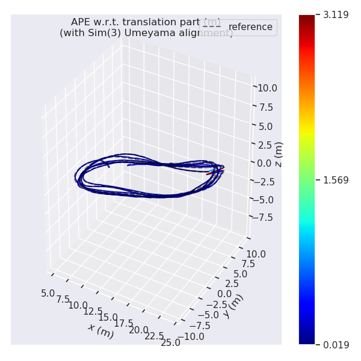

# SVO Pro on UZH-FPV — verification notes

Everything below was measured on this host (RTX 5090, 32 cores, podman 3.4.4) against
`indoor_forward_3_snapdragon_with_gt.bag`, downloaded from
`http://rpg.ifi.uzh.ch/datasets/uzh-fpv-newer-versions/v3/` (1,608,934,832 bytes,
matching the server's `Content-Length`).

## Results

| | stereo VIO | monocular VIO |
|---|---|---|
| Alignment | SE(3) (metric) | Sim(3) (scale-free) |
| RMS ATE | **0.434 ± 0.036 m** (7 runs) | **0.156 m** (2 runs) |
| RMS ATE range | 0.376 – 0.476 m | 0.132 – 0.180 m |
| mean / median (representative run) | 0.408 / 0.360 m | 0.151 / 0.146 m |
| max | 1.24 – 1.63 m across runs | 3.119 m |
| Estimated poses | 2551 (identical in all 7 runs) | 2240, 2242 |
| Associated GT pairs | 1335 | 1331 |
| Tracked duration | 92.06 s (full sequence) | 81.61 s |
| Output rate | 27.7 Hz | 27.4 Hz |
| Tracking gaps > 0.5 s | **0** | **0** |
| Solved scale factor | 1.00000 (fixed) | 0.99941 |

### Run-to-run variance

Seven stereo runs of the same bag with the same build gave RMS ATE
**0.471, 0.407, 0.415, 0.438, 0.376, 0.453, 0.476 m** — mean 0.434, stdev 0.036, a
spread of 23 % of the mean. So a single number would be cherry-picking; quote the mean.

**Running the GUI costs accuracy.** The 0.476 m result is the one run done with rviz on
a real X display, and it is the worst of the seven; the six headless runs average
0.427 m. Rendering the landmark cloud and camera view competes with the frontend for
CPU and GPU, so more frames get dropped. Use `--headless` when the number matters.

The cause is that the demo replays the bag in **real time**. Thread scheduling, and
which frames get dropped when the frontend falls behind, differ every run;
`use_async_reprojectors: True` makes the stereo reprojection order nondeterministic too.
For a stable benchmark, replay slower (`-e RATE=0.5`) or drive the pipeline through
upstream's `svo_benchmark` executable, which consumes a dataset folder frame-by-frame
with no real-time constraint.

The pose count was identical (2551) in all seven runs, so the variation is in *estimate
quality*, not in how much of the sequence was processed.

Ground truth spans 49.50 s of the 92.10 s flight, 278.30 m of path at 500 Hz. So the
stereo RMS ATE is **0.135–0.171 % of the ground-truth-covered trajectory length**.

Both pipelines tracked continuously — the largest gap between consecutive published
poses is 0.10 s (stereo) and 0.23 s (mono), against a 0.033 s camera period. Neither
run lost tracking or re-initialised, on a dataset built specifically to break VIO.
`svo.log` contains zero `[ERROR]` and zero `[WARN]` lines.

### Why monocular beats stereo here

Counter-intuitive, and worth being precise about rather than quoting the headline:

- The two numbers use **different alignments**. Mono is scale-free, so evo solves for
  scale (Sim(3)); stereo's scale is metric and fixed (SE(3)). That normally makes a
  mono number look artificially good.
- Here it barely matters: the scale evo solved for was **0.99941**, i.e. the monocular
  pipeline recovered metric scale from the IMU to within 0.06 %. So the comparison is
  close to apples-to-apples, and mono really did win on this sequence.
- The plausible reason is geometric. The stereo baseline is 79.6 mm while the scene is
  metres deep, so the second camera adds very little triangulation strength — but it
  doubles the frontend's per-frame image-processing cost. The stereo depth priors in
  `vio_stereo_fpv.yaml` (`min_depth_inv`, `max_depth_inv`, `mean_depth_inv`) are also
  upstream's EuRoC values and are not tuned for this scene.

Mono varies run-to-run for the same reason stereo does: two runs gave 0.180 and
0.132 m. Even the worse of the two beats the best stereo run (0.376 m), so the ordering
is not an artefact of which runs got sampled.

This is not a claim that mono is generally better — one sequence, one host, and only
two mono runs. It does mean the stereo configuration has tuning headroom.



The monocular trajectory, Sim(3)-aligned. Error is near-uniformly low (dark blue) all
the way round the oval, visibly tighter than the stereo plot in the README, which
reddens at one turn. The plot covers only the ground-truth overlap window, so the ~10 s
the mono pipeline spends initialising and recovering scale — 81.6 s tracked against
stereo's 92.1 s — is not visible here.

## The calibration conversion, which is where this demo would most easily go wrong

UZH-FPV ships Kalibr output; SVO wants the aslam/vikit "ncamera" format. Two
conversions matter, and neither fails loudly if you get it wrong:

1. **Kalibr gives `T_cam_imu`. SVO's `T_B_C` is the inverse** (the camera's pose *in*
   the IMU frame). Reversing this yields a pipeline that runs and silently drifts.
   Checks that the inversion in `config/UZH_FPV_*.yaml` is right:
   - `det(R) = 1.000000000` for both cameras, orthonormality error < 1e-12. This
     matters because `ncamera_yaml_serialization.cpp` hard-`CHECK`s that the upper-left
     3×3 block is a rotation matrix and aborts the process if it is not.
   - the resulting camera-centre distance is **0.079621 m**, which independently agrees
     with the `T_cn_cnm1` baseline of −0.0796 m in the same Kalibr file.
2. **`equidistant` is the fisheye model** and needs exactly 4 coefficients.
   `camera_yaml_serialization.cpp:66` maps `type: pinhole` + `distortion: equidistant`
   to `PinholeEquidistantGeometry`. Confirmed live in `svo.log`:
   `Distortion: Equidistant(-0.0137218, 0.0207274, -0.0127865, 0.00252423)`.

A trap for anyone adapting this: upstream's `svo_ros/param/calib/bluefox_25000826_fisheye.yaml`
is named "fisheye" but is actually the `omni` model with a 24-element intrinsics vector.
`davis_flyingroom.yaml` is the real equidistant reference. Also do not copy
`vikit/vikit_cameras/test/data/calib_pinhole_equidistant.yaml` — that is the legacy flat
vikit format and is incompatible with the `cameras:` list that `NCamera::loadFromYaml`
expects.

### Parameters that are not optional for a fisheye lens

Upstream's `vio_mono.yaml` / `vio_stereo.yaml` are tuned for pinhole cameras and omit
three settings that upstream's own `param/fisheye.yaml` enables. `config/vio_*_fpv.yaml`
sets all three:

```yaml
img_align_use_distortion_jacobian: True   # defaults to false in svo_factory.cpp:66
poseoptim_using_unit_sphere: True         # False in upstream's vio_*.yaml
scan_epi_unit_sphere: True                # False in upstream's vio_*.yaml
```

`img_align_use_distortion_jacobian` is the important one: it appears in **no** `vio_*.yaml`
at all and defaults to `false`, so it is silently off unless added by hand. Upstream's
comment is "the distortion of fisheye is not negligible, therefore the jacobian need to
be considered". Verified active in the run log: `distortion_jacobian, value: 1`.

Deliberately **not** copied from `param/fisheye.yaml`: `use_ceres_backend: False`. That
file is a VO-only profile; copying it wholesale would quietly disable the entire
visual-inertial backend.

## IMU parameters

Mapped from the dataset's Kalibr `imu.yaml`:

| Kalibr | SVO | value |
|---|---|---|
| `gyroscope_noise_density` | `sigma_omega_c` | 0.05 |
| `accelerometer_noise_density` | `sigma_acc_c` | 0.1 |
| `gyroscope_random_walk` | `sigma_omega_bias_c` | 4.0e-05 |
| `accelerometer_random_walk` | `sigma_acc_bias_c` | 0.002 |
| `update_rate` | `imu_rate` | 500 |

`acc_max` (176.0) and `omega_max` (34.0) are **saturation limits, not noise** —
`imu_handler.cpp:393` reads them into `saturation_accel_max` / `saturation_omega_max`,
which the backend then uses as OKVIS's `a_max` / `g_max`. They sit just under the
Snapdragon MPU-9250's own ±16 g / ±2000 °s⁻¹ ceiling because drone racing genuinely
approaches both; EuRoC's gentler `omega_max: 17` would clip.

Every key in `imu_params` is read with an unchecked `.as<double>()`, so omitting any one
of the ten throws rather than falling back to a default.

`delay_imu_cam` is left at **0.0** even though Kalibr reports
`timeshift_cam_imu = -0.016684572` for cam0. SVO's convention
(`delay_imu_cam = cam_ts - cam_ts_delay`, `imu_calibration.h:20`) is the opposite sign to
Kalibr's, and guessing wrong doubles the error instead of removing it. Upstream's own
EuRoC config also ships 0.0. Worth revisiting as a tuning experiment — a correctly
signed 17 ms correction should help at these angular rates.

## Things that cost time, recorded so they do not cost it twice

- `svo_node`'s camera and IMU topics are **private ROS params, not remappings**.
  `<remap from=.../>` is silently ignored; you must use
  `<param name="cam0_topic" .../>` inside the `<node>` block. The mono and stereo code
  paths also have *different* hardcoded defaults for `cam0_topic`, so always set it
  explicitly rather than relying on the default.
- `<rosparam file=...>` must be **inside** the `<node>` element. At `<launch>` level the
  keys land in the global namespace, `vk::param()` never sees them, and every tuning
  parameter silently falls back to its compiled-in default.
- ROS's `setup.bash` forwards the current positional parameters to `_setup_util.py`. In
  a container entrypoint or any script with its own arguments, `source setup.bash`
  without a trailing `--` dies with
  `/tmp/setup.sh.XXXX: line 1: usage:: command not found`. Both `scripts/entrypoint.sh`
  and `scripts/run_fpv.sh` pass `--`.
- `rospack find svo_ros` resolves to the **source** tree in a catkin devel workspace,
  which is why the Dockerfile copies launch files and configs into
  `src/rpg_svo_pro_open/svo_ros/` rather than into `devel/`.
- Upstream's `rviz_config_vio.rviz` hardcodes `Width: 2018, Height: 1121, X: 274`. On a
  bare Xvfb with no window manager nothing maximises the window, so it renders with
  black margins. `config/fpv_vio.rviz` is the same config resized to the 1600×900
  framebuffer, with the view pulled back to frame a whole lap.
- The rviz view is framed from the trajectory centroid in **SVO's own world frame**
  (`(-1.30, 3.64, 0.62)`, ~20 m span). The evo plots are in the *ground-truth* frame,
  because evo aligns the estimate into the reference — reading focal-point coordinates
  off an evo plot puts the camera in the wrong place.
- Upstream doc paths are stale in two places: `doc/frontend/visual_frontend.md` cites
  `param/euroc_mono_imu.yaml` (really `param/frontend_imu/euroc_mono_imu.yaml`), and
  `doc/vio.md` writes `vio_stere`. Trust the launch files over the prose.
- `live_nodelet.launch` cannot be run at all: it needs `$(find rpg_calib)` and a
  `bluefox_ros` nodelet, both private packages that were never released.

## Reproducing

```bash
python3 ../download_uzh_fpv.py
podman build -t slam_zero_to_hero:svo_pro_open .
podman run --rm -v ~/data/uzh_fpv:/data:ro -v $PWD/results:/results \
  slam_zero_to_hero:svo_pro_open \
  /svo_ws/scripts/run_fpv.sh /data/indoor_forward_3_snapdragon_with_gt.bag stereo --headless
```

Upstream is unmaintained — last code commit 2022-08-04, 61 open issues including
several unanswered build reports — so the Dockerfile's patches are unlikely to become
unnecessary.
