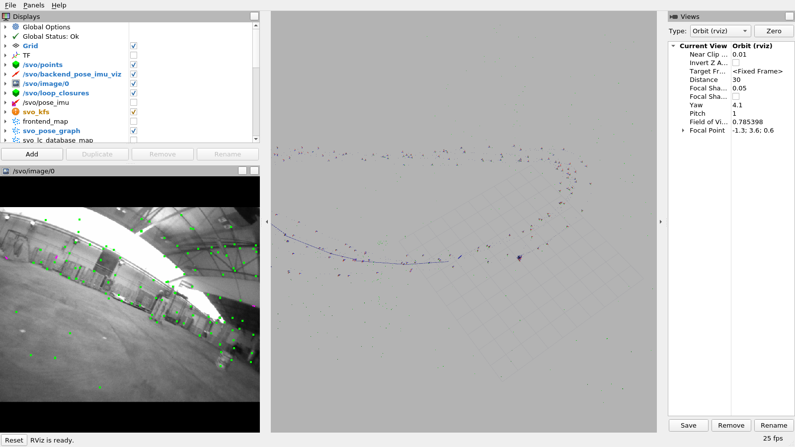
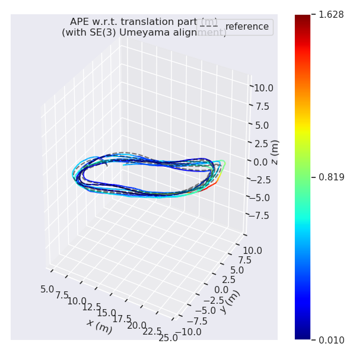

# SVO Pro

Semi-direct visual odometry: sparse direct image alignment to track the frame, then
feature-based reprojection and optimisation to refine it. This demo runs the full
**visual-inertial** configuration — SVO frontend plus an OKVIS-style ceres
sliding-window backend — on drone-racing footage recorded by the same lab that wrote it.

- **Repo**: [uzh-rpg/rpg_svo_pro_open](https://github.com/uzh-rpg/rpg_svo_pro_open)
- **Paper**: [SVO: Semi-Direct Visual Odometry for Monocular and Multi-Camera Systems](http://rpg.ifi.uzh.ch/docs/TRO17_Forster-SVO.pdf) — Forster, Zhang, Gassner, Werlberger and Scaramuzza, IEEE T-RO 2017
- Also relevant: [SVO: Fast Semi-Direct Monocular Visual Odometry](http://rpg.ifi.uzh.ch/docs/ICRA14_Forster.pdf) (ICRA 2014, the original); [Benefit of Large Field-of-View Cameras for Visual Odometry](http://rpg.ifi.uzh.ch/docs/ICRA16_Zhang.pdf) (ICRA 2016, the fisheye camera model this demo relies on); [Keyframe-based visual–inertial odometry using nonlinear optimization](https://doi.org/10.1177/0278364914554813) (Leutenegger et al., IJRR 2015 — the OKVIS backend this repo's sliding window is modified from; paywalled, and its freely readable RSS 2013 predecessor is [Keyframe-Based Visual-Inertial SLAM Using Nonlinear Optimization](https://www.roboticsproceedings.org/rss09/p37.pdf))
- **Dataset**: [UZH-FPV Drone Racing Dataset](https://fpv.ifi.uzh.ch/) — [Are We Ready for Autonomous Drone Racing?](https://rpg.ifi.uzh.ch/docs/ICRA19_Delmerico.pdf), Delmerico, Cieslewski, Rebecq, Faessler and Scaramuzza, ICRA 2019

Verified on UZH-FPV `indoor_forward_3` (Snapdragon stereo fisheye + 500 Hz IMU):
**RMS ATE 0.43 ± 0.04 m over a 278 m flight (~0.16 %)** in stereo, tracking all 92 s
without a single loss. That is a mean over seven runs of the same bag — the pipeline
runs in real time, so the figure moves by ±0.05 m between runs, and a run with the GUI
open scores slightly worse than a headless one. Full numbers, and
why the monocular pipeline scores *better* here (0.156 m), in [NOTES.md](NOTES.md).



Left: the fisheye image with tracked features (green). Right: keyframe frusta and
landmarks accumulated along the flown path, with the backend's sliding-window
trajectory in blue.

## Build

```bash
podman build -t slam_zero_to_hero:svo_pro_open .
```

Ubuntu 20.04 + ROS Noetic, one of the two configurations upstream lists as tested.
The build pulls 13 dependency repos and compiles Ceres, glog, gflags, DBoW2 and
OpenGV from source, so it takes a few minutes and needs network throughout.

Five things upstream's instructions do not cover, all handled in the Dockerfile:

| Problem | Fix |
|---|---|
| Every URL in `dependencies.yaml` is `git@github.com:` (SSH), and `dbow2_catkin` SSH-clones DBoW2 again *during* `catkin build`. A build container has no SSH key. | A single `git config --global url."https://github.com/".insteadOf git@github.com:` before `vcs import`, which covers both. |
| `glog_catkin` builds glog via `autoreconf`, which dies with `Can't exec "libtoolize"` on a stock ROS image. | Install `autoconf automake libtool libtool-bin`. Not in upstream's dependency list. |
| `SvoSetup.cmake` hardcodes `-Werror`, with no way to override it from the catkin command line. GCC 9 raises diagnostics GCC 7 (Melodic) did not. | `sed` out only `-Werror`. Warnings still print; no optimisation or ABI flag is touched. |
| Podman's default OCI image format **silently ignores `SHELL`**, so `RUN source ...` would run under dash and fail with `source: not found`. | No `SHELL` directive; the step needing the ROS environment calls `bash -c` explicitly. |
| `evo` installs an `argcomplete` that subscripts `collections.abc.Iterable` — Python 3.9+ syntax, while Noetic ships 3.8. Every `evo_*` entry point dies with `'ABCMeta' object is not subscriptable`. | Pin `argcomplete==3.1.6` and add the `packaging` dependency evo fails to declare. |

The iSAM2 global-map variant is deliberately off. It needs two independent switches
flipped (`rm svo_global_map/CATKIN_IGNORE` **and** `SET(USE_GLOBAL_MAP TRUE)`) plus a
hand-patched GTSAM 4.0.3, and VIO does not use it. `svo_global_map` keeps its upstream
`CATKIN_IGNORE`.

> `SvoSetup.cmake` also hardcodes `-march=native`, so this image is compiled for the
> CPU that built it. Rebuild rather than copying the image to another machine, or
> expect `SIGILL`.

## Download the dataset

```bash
python3 ../download_uzh_fpv.py            # indoor_forward_3 + calibration, ~1.6 GB
python3 ../download_uzh_fpv.py --list     # all 28 sequences, and which have ground truth
```

Everything lands in `~/data/uzh_fpv/`. The default is `indoor_forward_3`, the sequence
this demo is verified on.

The drone carries two camera systems and the dataset ships both. This demo uses the
**Snapdragon Flight**: a 640×480 stereo *fisheye* pair at 30 Hz plus a 500 Hz IMU.
`--sensor davis` gets the 346×260 mDAVIS event camera instead; SVO consumes ordinary
frames, so the higher-resolution stereo pair is the better fit.

Only sequences whose filename ends in `_with_gt` carry ground truth, and that ground
truth covers **part** of each flight — on `indoor_forward_3`, 49.5 s of the 92 s.
The bag holds exactly five topics:

| Topic | Type |
|---|---|
| `/snappy_cam/stereo_l`, `/snappy_cam/stereo_r` | `sensor_msgs/Image`, 640×480 raw |
| `/snappy_imu` | `sensor_msgs/Imu`, 500 Hz |
| `/groundtruth/pose`, `/groundtruth/odometry` | `geometry_msgs/PoseStamped`, `nav_msgs/Odometry` |

## Run the algorithm

One command runs the pipeline, records the estimated trajectory, replays the bag and
scores the result against ground truth:

```bash
podman run --rm \
  --runtime=/usr/bin/nvidia-container-runtime \
  -e NVIDIA_VISIBLE_DEVICES=all -e NVIDIA_DRIVER_CAPABILITIES=graphics,compute,utility \
  -e DISPLAY=$DISPLAY -e QT_X11_NO_MITSHM=1 \
  -v /tmp/.X11-unix:/tmp/.X11-unix \
  -v ~/data/uzh_fpv:/data:ro \
  -v $PWD/results:/results \
  slam_zero_to_hero:svo_pro_open \
  /svo_ws/scripts/run_fpv.sh /data/indoor_forward_3_snapdragon_with_gt.bag stereo
```

An rviz window opens showing the tracked fisheye image, the landmark cloud, keyframe
frusta and the sliding-window trajectory. No `xhost` change and no `--net=host` are
needed. The two NVIDIA lines give hardware GL; without them it falls back to software
rendering.

Swap `stereo` for `mono` to run the monocular pipeline. Useful variations:

```bash
# No display needed; writes the same trajectories and metrics.
... slam_zero_to_hero:svo_pro_open /svo_ws/scripts/run_fpv.sh /data/<bag>.bag stereo --headless

# Replay slower, or skip into the sequence (mono initialisation sometimes wants this).
... -e RATE=0.5 -e START=5 ... /svo_ws/scripts/run_fpv.sh /data/<bag>.bag mono

# Regenerate the screenshot above on a private Xvfb display, no host X server involved.
... /svo_ws/scripts/capture_rviz.sh /data/<bag>.bag stereo 85
```

Each run writes to `results/<bag>_<mode>/`: `svo_tum.txt` and `gt_tum.txt` (TUM-format
trajectories), `ape.zip` and `ape_plot_*.png` from evo, `rviz.png` if captured, and
`svo.log`.

To drive the pipeline yourself instead of using the wrapper, the launch files take the
usual roslaunch arguments:

```bash
roslaunch svo_ros fpv_vio_stereo.launch          # or fpv_vio_mono.launch
rosbag play /data/indoor_forward_3_snapdragon_with_gt.bag
```

`rviz:=false` for no GUI, `runlc:=true` to enable loop closing, and `calib_file:=` /
`param_file:=` / `cam0_topic:=` to point it at a different sensor set.

## Output

Estimated trajectory (coloured by error) against ground truth (dashed), SE(3)-aligned —
several laps of the indoor racing track, with error staying low except at one turn:



This is one representative run (RMS ATE 0.471 m, the worst of the six), not the mean.
`run_fpv.sh` writes the same plot for every run.

## Supported datasets

| Dataset | Launch file | Calibration | Notes |
|---|---|---|---|
| **UZH-FPV** Snapdragon, `indoor_forward` (verified: `indoor_forward_3`) | `fpv_vio_stereo.launch`, `fpv_vio_mono.launch` | `UZH_FPV_indoor_forward_snapdragon_{stereo,mono}.yaml` | The verified configuration. |
| **UZH-FPV** Snapdragon, `indoor_45` / `outdoor_*` | same | needs its own calibration — download with `--sequences indoor_45_2` etc. and convert | Each environment has a **different** calibration; do not reuse the `indoor_forward` one. `outdoor_45` is the hardest split in the dataset. |
| **UZH-FPV** mDAVIS | same, with `cam0_topic:=` overridden | not provided here | 346×260 frames; expect to lower `grid_size` and `img_align_max_level` for the smaller image. |
| **EuRoC MAV** | upstream `euroc_vio_stereo.launch`, `euroc_vio_mono.launch` | upstream `euroc_{stereo,mono}.yaml` | Ships with the repo. Mono needs a start offset (`-s 10` for `V2_02_medium`). |
| **FLA** stereo+IMU | upstream `launch/frontend/fla_stereo_imu.launch` | upstream `fla_stereo_imu.yaml` | Frontend-with-IMU only, no ceres backend. |

Camera models the code actually accepts, from
`vikit/vikit_cameras/src/camera_yaml_serialization.cpp`: `pinhole` with `none`,
`radial-tangential`, `equidistant` (fisheye, 4 coefficients — what UZH-FPV uses) or
`fisheye` (the 1-parameter atan/FOV model), plus `omni` with a 24-element intrinsics
vector. Note that Kalibr writes `radtan`, which this loader does **not** match — rename
it to `radial-tangential` by hand.

Verified accuracy on `indoor_forward_3`: stereo **RMS ATE 0.43 ± 0.04 m** (mean of seven
runs, range 0.376–0.476 m; the six headless runs average 0.427 m and the one GUI run
scored 0.476 m), monocular **0.156 m** (mean of two runs,
range 0.132–0.180 m; Sim(3)-aligned, but scale was recovered to within 0.06 % so the
comparison is near-metric). Why mono scores better
than stereo here, the run-to-run variance, and the calibration conversion the whole
demo depends on are all in [NOTES.md](NOTES.md).
